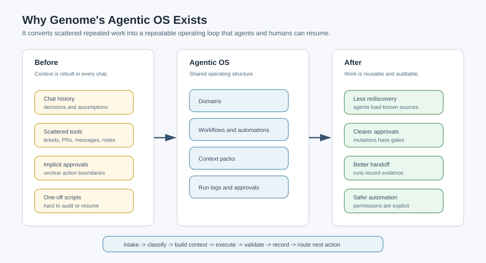
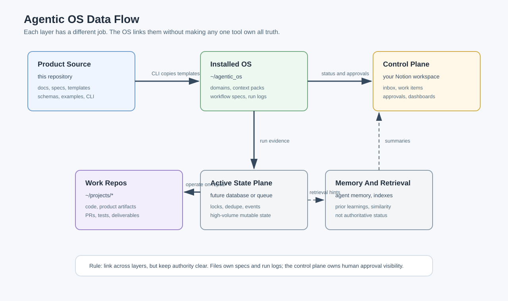
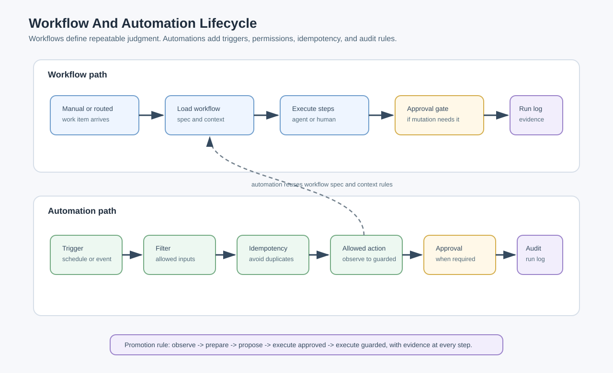

# Genome's Agentic OS

Genome's Agentic OS is the source package for creating a local operating system for AI-assisted work. It gives humans, Codex, Claude, and future automations the same durable structure for intake, routing, context loading, execution, validation, approvals, run logs, and handoff.

The goal is simple: stop rebuilding operating context from scratch in every chat.

## What This Creates

The CLI scaffolds an installed OS root, usually at `~/agentic_os`. The installed root is domain-first. The top level is not `workflows/` or `automations/`; those are lanes inside each domain.

```text
~/agentic_os/
  ROUTER.md
  AGENTS.md
  CLAUDE.md
  AGENT.md
  README.md
  personal/
  clarks_consulting/
  los/
  shared_factory/
  archive/
```

Lender-related work belongs inside `los/`; it is not a separate top-level domain.

Each domain gets the same numbered operating structure:

```text
<domain>/
  ROUTER.md
  AGENTS.md
  CLAUDE.md
  AGENT.md
  CONTEXT.md
  REFERENCES.md
  README.md
  domain.yml
  00-control-plane/
    active-work.md
    decisions.md
    routing-rules.md
    approval-rules.md
  01-inbox/
    raw-ideas.md
    triage.md
  02-projects/
  03-workflows/
    README.md
    engineering/
      README.md
    marketing/
    sales/
    support/
    operations/
    finance/
    personal_admin/
    learning/
  04-automations/
    README.md
    engineering/
    marketing/
    sales/
    support/
    operations/
    finance/
    personal_admin/
    learning/
  05-knowledge/
    source-map.md
    glossary.md
    memory-policy.md
  06-runs-and-logs/
    activity-log.md
    runs/
      README.md
    failures/
      README.md
  07-metrics/
    baselines.md
    scorecards.md
  08-archive/
```

`ROUTER.md` is the source of truth. Root `ROUTER.md` picks the domain. Domain `ROUTER.md` picks the lane, project, workflow, automation, or run-log destination. `AGENTS.md`, `CLAUDE.md`, and `AGENT.md` are compatibility pointers for tools that discover those filenames automatically. Domain `CONTEXT.md` and `REFERENCES.md` teach the agent how the domain works and where its source systems live.

## Why This Matters

Most AI work fails quietly because state lives in the wrong places:

- Chat history holds decisions that should be durable.
- Prompts carry context that should be reusable.
- Notion pages become dashboards without execution records.
- Automations mutate systems before approval boundaries are explicit.
- Every new agent run spends time rediscovering repo paths, commands, owners, and prior decisions.

Agentic OS turns that into an operating loop:

```text
intake -> classify -> build context -> execute -> validate -> record -> route next action
```

The result is less prompt mass, fewer missed approvals, cleaner handoffs, and workflows that can be run by Codex, Claude, a scheduled automation, or a human without changing the underlying process.



## Core Model

Genome's Agentic OS separates source, runtime state, work repositories, and the human control plane.

| Layer | Source Of Truth | Purpose |
| --- | --- | --- |
| Product package | This repository | Reusable specs, templates, schemas, examples, diagrams, and CLI scaffold logic. |
| Installed OS | `~/agentic_os` | Live domain roots, routers, workflow specs, automation specs, context packs, run logs, and memory policy. |
| Work repos | `~/projects/*` | Product, client, content, or code repositories operated by the OS. |
| Notion control plane | Genome's Notion or an explicitly selected client workspace | Human cockpit for intake, approvals, status, dashboards, and review. |
| Future active state plane | Database or queue | High-volume mutable state, locking, dedupe, replay, matching, and event history. |

The hierarchy is:

```text
Domain
  Workstream or lane
    Workflow
      Automation
        Run
          Artifact
```

## The Operating Flow

Every meaningful work item should pass through the same lifecycle:

| Stage | What Happens | Durable Output |
| --- | --- | --- |
| Intake | Raw request, issue, PR, meeting note, message, or scheduled trigger arrives. | Inbox item or work item reference. |
| Classify | The OS chooses domain, lane, workflow or automation, urgency, and permission level. | Domain/lane/work type metadata. |
| Build Context | Agent loads only the context needed for the task. | Context pack references and source links. |
| Execute | Human, agent, or automation runs the declared process. | Changed files, drafted output, tickets, summaries, artifacts, or prepared actions. |
| Validate | Output is checked against tests, acceptance criteria, approval rules, and evidence requirements. | Validation evidence and gaps. |
| Record | The run log captures what happened and what state changed. | Run log, decisions, artifacts, and final status. |
| Route | Work moves to done, waiting, needs approval, retry, blocked, or archived. | Next action and owner. |



## Workflows, Automations, And Runs

A workflow is a repeatable process for work that still needs judgment. Examples: feature development, PR review, release planning, meeting notes to action items, production issue triage.

The CLI creates workflow folders, not one loose Markdown file:

```text
<domain>/03-workflows/<lane>/<workflow>/
  workflow.md
  outcome-brief.md
  alignment-questions.md
  prd.md
  implementation-plan.md
  dispatch-handoff.md
  progress.md
  quick-reference.md
  state-machine.md
  context-pack.md
  approval-rules.md
  output-contract.md
  runbook.md
  examples/
    README.md
  runs/
    README.md
```

An automation is a workflow with a trigger and enough guardrails to run without a fresh human prompt. Automations start conservatively: observe, prepare, propose, then execute only after approval rules are proven.

```text
<domain>/04-automations/<lane>/<automation>/
  automation.md
  inputs.md
  outputs.md
  permissions.md
  failure-modes.md
  runbook.md
  tests.md
  logs/
    README.md
```

A run is one execution of a workflow, automation, or skill. Runs are the audit trail. If a second agent cannot tell what happened from the run log, the system did not record enough.

```text
<domain>/06-runs-and-logs/runs/<run-id>/
  run-log.md
  artifacts/
```



## Installable V1

Install the CLI from this repository:

```bash
python3 -m venv .venv
source .venv/bin/activate
python -m pip install -e .
```

For local test development, include the optional pytest dependency:

```bash
python -m pip install -e '.[dev]'
```

The installed command is:

```bash
agentic-os --help
```

### Smoke Test

Run this against a temporary directory before using a real OS root:

```bash
tmpdir=$(mktemp -d)
agentic-os init --target "$tmpdir/os"
agentic-os workflow create los engineering feature_dev --root "$tmpdir/os"
agentic-os automation create los support production_thread_intake --root "$tmpdir/os"
agentic-os run-log create los feature_dev --root "$tmpdir/os"
agentic-os validate --root "$tmpdir/os"
find "$tmpdir/os" -maxdepth 4 -type f | sort
```

For a real install, use the default root or pass an explicit target:

```bash
agentic-os init --target ~/agentic_os
```

## V1 Command Surface

| Command | Creates Or Checks |
| --- | --- |
| `agentic-os init --target ~/agentic_os` | Domain-first installed OS with root/domain routers and the standard numbered lanes. |
| `agentic-os domain create <name> --root ~/agentic_os` | Additional top-level domain with the same router, control plane, inbox, workflow, automation, knowledge, run, metric, and archive structure. |
| `agentic-os workflow create <domain> <lane> <name> --root ~/agentic_os` | Workflow folder with outcome brief, alignment questions, PRD, implementation plan, handoff, progress, spec, context pack, approvals, output contract, runbook, examples, and runs folder. |
| `agentic-os automation create <domain> <lane> <name> --root ~/agentic_os` | Automation folder with trigger spec, inputs, outputs, permissions, failure modes, runbook, tests, and logs. |
| `agentic-os run-log create <domain> <workflow-or-automation> --root ~/agentic_os` | Timestamped run folder under the domain's `06-runs-and-logs/runs/`. |
| `agentic-os validate --root ~/agentic_os` | Required domain-first folder checks plus JSON/YAML parseability. |

## What V1 Does

- Creates a working local OS tree under `~/agentic_os` or a supplied target.
- Creates the default domain roots: `personal`, `clarks_consulting`, `los`, `shared_factory`, and `archive`.
- Creates root and domain `ROUTER.md` files plus `AGENTS.md`, `CLAUDE.md`, and `AGENT.md` compatibility pointers.
- Creates domain `CONTEXT.md` and `REFERENCES.md` files for workspace memory and source maps.
- Creates each domain's numbered operating lanes from `00-control-plane` through `08-archive`.
- Creates workflow and automation folders with the support files needed to run, validate, approve, and audit them.
- Copies repository templates into `shared_factory/05-knowledge/templates/`.
- Creates timestamped run folders under the selected domain.
- Validates the required domain-first tree plus JSON/YAML parseability.
- Keeps generated files safe to rerun by not overwriting existing hand-authored content.

## What V1 Does Not Do

- It does not call the Notion API or create pages/databases in Notion.
- It does not install Claude or Codex skills into local harness folders.
- It does not execute automations, schedule jobs, or manage long-running state.
- It does not store secrets.
- It does not perform full JSON Schema validation of workflow or automation content yet.
- It does not replace project repositories, task trackers, or the human approval process.

## Repository Map

```text
docs/       Human-readable operating manual and diagrams.
spec/       Product and implementation specs.
templates/  Copyable source templates for installed OS objects.
schemas/    JSON schemas for future stricter validation.
examples/   Example domain operating systems.
skills/     Claude and Codex skill entrypoints.
installers/ Installer and scaffold planning notes.
config/     Example configuration files.
src/        Installable Python CLI package.
tests/      CLI and scaffold smoke tests.
```

Key starting points:

- [Documentation index](docs/README.md)
- [CLI and install guide](docs/10-cli-and-install/README.md)
- [Operating model](docs/01-operating-model/README.md)
- [Information architecture](docs/02-information-architecture/README.md)
- [Workflow guide](docs/04-workflows/README.md)
- [Cliefnotes operating guide](docs/11-cliefnotes-operating-guide/README.md)
- [Automation guide](docs/05-automations/README.md)
- [Storage model](docs/09-storage-model/README.md)
- [Spec index](spec/README.md)
- [Templates](templates/README.md)

## Customization

Use filesystem-safe names that match `^[a-z0-9_]+$`. The installed OS can add more domain roots with `agentic-os domain create <name>`, but active work should still follow the same numbered structure and approval model.

Customize domain context, workflow choices, automation permissions, Notion views, and integration adapters. Do not fork the core object vocabulary, run log format, approval state model, context pack contract, or audit evidence requirements unless the product spec changes too.
