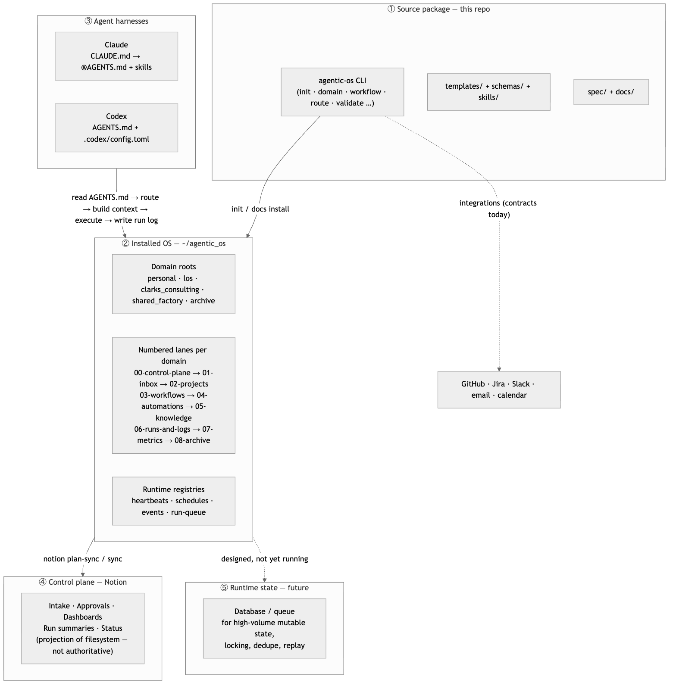

# 00 · Overview

> **Purpose:** understand what Genome's Agentic OS is, why it exists, and what it
> does — so every subsequent page has a frame to land in.
>
> **You'll use:** nothing yet — this is orientation.
> **Prereqs:** none. This is the first page.

---

## The problem this solves

Every chat with an AI agent starts the same way: rebuilding context. What project
is this? Where does state live? Which process should run? What has already
happened? Where does the output go?

That rebuild is not free. It costs tokens, introduces drift between sessions, and
means the agent's first several exchanges are orientation rather than work. In a
single-project hobby setup the cost is tolerable. Across ten active work-streams,
two clients, a personal life, and a shipping product, it compounds into a material
drag on everything.

Genome's Agentic OS eliminates that rebuild by making the operating structure
**explicit and durable in the filesystem** — present and correctly scoped every
time an agent opens a session.

---

## What the OS is

**Genome's Agentic OS** is an installable Python CLI (`agentic-os`) that scaffolds
a *domain-first filesystem* designed to be the persistent operating environment for
AI agents, automations, and human-reviewed workflows.

It is not a multi-agent framework. It is not a hosted platform. It does not own
your models, your data, or your execution. What it creates is a **structured tree
of directories and markdown files** whose layout, naming conventions, and
well-known file names (`AGENTS.md`, `ROUTER.md`, `CONTEXT.md`, `RULES.md`) tell
any capable agent exactly what to load, where to work, what approval gates apply,
and how to record what happened.

The insight: **structure is the cheapest form of context.** A numbered folder
scheme replaces a conversation's worth of orientation questions. A `ROUTER.md`
replaces an in-prompt routing table. A `RULES.md` replaces repeated system-prompt
text about approval and safety. One agent reading the right files at the right
moment is enough — no agent orchestration framework required.

---

## The Model Workspace Protocol (MWP)

This project is a concrete, installable implementation of the **Model Workspace
Protocol** described in *"Interpretable Context Methodology: Folder Structure as
Agentic Architecture"* (Van Clief & McDermott, arXiv:2603.16021, March 2026).

The paper's core thesis: for sequential, human-reviewed workflows you do not need
a code-level multi-agent framework. Framework orchestration can be replaced by
**filesystem structure**.

| MWP idea | How this repo realizes it |
| --- | --- |
| Numbered folders are stages | `00-control-plane` → `01-inbox` → `02-projects` → `03-workflows` → `04-automations` → `05-knowledge` → `06-runs-and-logs` → `07-metrics` → `08-archive` |
| Markdown files carry the prompt/context for each step | `ROUTER.md`, `AGENTS.md`, `CONTEXT.md`, `RULES.md`, `TOOLS.md` at every routable layer |
| Local scripts do the mechanical, non-AI work | The `agentic-os` Python CLI (scaffolding, validation, routing, registries) |
| One agent reading the right files at the right moment | The routing loop: read `ROUTER.md` → route to the narrowest layer → re-read context after stepping into it |

**Design consequence that governs everything:** the *filesystem is the
architecture*. The CLI's job is to create, validate, and navigate that structure
deterministically. The optional Execution Fabric is the explicit exception for
always-on execution: it owns durable queue, attempt, effect, alarm, and
failover state behind a versioned control-plane contract while the filesystem
continues to own operating policy and human-readable context.

---

## The five-layer model

Genome's Agentic OS deliberately separates concerns across five planes:



| Layer | Source of truth | Owns |
| --- | --- | --- |
| ① Source package (this repo) | git | Reusable specs, templates, schemas, CLI scaffold logic, docs |
| ② Installed OS (`~/agentic_os`) | **filesystem** | Live domains, routers, workflow/automation specs, context packs, run logs, runtime registries |
| ③ Harnesses (Claude, Codex) | their own config | Reading OS specs and executing workflows |
| ④ Control plane (Notion) | Notion (mirror) | Human cockpit: intake, approvals, dashboards, status |
| ⑤ Runtime state (future) | DB/queue | High-volume mutable state, locks, dedupe, replay |

**The single most important rule:** the filesystem (②) is always the operational
source of truth. Notion (④) is a *projection*. The database (⑤) is a *future*
plane — designed but not yet running. **V1 runs without it.**

---

## The object hierarchy

Everything inside the OS is an instance of one of these types:

```text
Domain                      (personal, work, archive, … plus harness/shared_factory)
  └─ Lane / workstream      (engineering, marketing, sales, support, operations,
                             finance, personal_admin, learning)
      └─ Workflow           (a reusable, human-reviewed procedure spec)
          └─ Automation     (a qualified workflow promoted to recurring/triggered)
              └─ Run         (one execution, with a run log)
                  └─ Artifact (the durable output of a run)
```

Every domain gets the **identical numbered skeleton**. This uniformity is the
point: an agent that learns one domain can navigate any domain.

---

## What V1 does

A fresh install of `agentic-os init --target ~/agentic_os` produces a complete
working OS tree in seconds:

```bash
agentic-os init --target ~/agentic_os
```

```text
created: .../agentic_os
created: .../agentic_os/.agentic_root
created: .../agentic_os/harness
created: .../agentic_os/harness/ROUTER.md
created: .../agentic_os/harness/AGENTS.md
created: .../agentic_os/harness/CONTEXT.md
created: .../agentic_os/harness/RULES.md
created: .../agentic_os/harness/TOOLS.md
created: .../agentic_os/harness/registries/capabilities.yml
created: .../agentic_os/harness/shared_factory
created: .../agentic_os/personal
created: .../agentic_os/personal/00-control-plane
created: .../agentic_os/personal/01-inbox
...
created: .../agentic_os/work
created: .../agentic_os/archive
```

The root-level `AGENTS.md`, `ROUTER.md`, `CONTEXT.md`, `RULES.md`, and `TOOLS.md`
that agents actually read live under `harness/` — that directory is the OS
brain. `shared_factory` is not a sibling domain; it is a fixed subdirectory of
`harness/` that holds shared patterns, templates, and cross-domain knowledge.
`personal`, `work`, and `archive` are the three default domains; add more with
`agentic-os domain create <name>`.

V1's full capability surface:

| What | Commands |
| --- | --- |
| Scaffold a complete OS tree | `agentic-os init --target <path>` |
| Add a domain | `agentic-os domain create <name>` |
| Create a workflow folder | `agentic-os workflow create <domain> <lane> <name>` |
| Create an automation folder | `agentic-os automation create <domain> <lane> <name>` |
| Open a run log | `agentic-os run-log create <domain> <workflow_or_automation>` |
| Route a request to a ContextPacket | `agentic-os route "<request>"` |
| Build context from cwd or explicit target | `agentic-os here route`, `agentic-os context build` |
| Validate the OS tree structure | `agentic-os validate` |
| Run health checks | `agentic-os doctor` |
| Install/update runtime docs and skills | `agentic-os docs install` / `docs update` |
| Scaffold a customer OS | `agentic-os customer init` |

---

## What V1 does not do

Be precise about the current state:

| Does not do | Status |
| --- | --- |
| Run as a persistent, always-on scheduler | `runtime supervise`, `heartbeat run`, and `schedule run-due` each execute one tick and exit; something external (cron, launchd, a wrapper) must call them on a cadence. The CLI calls the real Notion API where it counts (`notion track-runtime`, `notion active-work-sync` — dry-run by default, `--apply` + verified workspace to write; `notion sync`/`bootstrap` maintain local projections) — the control plane is wired, not plan-only. |
| Execute automations autonomously past their maturity gate | Automation specs advance through `observe` → `prepare` → `propose` → `execute_approved` → `execute_guarded`; each step still needs the evidence and approval its level requires. |
| Schema-enforce structured content on every plain `validate` run | `validate --strict` (F-011, closing Gap D) checks workflow/automation and other structured YAML/JSON against `schemas/`; plain `validate` checks shape and parseability only. |
| Install Claude or Codex skills into local harness folders | Skills are authored in this repo; installation into `~/.claude/` or `~/.codex/` is manual in V1. |
| Store secrets | Secrets belong in the harness keychain or environment; the OS holds references, not values. |
| Replace project repositories, task trackers, or the human approval process | The OS *wraps* these; it does not replace them. |
| Build a web app | Non-goal for V1. |

---

## Running this from Claude vs Codex

> The OS is harness-neutral. The same `agentic-os` CLI, the same specs, the same
> run logs — only the entry point differs.

- **Claude:** start a session in `~/agentic_os`; Claude loads `CLAUDE.md` → `@AGENTS.md`
  and discovers the OS automatically. Use the **`/os-route`** command or the
  **`os-navigator`** skill for the first routing step.
- **Codex:** run `agentic-os init` from the terminal, then open a Codex session;
  it reads `AGENTS.md` via the `agentic_os_root` profile in
  `~/agentic_os/config.toml` (created by `agentic-os init` and repairable with
  `agentic-os config install-tree --root ~/agentic_os --dry-run`, then `--apply`
  after review).

Full mechanics: [13 · Agent Surfaces](13-agent-surfaces.md).

---

## Guardrails & gotchas

- **`--root` defaults to `~/agentic_os`** — nearly every command accepts `--root`
  to point at an alternate tree. Omit it when working in your real installed OS.
- **Names are snake_case.** Hyphens are rejected by the CLI validator. Use
  `launch_blog`, not `launch-blog`.
- **Dry-run by default for side effects.** Runtime, Notion sync, and backup
  commands that modify external state require `--apply` to execute. Omit `--apply`
  to preview safely.
- **Exit codes are consistent:** `0` = ok, `1` = health check failed,
  `2` = usage error or deliberate refusal (e.g., low-confidence routing).
- **"Always-on" still means "invoked on a cadence," not "a background daemon."**
  `runtime supervise`, `heartbeat run`, `schedule run-due`, and `watch-source run-due`
  each execute one tick and exit; something external has to call them repeatedly
  (cron, launchd, a wrapper script) for the system to feel always-on.
- **Notion writes are real but gated.** `notion sync` / `notion bootstrap` /
  `notion track-runtime` call the live Notion API through `GENOMES_NOTION_PAT`;
  they default to dry-run and only write with `--apply`.

---

## Related

- [01 · Install & Quickstart](01-install-and-quickstart.md) — get a working OS tree in five minutes.
- [02 · Architecture](02-architecture.md) — the Python package, layering, and module map.
- [03 · Operating Model](03-operating-model.md) — the operating loop an agent follows on every session.
- [04 · Information Architecture](04-information-architecture.md) — the numbered folder scheme in detail.
- [05 · Routing & Context](05-routing-and-context.md) — how a request becomes a ContextPacket.
- [17 · CLI Reference](17-cli-reference.md) — every command, every flag.
- Atlas: [`architecture/system-architecture.md`](architecture/system-architecture.md) · gap statuses: [18 · Troubleshooting, Part B](18-troubleshooting-and-faq.md)
