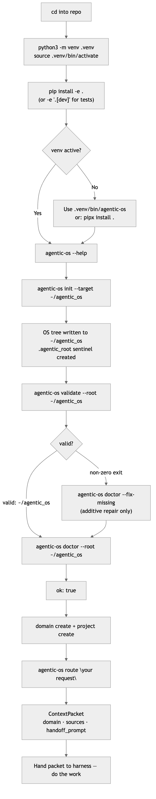

# 01 · Install & Quickstart

> **Purpose:** get from zero to a working Agentic OS root with your first routed
> work handed off to a harness — in about ten minutes.
>
> **You'll use:** `agentic-os init`, `validate`, `doctor`, `domain create`,
> `project create`, `route`.
> **Prereqs:** Python 3.10+, git (to clone the source repo). No other runtime
> dependencies — the package ships only PyYAML.

---

## The idea

Installing the Agentic OS is a three-step process: **install the CLI** from the
source repo into a Python virtual environment, **init an OS root** (the
domain-first filesystem tree that is your operating system), then **smoke-test**
it before doing any real work. After that, three more commands create a domain, a
project, and route your first request.



---

## 1 · Install the CLI

From inside the cloned repository directory, create a venv and install:

```bash
python3 -m venv .venv
source .venv/bin/activate
python -m pip install -e .
```

To run tests too, add the `dev` extra:

```bash
python -m pip install -e '.[dev]'
```

The installed entry point is `agentic-os`, wired to
`genomes_agentic_os.cli:main` in `pyproject.toml`.

Confirm it works:

```bash
agentic-os --help
```

```text
usage: agentic-os [-h]
                  {init,domain,profile,room,project,workflow,automation,
                   run-log,route,context,here,customer,update,license,
                   backup,config,notion,runtime,heartbeat,schedule,
                   integration,doctor,migrate,losmon,plan,
                   connected-system,watch-source,event,chain,validate,docs} ...

Scaffold and validate an Agentic OS root.
```

---

## 2 · PATH gotcha (Gap H) — read before you close the terminal

`agentic-os` is only on `PATH` while the venv is active. If you open a new
shell or deactivate, you will see `command not found`.

**Three remedies (pick one):**

| Approach | When to use |
| --- | --- |
| `source .venv/bin/activate` each session | Development / daily driver in the same repo |
| `.venv/bin/agentic-os <cmd>` (full path) | Scripts, cron, agent invocations that can't activate |
| `pipx install .` (from repo root) | Cleanest persistent install — puts `agentic-os` on PATH globally without managing a venv manually |

> This is Gap H in `.agentic-atlas/gap-register.md` — documented as an avoidable
> onboarding stumble. A future release will add a wrapper script; until then, use
> one of the three remedies above.

---

## 3 · Init the OS root

`init` writes the full domain-first filesystem tree to a target directory.
Defaults to `~/agentic_os` when `--target` is omitted.

### Flags

| Flag | Required | Default | Description |
| --- | --- | --- | --- |
| `--target` | No | `~/agentic_os` | Where to create the OS root. |
| `--profile` | No | — | Room-first profile YAML; activates the profile install path instead of the default layout. |
| `--projects-source` | No | — | Deprecated compatibility flag. Project repository links live under domain project folders. |
| `--include-legacy-agent` | No | off | Also creates `AGENT.md` compatibility shims for harnesses that require that exact filename. |

```bash
agentic-os init --target ~/agentic_os
```

Real output (abbreviated):

```text
created: .../agentic_os
created: .../agentic_os/.agentic_root
created: .../agentic_os/bin
created: .../agentic_os/commands
created: .../agentic_os/skills
created: .../agentic_os/mcp
created: .../agentic_os/plugins
created: .../agentic_os/libraries
created: .../agentic_os/hooks
created: .../agentic_os/rules
created: .../agentic_os/registries
...
created: .../agentic_os/README.md
created: .../agentic_os/config.toml
created: .../agentic_os/ROUTER.md
created: .../agentic_os/AGENTS.md
created: .../agentic_os/CLAUDE.md
created: .../agentic_os/MEMORY.md
...
```

`init` is **idempotent** — re-running it on an existing root is safe; it only
adds what is missing.

---

## 4 · Smoke test: validate + doctor

Run these immediately after `init`. They are read-only and always safe to re-run.

### `validate`

Checks that the required tree exists and that all YAML/JSON files are parseable.

```bash
agentic-os validate --root ~/agentic_os
```

Success is a single line:

```text
valid: .../agentic_os
```

Exit code 0 = clean. Exit code 1 = structural problems (run `doctor` next).

### `doctor`

Deeper health check — reports severity-tagged findings and optionally repairs
additive gaps with `--fix-missing`.

```bash
agentic-os doctor --root ~/agentic_os
```

Clean root output (real, from `.agentic-atlas/validation/command-output-examples.md`):

```text
root: .../agentic_os
ok: true
repairs: []
findings:
- severity: observation
  path: .../agentic_os
  message: required files and folders are present
```

If `ok: false`, add `--fix-missing` for an additive repair that will not
overwrite anything you have edited:

```bash
agentic-os doctor --root ~/agentic_os --fix-missing
```

```text
root: .../agentic_os
ok: true
repairs:
- init os
- install docs
findings:
- severity: observation
  path: .../agentic_os
  message: required files and folders are present
- severity: observation
  path: .../agentic_os
  message: 'additive repair executed: init os, install docs'
```

> `doctor` reports `ok: true` even when there are `fix-soon` or `cleanup`
> findings — only `blocker` severity findings cause `ok: false`. See
> [16 · Health, Doctor & Validation](16-health-doctor-validation.md) for
> the full finding taxonomy.

---

## 5 · First work: domain → project → route

### Create a domain

A domain is a top-level operating boundary — a client, a team, a product area.
Names are **snake_case**.

```bash
agentic-os domain create acme --root ~/agentic_os
```

Real output (abbreviated):

```text
created: .../agentic_os/acme
created: .../agentic_os/acme/README.md
created: .../agentic_os/acme/ROUTER.md
created: .../agentic_os/acme/AGENTS.md
created: .../agentic_os/acme/CLAUDE.md
created: .../agentic_os/acme/domain.yml
created: .../agentic_os/acme/00-control-plane
created: .../agentic_os/acme/01-inbox
created: .../agentic_os/acme/02-projects
created: .../agentic_os/acme/03-workflows
created: .../agentic_os/acme/04-automations
created: .../agentic_os/acme/05-knowledge
created: .../agentic_os/acme/06-runs-and-logs
created: .../agentic_os/acme/07-metrics
created: .../agentic_os/acme/08-archive
...
```

### Create a project

A project lives inside a domain under `02-projects/`.

| Arg / Flag | Required | Default | Description |
| --- | --- | --- | --- |
| `domain` | Yes (positional) | — | Domain slug. |
| `project` | Yes (positional) | — | Project slug (snake_case). |
| `--root` | No | `~/agentic_os` | OS root. |
| `--repo` | No | — | Repository path or URL. |
| `--notion` | No | — | Notion page, database, or URL. |
| `--jira` | No | — | Jira project, issue, or URL. |
| `--status` | No | `active` | One of: `active`, `waiting`, `blocked`, `done`. |
| `--lane` | No | — | Primary operating lane. |

```bash
agentic-os project create acme launch --root ~/agentic_os --repo ~/projects/acme/launch
```

Real output:

```text
created: .../agentic_os/acme/02-projects/launch
created: .../agentic_os/acme/02-projects/launch/artifacts
created: .../agentic_os/acme/02-projects/launch/config
created: .../agentic_os/acme/02-projects/launch/ideas
created: .../agentic_os/acme/02-projects/launch/worktrees
created: .../agentic_os/acme/02-projects/launch/README.md
created: .../agentic_os/acme/02-projects/launch/project.yml
created: .../agentic_os/acme/02-projects/launch/status.md
created: .../agentic_os/acme/02-projects/launch/decisions.md
created: .../agentic_os/acme/02-projects/launch/source-map.md
created: .../agentic_os/acme/02-projects/launch/AGENTS.md
created: .../agentic_os/acme/02-projects/launch/config/output-artifacts.yml
created: .../agentic_os/acme/02-projects/launch/worktrees/index.yml
created: .../agentic_os/acme/02-projects/launch/src
updated: .../agentic_os/acme/02-projects/README.md
updated: .../agentic_os/acme/00-control-plane/active-work.md
```

For an older project folder, repair the local agent/config/idea/worktree surface:

```bash
agentic-os project onboard acme launch --root ~/agentic_os
```

For an existing project, create or repair only the project-scoped source link:

```bash
agentic-os project link-source acme launch --root ~/agentic_os --repo ~/projects/acme/launch
```

If `project.yml` already has `sources.repo`, the short alias can use it:

```bash
agentic-os project src acme launch --root ~/agentic_os
```

Both forms write `acme/02-projects/launch/src`; they do not create a root-level
`~/agentic_os/projects` link.

To make an active branch checkout visible from the project folder:

```bash
agentic-os project worktree add acme launch feature_123 --root ~/agentic_os --path ~/worktrees/launch-feature-123
```

This creates `acme/02-projects/launch/worktrees/feature_123`, updates
`worktrees/index.yml`, and lets `agentic-os here context build` route correctly
from inside the real worktree path.

### Route your first request

`route` takes free text, matches it deterministically against known
domains/projects/workflows, and returns a **ContextPacket** — the ordered file
list, approval risks, and handoff prompt ready to hand to a harness.

```bash
agentic-os route "ship the launch blog post" --root ~/agentic_os
```

Real output:

```text
domain: acme
lane: ''
object_type: project
target_path: .../agentic_os/acme/02-projects/launch
sources_to_load:
- .../agentic_os/ROUTER.md
- .../shared_factory/05-knowledge/references/naming-conventions.md
- .../shared_factory/05-knowledge/references/tool-index.md
- .../shared_factory/05-knowledge/references/source-priority.md
- .../shared_factory/05-knowledge/references/style-and-output-rules.md
- .../agentic_os/acme/ROUTER.md
- .../agentic_os/acme/CONTEXT.md
- .../agentic_os/acme/REFERENCES.md
- .../agentic_os/acme/00-control-plane/active-work.md
- .../agentic_os/acme/05-knowledge/memory-policy.md
- .../agentic_os/acme/02-projects/launch/project.yml
- .../agentic_os/acme/02-projects/launch/status.md
- .../agentic_os/acme/02-projects/launch/source-map.md
- .../agentic_os/acme/02-projects/launch/decisions.md
approval_risks: []
known_gaps: []
handoff_prompt: Load the listed sources, work in .../acme/02-projects/launch,
  follow approval rules, and record validation before closeout.
```

Load `sources_to_load` into your harness context, then execute inside
`target_path`. The OS has done the "where does this belong?" work — you just
follow the packet.

---

## Running this from Claude vs Codex

> Install and init are identical in both harnesses — the same CLI, same tree, same
> commands. The only difference is how the harness picks up the installed OS.

- **Claude:** after `init`, use the **install skills** step in the onboarding flow
  (`CLAUDE.md` is already a `@AGENTS.md` adapter that surfaces domain context).
  Route requests with `/os-route "<request>"` or the **`os-navigator`** skill.
- **Codex:** after `init`, run
  `agentic-os config install --layer global_harness --root ~/.codex --dry-run`
  for user-level harness defaults if needed. The installed OS root and routed
  layers already receive `config.toml` during scaffold; use
  `agentic-os config install-tree --root ~/agentic_os --dry-run` to preview a
  tree repair and rerun with `--apply` after reviewing the diff.

Full mechanics: [13 · Agent Surfaces](13-agent-surfaces.md).

---

## Guardrails & gotchas

- **`agentic-os` not found?** The venv is not active. Use `.venv/bin/agentic-os`
  or `pipx install .` — see section 2 above (Gap H).
- **Names are snake_case.** `launch_blog`, not `launch-blog`. The CLI enforces
  this on domain, project, workflow, and automation slugs.
- **`--root` defaults to `~/agentic_os`.** If your OS root is elsewhere, pass
  `--root` on every command — or `cd` into the domain directory and use
  `agentic-os here route "<request>"` (auto-detects root from `.agentic_root`).
- **`init` is additive.** Running it twice on the same root is safe. It never
  overwrites files you have edited.
- **`validate` and `doctor` are read-only.** Run them anytime without risk.
- **Low-confidence refusal.** If `route` cannot match your request confidently,
  it exits 2 with an error rather than guessing. Name the domain explicitly, or
  `cd` into it and use `here route`. See
  [18 · Troubleshooting & FAQ](18-troubleshooting-and-faq.md).
- **`runtime`, `notion`, and `backup` commands default to dry-run.** They require
  `--apply` to make changes. Nothing in the quickstart flow touches those
  commands.

---

## Related

- [00 · Overview](00-overview.md) — the five-layer model and where install fits.
- [02 · Architecture](02-architecture.md) — what the OS root contains and why.
- [05 · Routing & Context](05-routing-and-context.md) — deep dive into the
  `ContextPacket` and routing mechanics.
- [16 · Health, Doctor & Validation](16-health-doctor-validation.md) — full finding
  taxonomy, `--fix-missing`, and per-subsystem doctors.
- [17 · CLI Reference](17-cli-reference.md) — complete flag reference for every
  command.
- [18 · Troubleshooting & FAQ](18-troubleshooting-and-faq.md) — command-not-found,
  low-confidence refusals, re-init on a dirty root.
- Atlas: [`command-reference.md`](../.agentic-atlas/architecture/command-reference.md) ·
  [`gap-register.md §H`](../.agentic-atlas/gap-register.md)
