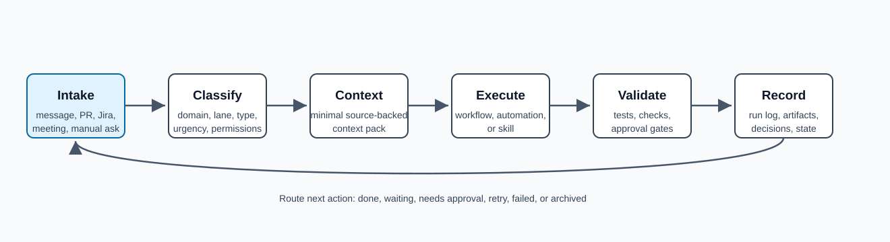

# Operating Model

The OS is built around a small loop that repeats across domains, workflows, and automations.



```text
intake -> classify -> build context -> execute -> validate -> record -> route next action
```

## Object Flow

| Stage | Output |
| --- | --- |
| Intake | Raw external message, Jira, PR, meeting note, Slack thread, email, or manual request. |
| Classify | Domain, lane, work type, urgency, owner, and whether automation is allowed. |
| Build Context | Context pack with project facts, linked artifacts, prior state, constraints, and active instructions. |
| Execute | Workflow run, automation run, skill run, or human-approved task. |
| Validate | Tests, source checks, approval criteria, evidence, and failure handling. |
| Record | Run log, decisions, artifacts, status, and next state. |
| Route | Done, waiting, needs approval, retry, blocked, or escalated. |

## Core States

Use a small status vocabulary everywhere:

| State | Meaning |
| --- | --- |
| `new` | Captured but not classified. |
| `triaged` | Classified and linked to a domain/lane. |
| `ready` | Context exists and execution can begin. |
| `running` | An agent, automation, or human is actively working. |
| `waiting` | Blocked on human, external system, customer, CI, or time. |
| `needs_approval` | Output is ready but needs human approval before action. |
| `done` | Desired outcome completed and recorded. |
| `archived` | No longer active but retained for search/history. |
| `failed` | Execution failed and needs retry, redesign, or manual intervention. |

## Run Discipline

Every non-trivial agent run should produce:

- Input reference.
- Chosen workflow or automation.
- Context sources used.
- Actions taken.
- Validation performed.
- Artifacts created or changed.
- Final state.
- Next action.

This is the minimum record needed for another agent to resume without rereading the whole world.
