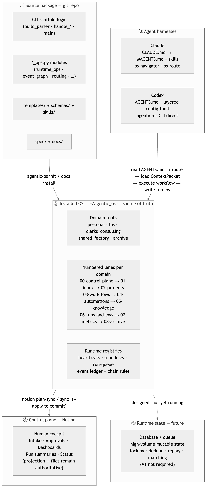
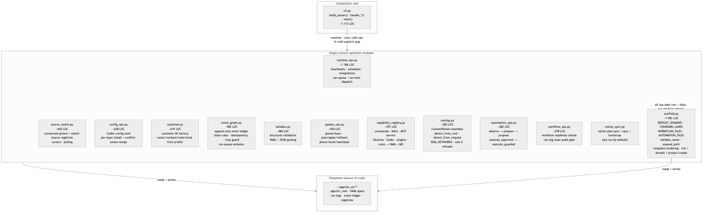
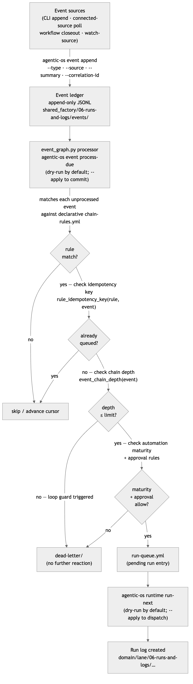

# 02 · Architecture

> **Purpose:** understand how Genome's Agentic OS is put together — the five layers
> it runs across, the object model it operates on, the Python package that drives it,
> and the design decisions that keep it maintainable. This page is the human companion
> to the deep atlas map.
>
> **You'll use:** this page as a map when writing new code, designing workflows, or
> debugging unexpected behavior.
> **Prereqs:** familiarity with the CLI ([01 · Install & Quickstart](01-install-and-quickstart.md)).

---

## The five-layer runtime model

Genome's Agentic OS separates concerns across five planes. Confusing these layers
is the most common way to make a mess.



| Layer | Source of truth | Owns |
| --- | --- | --- |
| ① Source package (this repo) | git | Reusable specs, templates, schemas, CLI scaffold logic, docs |
| ② Installed OS (`~/agentic_os`) | **filesystem** | Live domains, routers, workflow/automation specs, context packs, run logs, runtime registries |
| ③ Harnesses (Claude, Codex) | their own config | Reading OS specs and executing workflows |
| ④ Control plane (Notion) | Notion (mirror) | Human cockpit: intake, approvals, dashboards, status. **Files remain authoritative.** |
| ⑤ Runtime state (future) | DB / queue | High-volume mutable state, locks, dedupe, replay, matching |

**The rule:** layer ② (the filesystem) is always the operational source of truth.
Notion is a *projection*. The database is a *future* plane for when file-based
state stops scaling — it is not required for V1.

### When to introduce the runtime database (F-023)

Do **not** add a database until at least one of these conditions is true
(from [`spec/data-model.md`](../spec/data-model.md)):

| Condition | Why it triggers the database |
| --- | --- |
| Inbound messages are **frequent and messy** | File-per-message creates noise and race conditions |
| Multiple automations can **update the same work item** | File writes are not atomic; concurrent agents clobber each other |
| State changes need **replay** (audit, debugging, rollback) | Files don't have a native event log |
| **Dedupe and idempotency** are required | Hash-based dedupe belongs in a table, not a glob of files |
| **Joins across domains** are needed (messages, PRs, incidents, runs, approvals) | SQL or a query engine, not `rglob` |
| **Matching or embeddings** are part of the product | Vector search requires a vector store |

If none of these apply, the filesystem scales fine.  Introducing the database
prematurely adds operational complexity (migrations, connection management,
backup strategy, local dev setup) with no payoff.  The earliest sane trigger is
usually when a single domain processes > 50 inbound items/day from automated
sources, or when two or more automations compete to update work item state.

---

## The object hierarchy

Everything in the OS is an instance of one of six nested objects:

```text
Domain                      (personal, los, clarks_consulting, shared_factory, …)
  └─ Lane / workstream      (engineering, marketing, sales, support, operations,
                             finance, personal_admin, learning)
      └─ Workflow           (a reusable, human-reviewed procedure spec)
          └─ Automation     (a qualified workflow promoted to recurring/triggered)
              └─ Run         (one execution, with a run log)
                  └─ Artifact (the durable output of a run)
```

Every domain gets the identical numbered skeleton:

| Folder | Purpose |
| --- | --- |
| `00-control-plane/` | Active work, routing, approvals, and decisions. |
| `01-inbox/` | Raw capture and triage. |
| `02-projects/` | Active project folders. |
| `03-workflows/` | Repeatable human-and-agent workflow specs. |
| `04-automations/` | Trigger-driven automation specs and logs. |
| `05-knowledge/` | Source maps, glossary, memory policy, and reference material. |
| `06-runs-and-logs/` | Execution records, artifacts, failures, and activity logs. |
| `07-metrics/` | Baselines and scorecards. |
| `08-archive/` | Closed or inactive material. |

This uniformity is the point: an agent that learns one domain can navigate any domain.

### `harness/shared_factory/` — the canonical shared OS product layer

`shared_factory` is the one domain that is not user-facing work. It holds
OS-level plans, references, host-tool registries, hooks, and the event-control
plane that all domains share.

**Canonical path (new installs):**

```text
<os-root>/harness/shared_factory/
  00-control-plane/    event-ledger-index.md, chain-rules.yml, run-queue.yml …
  05-knowledge/        plans/, references/, host-tool-registry.<host>.yml …
  06-runs-and-logs/    events/ (ledger JSONL), processing-results/ …
```

`harness/shared_factory/` lives under `harness/` because it is managed OS
infrastructure, not a first-class user domain.  In code it is resolved via
`shared_factory_path(root, ...)` — which expands to
`<root>/harness/shared_factory/...` — and `domain_path(root, "shared_factory")`
routes there automatically.

**Migration safety for older installs:**

Installs created before this convention existed may have a top-level
`shared_factory/` directory (a plain domain alongside `personal/`, `los/`,
etc.). That layout still works — `domain_path` resolves it correctly.  Migrate
when convenient by running `agentic-os doctor --fix-missing`, which scaffolds
the canonical `harness/shared_factory/` without touching the existing top-level
directory. Then move content manually under the new path and remove the old
directory once you have verified the move.  There is no automated migration that
deletes files; the move is intentionally explicit.

**Rule:** new templates, plans, hook registries, and OS product docs should
always reference `harness/shared_factory/`, never the bare top-level path.
Existing docs that still say `shared_factory/` (without `harness/`) remain
valid for older installs and will be updated as each doc is revised.

---

## Python package map

The CLI is a single Python package (`src/genomes_agentic_os/`, ~10k LOC). It is
a **layered functional CLI** — not the TypeScript/hexagonal pattern used in other
projects. The philosophy is the same (explicit naming, dependencies passed in, no
hidden globals); the mechanism is Pythonic (modules of pure functions, `argparse`
composition root).



**Dependency rule:** `cli.py` depends on the ops modules; ops modules depend on
`scaffold.py` for shared primitives. Ops modules must not import `cli.py`. No
circular imports. New shared primitives belong in `scaffold.py`, not a new
`utils.py`.

### Module responsibility table

| Module | LOC | Responsibility |
| --- | --- | --- |
| `scaffold.py` | 1981 | **The backbone.** `DEFAULT_DOMAINS`, `STANDARD_LANES`, `WORKFLOW_FILES`, `AUTOMATION_FILES`; `.agentic_root` marker; `validate_name`, `expand_path`; template rendering; `init` / domain / project creation. |
| `runtime_ops.py` | 1186 | **Runtime registries.** Heartbeats, schedules, integrations, the run-queue, and `run-next` dispatch. File-backed; dry-run by default. |
| `cli.py` | 1117 | **Composition root.** `build_parser()` declares every command; `handle_*` functions adapt args → ops calls; `main()` dispatches. The one place wiring lives. |
| `source_watch.py` | 665 | **Connected sources.** `connected-system` + `watch-source` registries, cursors, polling. |
| `config_ops.py` | 628 | **Codex `config.toml`.** Per-layer install/doctor with conflict-aware merge. |
| `customer.py` | 619 | **Customer-OS factory.** Renders a client OS (router/context/rules/tools/assets) from a profile. |
| `event_graph.py` | 582 | **Event ledger + chains.** Append-only event log, declarative chain rules, idempotency keys, chain-depth loop guard, run-queue emission. |
| `validate.py` | 480 | **Structural validation.** Confirms an installed root has the expected shape; parses YAML/JSON. |
| `update_ops.py` | 454 | **Update & backup.** Grants/keys, plan/apply/rollback, `phone-home` heartbeat payload. |
| `capability_registry.py` | 291 | **Visible capability registry.** Commands, skills, MCP servers, libraries, hooks, plugins, rules → registry YAML + inventory markdown. |
| `routing.py` | 283 | **Deterministic routing.** `ContextPacket` assembly, `detect_from_cwd`, `detect_from_request`, `RISK_KEYWORDS` approval detection. No LLM. |
| `automation_ops.py` | 282 | **Automation maturity ladder.** Readiness checks + `observe → prepare → propose → execute_approved → execute_guarded`. |
| `workflow_ops.py` | 278 | **Workflow readiness + run closeout.** Required-section checks, `run-log close` audit gate. |
| `notion_sync.py` | — | **Notion projection.** `plan-sync`, `sync`, `bootstrap`, `track-runtime`. Dry-run by default. |

---

## Dependency injection model

There is **no DI framework and no module-level mutable global**. The pattern is
*explicit parameter passing* — the Python analogue of the AppContext pattern:

- **`--root`** is the primary injected dependency. Every ops function takes `root`
  explicitly; nothing reads a global "current OS."
- **`.agentic_root`** (TOML marker at the OS root) carries install-scoped config
  (`update_channel`, `update_policy`, and project link scope). It is read from `root`
  on demand — never cached in a singleton.
- **`config.toml`** (Codex) and **profile YAML** are *data dependencies* resolved
  once at the CLI handler edge and passed down — never re-read deep in the call tree.
- **`cli.py` handlers are the composition root:** parse args, resolve `root`, call
  the ops function with explicit arguments. Ops functions are pure with respect to
  their inputs plus the filesystem.

**Rule for new code:** take what you need as an argument. If a function needs the
root, pass `root`. Do not introduce a global config object, a singleton client, or
an import-time side effect.

---

## Event model

This is the closest thing to an "event bus," but it is **file-backed and
deterministic** — consistent with the Model Workspace Protocol: state lives in
files, not memory.



Key files (under `shared_factory/00-control-plane/` and
`shared_factory/06-runs-and-logs/events/`):

| File | Purpose |
| --- | --- |
| `event-ledger-index.md` + ledger JSONL | Append-only event log |
| `chain-rules.yml` | Declarative rules: event type → queued run |
| `event-cursors.yml` | Per-rule processing cursor (idempotent replay) |
| `run-queue.yml` | Pending runs waiting for `run-next` |
| `dead-letter/` | Reactions blocked by loop guard or missing maturity |
| `processing-results/` | Evidence of each process-due pass |

Guarantees built into `event_graph.py`:

- **Idempotency** — `rule_idempotency_key(rule, event)` prevents duplicate queueing.
- **Loop protection** — `event_chain_depth(event)` caps chain reactions.
- **Safety** — reactions only *queue* runs; execution is gated by automation maturity
  and approval rules. Nothing fires an external side effect implicitly.

**Rule:** emit events for cross-concern reactions. Do *not* invent an in-process
pub/sub. Append to the ledger and add a chain rule. If a caller needs an immediate
result, call the function directly.

---

## Deterministic routing

`routing.py` answers "where does this request belong?" with **no model call**:

- `detect_from_cwd(root, cwd)` — infer domain/project from the current path.
- `detect_from_request(root, request)` — match request text against known
  domains, projects, and lanes.
- `route_request(...)` returns a **`ContextPacket`**: `domain`, `lane`,
  `object_type`, `target_path`, `sources_to_load`, `approval_risks`, `known_gaps`,
  `handoff_prompt`.
- `RISK_KEYWORDS` flags approval risks (`send`, `deploy`, `delete`, `billing`,
  `customer`, `secret`) so risky work surfaces an approval gate before execution.
- Low-confidence matches **refuse** with exit code 2 (`routing confidence is low`)
  rather than guess — a deliberate guardrail.

The `ContextPacket` is the contract handed to a harness: the minimal ordered set
of files to load, plus risks and gaps. This is MWP's "right files at the right
moment," computed deterministically.

Full details: [05 · Routing & Context](05-routing-and-context.md).

---

## Enforced conventions

These are not style suggestions — they are enforced by the CLI:

| Convention | Enforced where | Consequence if violated |
| --- | --- | --- |
| **snake_case names** (lowercase, digits, `_`) for all slugs | `scaffold.validate_name` | Command errors: "must use lowercase letters, numbers, and underscores only" |
| **Exit codes**: `0` ok · `1` health "not ok" · `2` usage error *or* deliberate refusal | `cli.main` | A non-zero exit is often a guardrail, not a crash. |
| **`--root` defaults to `~/agentic_os`** | every handler | Always pass `--root` in scripts/tests to avoid touching the real install. |
| **Dry-run by default** for runtime/notion/backup effects | `runtime_ops`, `notion_sync`, `update_ops` | Must pass `--apply` to commit; omitting it is always safe. |
| **`run-log close --status done` requires `--validation`** | `workflow_ops` | Audit gate: cannot close "done" without evidence. |
| **`backup run` requires `update register` first** | `update_ops` | Needs an update grant in `registries/`. |
| **`CLAUDE.md` is a thin include** (`@AGENTS.md`) | templates + installer | Don't duplicate instructions into `CLAUDE.md`. |

---

## How to extend without making a mess

### Adding a new command

1. Add the subparser + flags in `cli.py:build_parser()` — match the style of a
   sibling command.
2. Add a `handle_<command>(args)` function (thin adapter: resolve root → call ops
   → print result).
3. Put the real logic in the matching `*_ops.py` module (or a new
   `<concern>_ops.py` for a genuinely new concern). Functions take `root` and data
   explicitly.
4. If it creates files, add the template under `templates/` and a schema under
   `schemas/` if structured.
5. If it adds a tool/skill/command an agent should *see*, register it in
   `capability_registry.py`.
6. Keep names snake_case; keep effects dry-run-by-default if they touch external
   systems.
7. Add a test under `tests/`.

### Adding a new domain/lane/workflow/automation

Use the CLI (`domain create`, `project create`, the `templates/workflow/*` and
`templates/automation/*` files). Never hand-roll a divergent folder shape —
`doctor` and `validate` will flag drift from the required skeleton.

### Anti-patterns to reject

- A new `utils.py` dumping ground.
- An in-process event bus (use the file-backed ledger + chain rules).
- A module-level singleton or import-time side effect.
- Reading config deep in the call tree (resolve at the CLI handler and pass in).
- Non-deterministic routing (no LLM calls in `routing.py`).
- A workflow/automation folder that doesn't match `WORKFLOW_FILES` /
  `AUTOMATION_FILES`.

---

## Running this from Claude vs Codex

> Same OS, same filesystem, same object hierarchy — only the trigger differs.

- **Claude:** the `/os-route` command or the **`os-navigator`** skill lets you
  address the OS via natural language; skills call `agentic-os` under the hood.
- **Codex:** `agentic-os <command> --root ~/agentic_os` directly; the `agentic_os_root`
  layer in `config.toml` governs the operating profile, shared tooling, and
  memory/control-plane conventions.

Full mechanics: [13 · Agent Surfaces](13-agent-surfaces.md).

---

## Guardrails & gotchas

- **Hyphens are rejected in names.** `my-workflow` fails; use `my_workflow`.
- **Exit 2 is a guardrail, not a crash.** Low-confidence routing, conflicts during
  `config install`, and missing `--validation` on `run-log close --status done` all
  exit 2 intentionally. Read the error message before reaching for a workaround.
- **Notion is always a mirror.** Never edit Notion as the primary record; the next
  `notion sync` overwrites edits made there. Files first.
- **Layer ⑤ does not exist yet.** The event ledger, run-queue, and registries are
  file-backed. High-volume event fanout and real-time matching require layer ⑤;
  until it exists, keep chain-rule fan-out conservative.
- **Always pass `--root` in scripts.** The default `~/agentic_os` is your live
  install; running without `--root` in a test mutates it.

---

## Related

- [03 · Operating Model](03-operating-model.md) — how the architecture translates into a running loop.
- [04 · Information Architecture](04-information-architecture.md) — domain/lane/folder conventions in depth.
- [05 · Routing & Context](05-routing-and-context.md) — the `ContextPacket` and routing commands.
- [09 · Runtime & Always-On](09-runtime-and-always-on.md) — the runtime registries and run-next dispatch.
- [10 · Events & Chains](10-events-and-chains.md) — the event ledger and chain-rule system.
- [13 · Agent Surfaces](13-agent-surfaces.md) — Claude vs Codex harness setup in detail.
- [17 · CLI Reference](17-cli-reference.md) — every command, flag, and exit code.
- Atlas deep version: [`architecture/system-architecture.md`](../.agentic-atlas/architecture/system-architecture.md) · [`harness-modes.md`](../.agentic-atlas/architecture/harness-modes.md)
