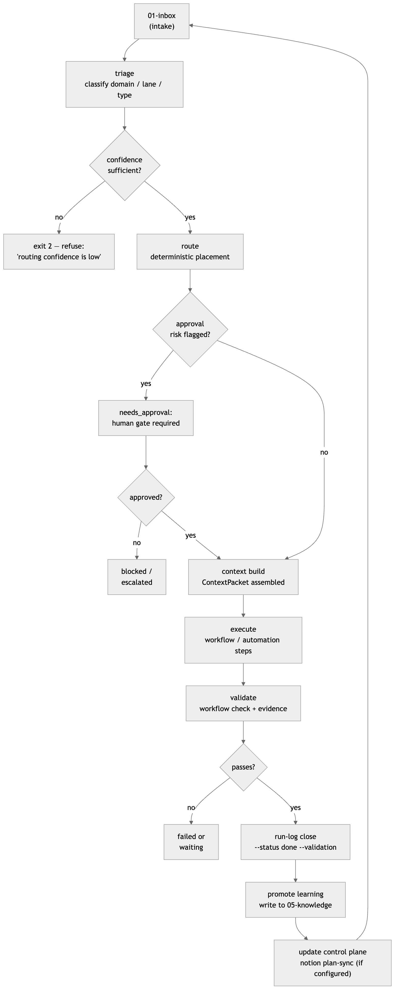

# 03 · Operating Model

> **Purpose:** understand the end-to-end loop every request follows — from drop into
> `01-inbox` through triage, deterministic routing, context assembly, execution,
> validation, run-log close, and back around — so you can trace any piece of work
> to its stage and know exactly which command applies.
>
> **You'll use:** `agentic-os route`, `agentic-os context build`, `agentic-os run-log create/close`.
> **Prereqs:** an installed OS root ([01 · Install & Quickstart](01-install-and-quickstart.md)) with at least one domain and workflow.

---

## The loop

The Agentic OS is built around a single, repeating cycle grounded in the Model
Workspace Protocol (MWP, arXiv:2603.16021). **Filesystem structure replaces
framework orchestration**: numbered folders are stages, Markdown files carry
per-step context, and the `agentic-os` CLI does the mechanical work
deterministically. A human — or a harness following human-authored specs — reviews
the output of each stage before the next begins.

The loop never skips stages and never writes to a later stage without evidence from
earlier ones. That constraint is what makes runs auditable and reversible.

### Stages

| # | Stage | What happens | Key folder |
|---|---|---|---|
| 1 | **Intake** | Work lands in `01-inbox` — a Slack thread, a Jira card, a meeting note, a manual request, or an automation trigger. Nothing is acted on yet. | `<domain>/01-inbox/` |
| 2 | **Triage** | Classify: which domain? which lane? what work type (workflow vs automation vs project)? urgency, owner, whether automation is allowed. Status moves `new → triaged`. | `01-inbox/triage.md` |
| 3 | **Route** | `agentic-os route` (or `here route`) runs deterministically — no model call. It matches the request against known domains/projects/lanes and returns a `ContextPacket`. Low-confidence input **refuses** with exit 2; the human disambiguates and re-runs. | `ROUTER.md` at each layer |
| 4 | **Context build** | Routing (or `context build`) produces the `ContextPacket`: the minimal ordered set of files for this exact piece of work, plus any approval risks and known gaps. Approval-risk keywords (`send`, `deploy`, `delete`, `billing`, …) immediately surface a `needs_approval` gate. | `ContextPacket` → harness |
| 5 | **Execute** | The harness loads the sources listed in `ContextPacket.sources_to_load`, works in `target_path`, and follows only the steps allowed by the workflow or automation spec. Risky actions already gated in stage 4 require written human approval before proceeding. | `<domain>/03-workflows/` or `04-automations/` |
| 6 | **Validate** | `workflow check` (or `automation check`) confirms required spec files are present and free of blockers. The agent records evidence — tests passed, manual QA, artifact paths — before any close. | `06-runs-and-logs/` |
| 7 | **Close run log** | `run-log close --status done` requires `--validation` evidence. Without it the command rejects (exit 1). Status options: `done`, `waiting`, `failed`, `needs_approval`. Closing writes to the activity log and seals the run record. | `06-runs-and-logs/runs/<run-id>/run-log.md` |
| 8 | **Promote learning** | Durable findings — routing quirks, payload surprises, decision rationale — are written to `<domain>/05-knowledge/` per the domain's `memory-policy.md`. This is a file write, not a CLI command. | `<domain>/05-knowledge/` |
| 9 | **Update control plane** | `notion plan-sync` computes the diff between filesystem state and the Notion workspace and prints a reviewable plan. Sync is dry-run by default; files remain authoritative. Control-plane update is the last step before the loop restarts. | `00-control-plane/` + Notion |

---

## The cycle diagram



---

## Run states

Every piece of work carries one status at all times. Status moves forward; it does
not skip.

| Status | Meaning |
|---|---|
| `new` | Captured in inbox, not yet classified. |
| `triaged` | Classified and linked to a domain/lane. |
| `ready` | `ContextPacket` assembled; execution may begin. |
| `running` | An agent, automation, or human is actively working. |
| `waiting` | Blocked on human, external system, CI, or time. |
| `needs_approval` | Output ready; approval required before action. |
| `done` | Desired outcome completed, evidence recorded, run log closed. |
| `failed` | Execution failed; needs retry, redesign, or manual intervention. |
| `archived` | Retained for search and history; no longer active. |

---

## Workflow vs automation vs project

| Object | Use when | Human role | Run discipline |
|---|---|---|---|
| **Workflow** | Process needs judgment, context interpretation, or variable steps. | Start, supervise, approve, review. | One run log per execution. |
| **Automation** | Trigger and allowed action are stable enough to run repeatedly without supervision. | Define permissions, review evidence, approve mutations. | Run log required; maturity gate before promotion. |
| **Project** | Outcome-scoped work tracked across multiple workflow runs. | Own, direct, close. | Project status updated as runs complete. |

The route determines which object type the request maps to. A routed request lands
on the narrowest matching layer: if a specific workflow matches, the agent works
there; if only a domain matches, the agent triages into the right lane first.

---

## Real examples

### Step 3 — route

```bash
agentic-os route "ship the launch blog post" --root ~/agentic_os
```

```text
domain: acme
lane: ''
object_type: project
target_path: .../acme/02-projects/launch
sources_to_load:
- .../ROUTER.md
- .../shared_factory/05-knowledge/references/naming-conventions.md
- .../shared_factory/05-knowledge/references/tool-index.md
- .../shared_factory/05-knowledge/references/source-priority.md
- .../shared_factory/05-knowledge/references/style-and-output-rules.md
- .../acme/ROUTER.md
- .../acme/CONTEXT.md
- .../acme/REFERENCES.md
- .../acme/00-control-plane/active-work.md
- .../acme/05-knowledge/memory-policy.md
- .../acme/02-projects/launch/project.yml
- .../acme/02-projects/launch/status.md
- .../acme/02-projects/launch/source-map.md
- .../acme/02-projects/launch/decisions.md
approval_risks: []
known_gaps: []
handoff_prompt: Load the listed sources, work in .../acme/02-projects/launch,
  follow approval rules, and record validation before closeout.
```

The `handoff_prompt` is the ready-to-paste instruction for the harness. No
interpretation required — the route computed it.

### Step 4 — context build (when you already know the target)

```bash
agentic-os context build --domain acme --project launch --root ~/agentic_os
```

```text
domain: acme
lane: ''
object_type: project
target_path: .../acme/02-projects/launch
sources_to_load:
- .../ROUTER.md
- .../shared_factory/05-knowledge/references/naming-conventions.md
...
- .../acme/02-projects/launch/project.yml
- .../acme/02-projects/launch/status.md
approval_risks: []
known_gaps: []
handoff_prompt: Load the listed sources, work in .../acme/02-projects/launch,
  follow approval rules, and record validation before closeout.
```

Use `context build` when the domain and project are already known; use `route` when
you have a request string and want the OS to match it.

### Step 7 — run-log create then close

```bash
agentic-os run-log create acme launch_blog --root ~/agentic_os
```

```text
created: .../acme/06-runs-and-logs/runs/20260529T005116Z-acme-launch_blog
created: .../acme/06-runs-and-logs/runs/20260529T005116Z-acme-launch_blog/artifacts
created: .../acme/06-runs-and-logs/runs/20260529T005116Z-acme-launch_blog/run-log.md
```

```bash
agentic-os run-log close acme 20260529T005116Z-acme-launch_blog \
  --status done \
  --summary "shipped" \
  --validation "manual QA passed" \
  --next-action "monitor" \
  --root ~/agentic_os
```

```text
run_log: .../acme/06-runs-and-logs/runs/20260529T005116Z-acme-launch_blog/run-log.md
status: done
workflow_or_automation: launch_blog
activity_log: .../acme/06-runs-and-logs/activity-log.md
```

`--status done` without `--validation` is rejected (exit 1) — the CLI enforces
evidence before close.

---

## Running this from Claude vs Codex

> Same operating loop, same run logs, same filesystem — only the entry point differs.

- **Claude:** use the `/os-run-log` command or invoke the **`run-logger`** skill to
  open a run, step through execution, and close with evidence. The **`os-navigator`**
  skill wraps the full route → context build → handoff sequence.
- **Codex:** run `agentic-os run-log create <domain> <workflow>` and
  `agentic-os run-log close …` directly. The `domain_or_lane` profile in the
  relevant `config.toml` governs the model, tool allow-list, and validation hooks
  for that execution context.

Full mechanics and setup: [13 · Agent Surfaces](13-agent-surfaces.md).

---

## Guardrails & gotchas

- **Routing refusal is correct behavior (exit 2).** If `route` can't place a
  request confidently, it prints `error: routing confidence is low: no domain or
  project matched` and exits 2. Provide the domain explicitly (`--domain`) or `cd`
  into it and use `here route`. Do not work around a refusal by guessing the
  target. (See [18 · Troubleshooting](18-troubleshooting-and-faq.md).)
- **`run-log close --status done` requires `--validation`.** Omitting it exits 1.
  The evidence field is the loop's integrity gate — every closed run must have a
  stated basis.
- **Notion writes are real but gated (Gap B closed).** `notion plan-sync` computes
  a reviewable diff; live write paths require `--apply` plus a verified workspace, and
  `notion sync`/`bootstrap` maintain local projection records. Files are
  authoritative; Notion is a projection. Do not treat a plan-sync output as
  confirmation that Notion was updated.
- **Status moves forward only.** A run marked `done` is not re-opened; create a
  new run log for follow-up work.
- **All names are snake_case.** `launch_blog`, not `launch-blog`. Routing matches
  against slug names; mismatches cause refusal.
- **`route` and `context build` are read-only.** Safe to run at any time; they
  never write to the workspace.

---

## Related

- [05 · Routing & Context](05-routing-and-context.md) — deep dive into the `route` / `context build` commands and `ContextPacket` fields.
- [06 · Workflows](06-workflows.md) — what executes inside the loop at stage 5.
- [07 · Automations](07-automations.md) — promoted workflows with trigger-based entry into the loop.
- [08 · Runs & Run Logs](08-runs-and-run-logs.md) — the full run-log schema, close options, and activity log.
- [12 · Control Plane (Notion)](12-control-plane-notion.md) — the plan-sync / sync commands and Notion projection.
- Atlas: [`architecture/system-architecture.md`](architecture/system-architecture.md) · gap statuses: [18 · Troubleshooting, Part B](18-troubleshooting-and-faq.md)
