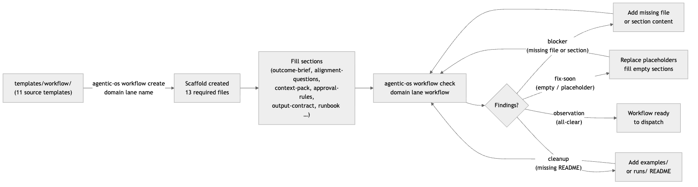

# 06 · Workflows

> **Purpose:** define, fill, and validate a reusable human-reviewed procedure spec
> so any agent — or human — can run the same process reliably every time.
>
> **You'll use:** `agentic-os workflow create`, `agentic-os workflow check`,
> the `workflow-builder` skill (Claude) or `templates/workflow/` directly (Codex).
>
> **Prereqs:** an installed OS root ([01 · Install & Quickstart](01-install-and-quickstart.md))
> with at least one domain ([05 · Routing & Context](05-routing-and-context.md)).

---

## What is a workflow?

A workflow is a **reusable, human-reviewed procedure spec** — a directory of
structured Markdown files that tells an agent exactly how to run a repeatable
process: what it needs upfront, which approval gates to stop at, what outputs to
produce, and how to hand off cleanly.

Workflows live at:

```
<root>/domains/<domain>/03-workflows/<lane>/<workflow_name>/
```

All three slug segments — `domain`, `lane`, and `workflow_name` — must be
`snake_case`. Hyphens are rejected by the CLI validator.

A workflow is **distinct from a run log** (the record of one execution) and from
an automation (a trigger-driven, policy-governed machine process — see
[07 · Automations](07-automations.md)). A workflow describes *how*; a run log
records *that it happened*.

The filesystem is the source of truth. No database, no control plane, no
approval from the OS is required to author a workflow — only the files on disk
matter to `workflow check`.

Operator applications can add the governed `workflow-engine/v1` definition,
version, instance, and queue-request contract without replacing these readable
workflow files. See [37 · Governed Workflow Engine](37-governed-workflow-engine.md).

---

## Required files

`agentic-os workflow create` scaffolds all 14 required files in one step.
Each file must be present for a workflow to be considered ready. Seven of them also
have **required sections** that `workflow check` inspects for content and
placeholder resolution.

| File | Section(s) checked by `workflow check` | Purpose |
| --- | --- | --- |
| `context-contract.yml` | — (exist only) | Machine-readable context contract |
| `workflow.md` | `Invocation Contract` | Overview, metadata, and invocation contract |
| `outcome-brief.md` | `Definition Of Done`, `Acceptance Criteria` | Success criteria, DoD |
| `alignment-questions.md` | `Required Questions`, `Dispatch Decision` | Pre-flight alignment gate |
| `prd.md` | — (exist only) | Product requirements |
| `implementation-plan.md` | — (exist only) | Step-by-step execution plan |
| `dispatch-handoff.md` | — (exist only) | What the agent gets when dispatched |
| `progress.md` | — (exist only) | Live progress notes during a run |
| `quick-reference.md` | — (exist only) | Cheat-sheet for the running agent |
| `state-machine.md` | — (exist only) | Valid state transitions |
| `context-pack.md` | `Source Links`, `Operating Constraints` | Which files/sources to load |
| `approval-rules.md` | `Approval Matrix` | Who approves what |
| `output-contract.md` | `Required Outputs` | Artifact and handoff contract |
| `runbook.md` | `Before Running`, `During The Run`, `After Running` | Execution runbook |

The scaffold also creates two support directories:
- `examples/README.md` — canonical worked examples
- `runs/README.md` — index of past run logs

---

## Authoring a workflow

### Step 1 — create the scaffold

```bash
agentic-os workflow create acme engineering launch_blog
# with explicit root:
agentic-os workflow create acme engineering launch_blog --root ~/agentic_os
```

| Arg / Flag | Required | Description |
| --- | --- | --- |
| `domain` | Yes | Domain slug (`snake_case`) |
| `lane` | Yes | Lane slug — e.g. `engineering`, `support` (`snake_case`) |
| `name` | Yes | Workflow slug (`snake_case`) |
| `--root` | No | Installed OS root. Defaults to `~/agentic_os`. |

This creates `<root>/domains/<domain>/03-workflows/<lane>/<name>/` and writes all 14
required files with placeholder content rendered from the templates in
`templates/workflow/`.

### Step 2 — fill the sections

Open each file and replace the placeholder content. The sections that
`workflow check` verifies for real content (not just presence) are the seven
listed in the Required files table above. Placeholder markers — `<…>`,
`yes | no`, `draft | ready` — are detected automatically and reported as
`fix-soon` findings.

Start with the files that gate dispatch:

1. `workflow.md` — define the Invocation Contract
2. `outcome-brief.md` — write the Definition Of Done and Acceptance Criteria
3. `alignment-questions.md` — answer the Required Questions and fill the Dispatch Decision
4. `context-pack.md` — list the source files/links the agent must load and state operating constraints
5. `approval-rules.md` — fill the Approval Matrix (who signs off on what)
6. `output-contract.md` — define the Required Outputs
7. `runbook.md` — write Before Running, During The Run, After Running

The remaining files (`prd.md`, `implementation-plan.md`, `state-machine.md`,
etc.) can be filled incrementally; `workflow check` flags missing sections but
does not block all other checks.

### Step 3 — validate readiness

```bash
agentic-os workflow check acme engineering launch_blog
agentic-os workflow check acme engineering launch_blog --root ~/agentic_os
```

| Arg / Flag | Required | Description |
| --- | --- | --- |
| `domain` | Yes | Domain slug |
| `lane` | Yes | Lane slug |
| `workflow` | Yes | Workflow slug |
| `--root` | No | Installed OS root. Defaults to `~/agentic_os`. |

`workflow check` always exits **0**. Findings are advisory — a workflow with
`blocker`-severity findings is not structurally enforced as un-dispatchable by
the OS, but it is a human gate: do not dispatch a workflow until `workflow check`
shows only `cleanup` findings or the single `observation` (all-clear).

---

## Workflow readiness lifecycle



---

## Reading `workflow check` output

Output is YAML. Each finding has `severity`, `path`, and `message`.

### Severity levels

| Severity | Meaning | What to do |
| --- | --- | --- |
| `blocker` | Required file missing, or required section absent | Create the file or add the `## Section Name` heading with content |
| `fix-soon` | Section exists but is empty or contains unresolved placeholders | Fill in real content; replace `<…>`, `yes | no`, `draft | ready` markers |
| `cleanup` | `examples/README.md` or `runs/README.md` is missing | Add a brief README to the support directory |
| `observation` | All required files and sections are present and filled | Workflow is ready; no action required |

### Real output — freshly scaffolded workflow

```bash
agentic-os workflow check acme engineering launch_blog --root /tmp/aos-validate/root
```

```yaml
findings:
- severity: fix-soon
  path: /private/tmp/aos-validate/root/domains/acme/03-workflows/engineering/launch_blog/alignment-questions.md
  message: 'section has unresolved placeholders: Dispatch Decision'
```

A fresh scaffold includes every required file and both support READMEs. Its one
finding is the intentional `fix-soon` placeholder in the `Dispatch Decision`
section. Replace the `yes | no`, `draft | ready`, or `<…>` tokens with real
decisions.

### All-clear output

When every file and section is present and filled, the output is:

```yaml
findings:
- severity: observation
  path: .../acme/03-workflows/engineering/launch_blog
  message: workflow has the required readiness files and sections
```

---

### Running this from Claude vs Codex

**Claude:** use `/os-create-workflow` (the harness command) to be guided through
scaffold + fill in one assisted session, or invoke the `workflow-builder` skill
directly for a structured authoring flow.

**Codex:** `agentic-os workflow create <domain> <lane> <name>` scaffolds the
files; then fill each file in your editor or via Codex edit instructions.
Validate with `agentic-os workflow check <domain> <lane> <name>`. The
`workflow_or_task` config layer (`<workflow>/config.toml`) can carry
workflow-specific model and tool overrides.

Both harnesses use the same files, the same `workflow check` command, and the
same readiness rules — there is no harness-specific variant of a workflow spec.

Full mechanics: [13 · Agent Surfaces](13-agent-surfaces.md).

---

## Guardrails & gotchas

- **`snake_case` only.** Domain, lane, and workflow slugs are validated at create
  time. Hyphens in any slug cause an immediate error. Example: `launch_blog` is
  valid; `launch-blog` is rejected.
- **`workflow check` is advisory, not a hard gate.** Exit code is always 0
  regardless of findings. The command never blocks dispatch — that is a human
  responsibility. See gap register D for the
  tracking note on schema enforcement.
- **Placeholders stop an agent mid-flight.** An agent that encounters
  `yes | no` or `<…>` in `alignment-questions.md` cannot make a dispatch
  decision safely. Resolve all `fix-soon` findings before handing to an agent.
- **No fabrication.** `context-pack.md → Source Links` must point to real files
  or URLs. A workflow context pack that references non-existent paths will
  silently give an agent an empty context.
- **`--root` defaults to `~/agentic_os`.** If you manage multiple OS roots, pass
  `--root` explicitly to every `workflow create` and `workflow check` call.
- **Dispatch does not happen at the workflow layer.** Routing (`agentic-os route`)
  selects the workflow; the workflow spec tells the agent what to do once there.
  See [05 · Routing & Context](05-routing-and-context.md).
- **`workflow run-now` is queue-only.** It writes a typed, idempotent run request
  with `dispatch_performed: false`; the harness/runtime worker must provide
  later execution evidence. See [37 · Governed Workflow Engine](37-governed-workflow-engine.md).

---

## Related

| Topic | Page |
| --- | --- |
| Installing an OS root | [01 · Install & Quickstart](01-install-and-quickstart.md) |
| Architecture & object hierarchy | [02 · Architecture](02-architecture.md) |
| Domain and project structure | [04 · Information Architecture](04-information-architecture.md) |
| Routing a request to a workflow | [05 · Routing & Context](05-routing-and-context.md) |
| Automations (machine-driven, trigger-based) | [07 · Automations](07-automations.md) |
| Recording a workflow execution | [08 · Runs & Run Logs](08-runs-and-run-logs.md) |
| Agent surfaces and skill inventory | [13 · Agent Surfaces](13-agent-surfaces.md) |
| Health, doctor, validation | [16 · Health, Doctor & Validation](16-health-doctor-validation.md) |
| Full CLI reference | [17 · CLI Reference](17-cli-reference.md) |
