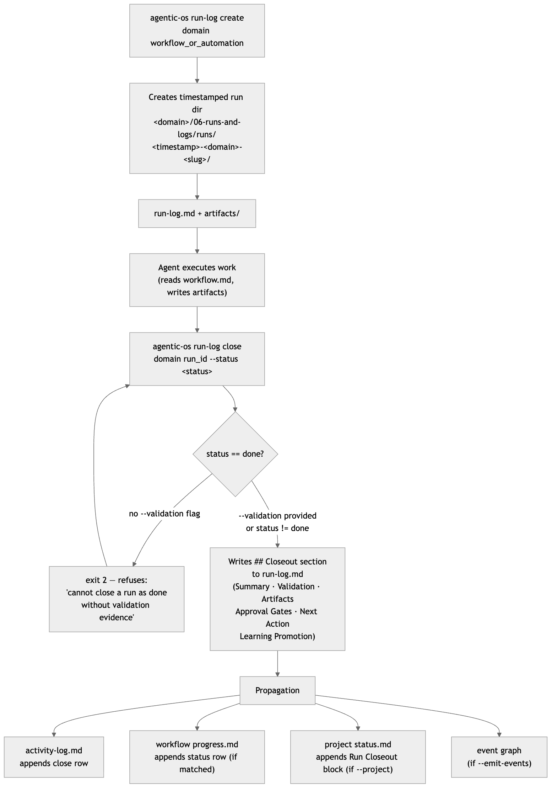

# 08 · Runs & Run Logs

> **Purpose:** record every agent execution as a timestamped, auditable file — so
> every run has evidence, every closeout has a validation gate, and the OS can
> reconstruct what happened, when, and why.
>
> **You'll use:** `agentic-os run-log create`, `agentic-os run-log close`.
> **Prereqs:** an installed OS root ([01 · Install & Quickstart](01-install-and-quickstart.md))
> with at least one domain and at least one workflow or automation
> ([06 · Workflows](06-workflows.md), [07 · Automations](07-automations.md)).

---

## What a run and a run log are

A **run** is one execution of a workflow or automation — a discrete, bounded piece
of agent work. Every run gets its own directory inside the domain's
`06-runs-and-logs/runs/` folder:

```
<root>/<domain>/06-runs-and-logs/runs/<timestamp>-<domain>-<slug>/
    run-log.md        ← primary audit record
    artifacts/        ← outputs produced during the run
```

The timestamp prefix uses UTC ISO-8601 compact format
(`20260529T005116Z`), so directory listings sort chronologically by default.

A **run log** (`run-log.md`) is the Markdown file that starts as a stub when the
run is created and gains a `## Closeout` section — with final status, validation
evidence, and any artifacts — when the run is closed. The filesystem is the source
of truth; nothing is stored in a database.

---

## Commands & flags

### `agentic-os run-log create <domain> <workflow_or_automation>`

Open a new run. Creates the timestamped directory and an empty `run-log.md`.

| Arg / Flag | Required | Description |
| --- | --- | --- |
| `domain` | ✅ | Domain slug (snake_case). |
| `workflow_or_automation` | ✅ | Workflow or automation slug (snake_case). |
| `--root` | — | Installed OS root. Defaults to `~/agentic_os`. |

### `agentic-os run-log close <domain> <run_id>`

Close a run with evidence. Writes the `## Closeout` section into the existing
`run-log.md` and propagates to the activity log, workflow progress, and optionally
the project status file.

| Arg / Flag | Required | Description |
| --- | --- | --- |
| `domain` | ✅ | Domain slug. |
| `run_id` | ✅ | The full timestamped slug from `run-log create` output (e.g. `20260529T005116Z-acme-launch_blog`). |
| `--status` | ✅ | One of: `done`, `waiting`, `failed`, `needs_approval`. |
| `--summary` | — | Free-text summary of what was done. |
| `--validation` | — (repeatable) | Evidence of validation. **Required when `--status done`** — the audit gate. |
| `--artifact` | — (repeatable) | Artifact path or URL produced during the run. |
| `--approval` | — (repeatable) | Approval reference encountered during the run. |
| `--next-action` | — | What comes next after this run. |
| `--owner` | — | Owner label (default: `OS Owner`). |
| `--learning` | — | Promoted learning to record in the closeout. |
| `--project` | — | Project slug — if provided, appends a Run Closeout block to the project's `status.md`. |
| `--emit-events` | — | Emit an OS event into the event graph on close (see [10 · Events & Chains](10-events-and-chains.md)). |
| `--root` | — | Installed OS root. Defaults to `~/agentic_os`. |

---

## The run lifecycle



---

## What closeout writes

When `run-log close` succeeds, it appends the following sections to `run-log.md`:

| Section | Content |
| --- | --- |
| `## Closeout` | Table: Final Status, Completed At (UTC ISO-8601), Owner. |
| `## Closeout Summary` | The `--summary` text, or `-` if omitted. |
| `## Closeout Validation` | Each `--validation` value as a bullet, or `-`. |
| `## Closeout Artifacts` | Each `--artifact` value as a bullet, or `-`. |
| `## Approval Gates Encountered` | Each `--approval` value as a bullet, or `-`. |
| `## Next Action` | The `--next-action` text, or `-`. |
| `## Learning Promotion` | The `--learning` text, or `Not promoted.` |

It also propagates to three additional files:

| File | What is appended |
| --- | --- |
| `<domain>/06-runs-and-logs/activity-log.md` | A row with date, actor (`agentic-os`), action, status, and next action. Always appended. |
| `<domain>/03-workflows/<lane>/<slug>/progress.md` | A row with date, actor, close summary, and link to the run directory. Appended only when the workflow slug matches a known workflow under the domain. |
| `<domain>/02-projects/<slug>/status.md` | A `## Run Closeout <run_id>` block with status and next action. Appended only when `--project` is given and the file exists. |

---

## The audit gate

Closing a run as `done` without `--validation` is **refused at the CLI level** —
exit code 2, no filesystem writes:

```
ValueError: cannot close a run as done without validation evidence
```

This is intentional. A `done` close claims the work is complete and correct. The
`--validation` flag is the machine-readable evidence: a test name, a QA sign-off
string, a URL, a reviewer name — any string that a human or tool can trace back to
proof. The other three statuses (`waiting`, `failed`, `needs_approval`) do not
require validation, because they are not claiming success.

---

## Real examples (verbatim output)

### Create a run

```bash
agentic-os run-log create acme launch_blog --root /tmp/aos-validate/root
```

```text
created: /private/tmp/aos-validate/root/acme/06-runs-and-logs/runs/20260529T005116Z-acme-launch_blog
created: /private/tmp/aos-validate/root/acme/06-runs-and-logs/runs/20260529T005116Z-acme-launch_blog/artifacts
created: /private/tmp/aos-validate/root/acme/06-runs-and-logs/runs/20260529T005116Z-acme-launch_blog/run-log.md
```

### Close a run with evidence

```bash
agentic-os run-log close acme 20260529T005116Z-acme-launch_blog \
  --status done \
  --summary shipped \
  --validation "manual QA passed" \
  --next-action monitor \
  --root /tmp/aos-validate/root
```

```text
run_log: /private/tmp/aos-validate/root/acme/06-runs-and-logs/runs/20260529T005116Z-acme-launch_blog/run-log.md
status: done
workflow_or_automation: launch_blog
activity_log: /private/tmp/aos-validate/root/acme/06-runs-and-logs/activity-log.md
```

---

### Running this from Claude vs Codex

> Same run-log creation, same audit gate, same filesystem writes — only the trigger differs.

- **Claude:** run the `/os-run-log` command, or invoke the **`run-logger`** skill.
  The skill wraps create + close and enforces the validation requirement before
  calling `run-log close --status done`.
- **Codex:** call `agentic-os run-log create <domain> <slug>` and
  `agentic-os run-log close <domain> <run_id> --status <status>` directly. The
  active profile in `config.toml` governs model and approval policy; the CLI
  enforces the audit gate regardless of profile.

Full mechanics: [13 · Agent Surfaces](13-agent-surfaces.md).

---

## Guardrails & gotchas

- **`done` without `--validation` exits 2.** The audit gate is enforced in
  `workflow_ops.close_run_log` before any filesystem write. Pass at least one
  `--validation` string — a test name, a reviewer, a QA note.
- **`run_id` must be the full timestamped slug.** Copy it exactly from
  `run-log create` output: `20260529T005116Z-acme-launch_blog`. Partial matches
  that are ambiguous or missing will error.
- **A run log can only be closed once.** Attempting to close an already-closed
  log raises `run log is already closed: <run_id>` (exit 2). Open a new run if
  you need to record further work.
- **Names are snake_case.** `launch_blog`, not `launch-blog`.
- **`--root` defaults to `~/agentic_os`.** Always pass `--root` in scripts and
  tests to avoid touching the real installed OS.
- **`--emit-events` ties into the event graph.** When passed, `run-log close`
  appends an `os.run.closed` event to the domain's event ledger. Chains that react
  to that event type will be evaluated by `agentic-os event process-due`.
  See [10 · Events & Chains](10-events-and-chains.md).

---

## Related

- [06 · Workflows](06-workflows.md) — the workflow specs that runs execute against.
- [07 · Automations](07-automations.md) — automated runs triggered by schedules or watchers.
- [09 · Runtime & Always-On](09-runtime-and-always-on.md) — how the runtime dispatches scheduled runs.
- [10 · Events & Chains](10-events-and-chains.md) — what `--emit-events` feeds into.
- [17 · CLI Reference](17-cli-reference.md) — full flag reference for `run-log`.
- [18 · Troubleshooting & FAQ](18-troubleshooting-and-faq.md) — common errors.
- Atlas: [`architecture/command-reference.md` §4](../.agentic-atlas/architecture/command-reference.md) · [`validation/command-output-examples.md` §13–14](../.agentic-atlas/validation/command-output-examples.md)
