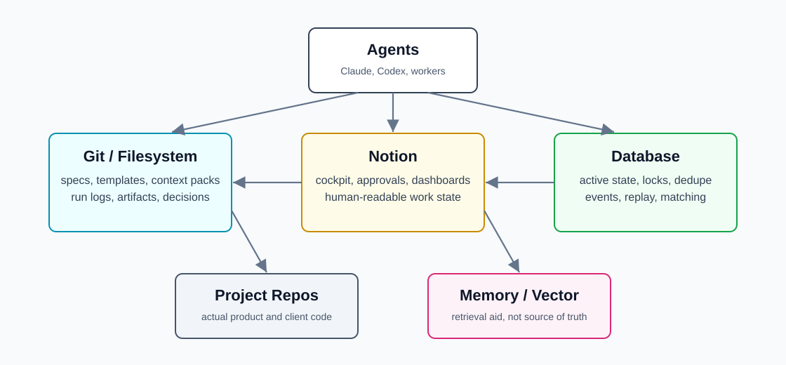

# Storage Model

The OS should not force every installation into the same storage backend. Use the simplest durable layer that fits the state.

## Storage Boundaries

| Storage | Use For | Do Not Use For |
| --- | --- | --- |
| Git/filesystem | Specs, templates, context packs, run logs, artifacts, config, decision records. | Concurrent queues, high-volume mutable state, locking. |
| Notion | Dashboards, approvals, work item cockpit, human-readable summaries. | Secrets, heavy event streams, rapid state mutation. |
| Database | Active state, dedupe, queue state, event history, matching, replay, high-volume lookup. | Narrative documentation, hand-authored specs. |
| Vector/memory | Retrieval, similarity, prior context hints. | Authoritative status, approvals, source of truth. |

## When Filesystem Is Enough

Filesystem plus Notion is enough when:

- Work volume is low to moderate.
- Only one agent or human is mutating a work item at a time.
- Runs are mostly manual or scheduled.
- State can be recovered from files and Notion.
- Search needs are simple.

## When To Add A Database

Add a database when:

- Multiple automations can touch the same object.
- Work changes state repeatedly over time.
- You need idempotency keys and locks.
- You need to join across messages, runs, PRs, incidents, and approvals.
- You need replayable event history.
- You need reliable dedupe.
- You need matching, embeddings, or ranking.

Your PR, production issue, and daily development volumes can start with files and Notion, but the long-term OS should have a database-backed active state plane for anything automated at scale.
