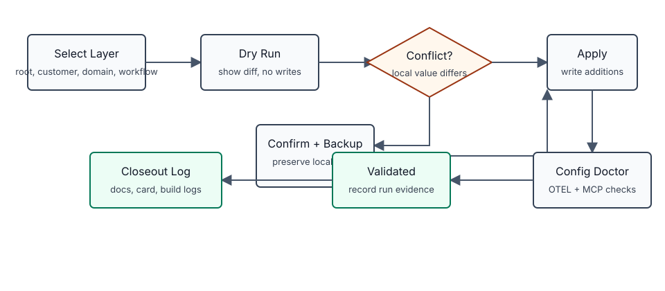

# CLI And Install

The V1 CLI is a scaffold and validation tool. It creates the local filesystem shape that humans, agents, and future automations can use as a shared operating surface.

It does not run automations for you yet. It creates the durable places where domain routers, workflow specs, automation specs, context packs, approvals, and run logs live.

## Table Of Contents

- [Install](#install)
- [Command Flow](#command-flow)
- [Codex Config Flow](#codex-config-flow)
- [Smoke Test](#smoke-test)
- [What The CLI Copies](#what-the-cli-copies)
- [Rerun Safety](#rerun-safety)
- [Validation Scope](#validation-scope)
- [Real Install Checklist](#real-install-checklist)

## Install

Use a virtual environment so the package and its development dependencies stay isolated from the system Python:

```bash
python3 -m venv .venv
source .venv/bin/activate
python -m pip install -e .
```

For local test work:

```bash
python -m pip install -e '.[dev]'
python -m pytest
```

Confirm the command is installed:

```bash
agentic-os --help
```

## Command Flow

The CLI flow mirrors the operating model:

| Step | Command | Why It Exists |
| --- | --- | --- |
| Create OS root | `agentic-os init --target ~/agentic_os` | Creates the domain-first installed root and all default domain routers. |
| Create domain | `agentic-os domain create client_delivery --root ~/agentic_os` | Adds another top-level operating boundary using the same numbered structure. |
| Create workflow | `agentic-os workflow create los engineering feature_dev --root ~/agentic_os` | Adds a repeatable process folder for judgment-heavy work. |
| Create automation | `agentic-os automation create los support production_thread_intake --root ~/agentic_os` | Adds a guarded trigger-driven process folder. |
| Create run log | `agentic-os run-log create los feature_dev --root ~/agentic_os` | Records one execution attempt for audit and handoff. |
| Install docs | `agentic-os docs install --root ~/agentic_os` | Adds runtime templates, operating manual, command prompts, harness skills, and plan backlog. |
| Update docs | `agentic-os docs update --root ~/agentic_os` | Adds missing template, manual, command, skill, and plan assets without overwriting local edits. |
| Install Codex config | `agentic-os config install --root ~/agentic_os --layer agentic_os_root --dry-run` | Plans or applies `config.toml` and prompt-file conventions for a directory layer. |
| Validate Codex config | `agentic-os config doctor --root ~/agentic_os --layer agentic_os_root` | Checks OTEL and MCP configuration contracts with actionable remediation. |
| Validate | `agentic-os validate --root ~/agentic_os` | Checks the required tree and parseable structured files. |

## Codex Config Flow



Use a dry-run before applying config changes:

```bash
agentic-os config install --root ~/agentic_os --layer agentic_os_root --dry-run
```

Apply after reviewing the diff:

```bash
agentic-os config install --root ~/agentic_os --layer agentic_os_root --apply --backup
```

Validate OTEL and MCP contracts:

```bash
agentic-os config doctor --root ~/agentic_os --layer agentic_os_root
```

When an existing `config.toml` contains a conflicting local value, first review
the blocked apply output. Then confirm only the non-conflicting managed
additions:

```bash
agentic-os config install --root ~/agentic_os --layer domain_or_lane --apply --confirm-conflicts --backup
```

Config examples and the full validation log live in:

- `docs/10-cli-and-install/config-toml-installer.md`
- `docs/10-cli-and-install/codex-config-closeout.md`

## Smoke Test

Use a temporary directory first:

```bash
tmpdir=$(mktemp -d)
agentic-os init --target "$tmpdir/os"
agentic-os workflow create los engineering feature_dev --root "$tmpdir/os"
agentic-os automation create los support production_thread_intake --root "$tmpdir/os"
agentic-os run-log create los feature_dev --root "$tmpdir/os"
agentic-os validate --root "$tmpdir/os"
find "$tmpdir/os" -maxdepth 4 -type f | sort
```

Expected result:

- `validate` exits successfully.
- `personal/`, `clarks_consulting/`, `los/`, `shared_factory/`, and `archive/` exist at the OS root.
- Root `ROUTER.md` exists and routes work into domains.
- Root `AGENTS.md`, `CLAUDE.md`, and `AGENT.md` point to `ROUTER.md`.
- `los/ROUTER.md`, `los/AGENTS.md`, `los/CLAUDE.md`, and `los/AGENT.md` exist.
- `los/00-control-plane/routing-rules.md` and `los/00-control-plane/approval-rules.md` exist.
- `los/CONTEXT.md` and `los/REFERENCES.md` exist.
- `los/03-workflows/README.md` and `los/03-workflows/engineering/README.md` exist.
- `los/03-workflows/engineering/feature_dev/workflow.md` exists.
- `los/03-workflows/engineering/feature_dev/outcome-brief.md`, `alignment-questions.md`, `prd.md`, `implementation-plan.md`, `dispatch-handoff.md`, `progress.md`, and `quick-reference.md` exist.
- `los/04-automations/README.md` and `los/04-automations/support/README.md` exist.
- `los/04-automations/support/production_thread_intake/automation.md` exists.
- `los/06-runs-and-logs/runs/<run-id>/run-log.md` exists.
- `shared_factory/05-knowledge/templates/` contains copied source templates.
- `shared_factory/05-knowledge/operating-manual/` contains the self-contained manual and visual index.
- `shared_factory/05-knowledge/commands/` contains reusable harness command prompts.
- `shared_factory/05-knowledge/skills/` contains reusable harness skill specs.
- `shared_factory/05-knowledge/plans/` contains the current source-package backlog and future-ideas intake rules.

## What The CLI Copies

`init` copies the repository `templates/`, `operating-manual/`, `harness/`, and `PLANS/` trees into `shared_factory/05-knowledge/` inside the installed OS. This matters because the installed OS should remain usable even when an agent is operating from the runtime root instead of this source repository.

Source templates stay in this repo. Runtime copies live in `shared_factory` because reusable templates and cross-domain patterns belong there.

Template, manual, command, skill, and plan copies are runtime assets. Add anything missing from the current package with:

```bash
agentic-os docs update --root ~/agentic_os
```

## Rerun Safety

V1 commands are intentionally conservative:

- Existing files are not overwritten.
- Existing folders are reused.
- Re-running a scaffold command should not erase hand-authored context.
- Update commands are additive and idempotent: they add newly packaged files across the installed OS, but preserve existing runtime files.
- New run logs use timestamped folders so each execution gets its own record.

If a template needs to change existing installed files in a future version, that must be an explicit migration command with a reviewable diff. It should not happen through default install or update commands.

## Validation Scope

V1 validation checks:

- Root `README.md`, `ROUTER.md`, `AGENTS.md`, `CLAUDE.md`, and `AGENT.md` exist.
- Default domain roots exist.
- Each default domain has its router, config, numbered operating lanes, standard lane folders, knowledge files, activity log, metrics files, and archive placeholder.
- `shared_factory/05-knowledge/operating-manual/`, `commands/`, `skills/`, and `plans/` contain the managed runtime operator layer.
- JSON files under the OS root are parseable.
- YAML files under the OS root are parseable.

V1 validation also warns if the legacy V1 root folders are present: `domains`, `workflows`, `automations`, `inbox`, `runs`, `context`, `memory`, `notion`, `config`, or `templates`.

V1 validation does not yet:

- Enforce every JSON Schema.
- Validate Markdown table contents.
- Check external links.
- Verify Notion page IDs or database IDs.
- Confirm Claude or Codex skill installation.

## Real Install Checklist

Before using a real `~/agentic_os` root:

1. Run the smoke test in a temporary directory.
2. Run `agentic-os init --target ~/agentic_os`.
3. Read root `~/agentic_os/ROUTER.md`.
4. Read the relevant domain router, such as `~/agentic_os/los/ROUTER.md`.
5. Fill in the domain control plane before running real work.
6. Add one workflow before adding automations.
7. Keep automation permissions at `observe` or `prepare` until approval and rollback rules are explicit.
8. Create run logs for non-trivial agent sessions.
9. Open `~/agentic_os/shared_factory/05-knowledge/operating-manual/index.html` when you want the readable visual manual.
10. Run `agentic-os validate --root ~/agentic_os` before handing the OS to another agent.
