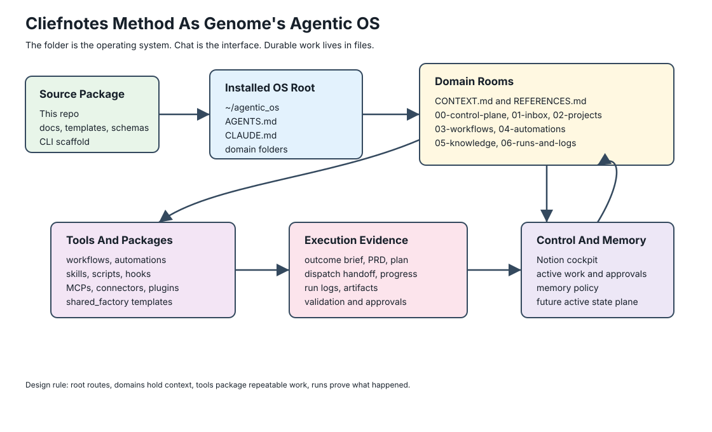
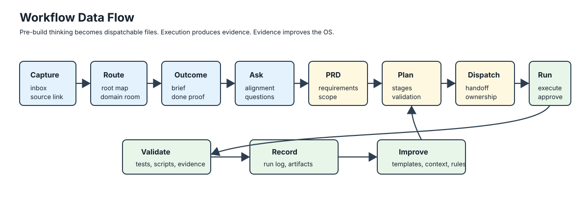

# Cliefnotes Operating Guide

This guide maps the local Cliefnotes classroom dump into Genome's Agentic OS. It does not copy the course; it turns the source guidance into operating contracts, scaffold files, and implementation rules for this repo.

Source reviewed: `/Users/genome/projects/factory/cliefnotes`.

## Source Scope

The local export contains 76 accessible lesson modules across six courses plus README files and 11 course/title folders with no accessible modules returned in the export. The detailed pass lives in [source-analysis.md](source-analysis.md).

Use this page as the working manual. Use [formats.md](formats.md) when creating or reviewing generated markdown files.

## The System In One View

The core teaching is that the folder is the operating system. Chat is the interface, but durable work happens in files that agents and humans can both read.



Genome's Agentic OS implements that as:

| Cliefnotes Concept | Agentic OS Implementation | Purpose |
| --- | --- | --- |
| Map | Root `ROUTER.md` | Route the request to the right domain. |
| Room | Domain folder such as `los/`, `personal/`, or `clarks_consulting/` | Keep persistent context, workflows, and logs for one operating area. |
| Room context | Domain `CONTEXT.md`, `REFERENCES.md`, `domain.yml`, and `05-knowledge/` | Teach the agent how this domain works and where source truth lives. |
| Tools | Workflows, automations, skills, connectors, scripts, hooks, and plugins | Package repeatable work instead of reprompting from scratch. |
| Session memory | `progress.md`, `context-pack.md`, run logs, active-work tables | Let a fresh session resume without depending on chat history. |
| Control plane | Notion or another human cockpit | Give humans status, approvals, dashboards, and review surfaces. |

## What The CLI Creates

`agentic-os init` creates a live OS root, usually `~/agentic_os`, with a small root router and top-level domain folders. Root should stay clean: it is the map, not the place where active work accumulates.

```text
~/agentic_os/
  ROUTER.md
  AGENTS.md
  CLAUDE.md
  AGENT.md
  README.md
  personal/
  clarks_consulting/
  los/
  shared_factory/
  archive/
```

Each domain is a room with its own router, context, references, control plane, inbox, projects, workflows, automations, knowledge, run logs, metrics, and archive.

```text
<domain>/
  ROUTER.md
  AGENTS.md
  CLAUDE.md
  AGENT.md
  CONTEXT.md
  REFERENCES.md
  README.md
  domain.yml
  00-control-plane/
  01-inbox/
  02-projects/
  03-workflows/
  04-automations/
  05-knowledge/
  06-runs-and-logs/
  07-metrics/
  08-archive/
```

The room `CONTEXT.md` is intentionally tactical. It names expected inputs, process, output folders, what to load, what to skip, tool triggers, and what done means. Long-lived source material goes in `REFERENCES.md` or `05-knowledge/`; active execution evidence goes in run logs.

Inside a domain, `workflow create` builds a full operating contract, not a loose prompt:

```text
<domain>/03-workflows/<lane>/<workflow>/
  workflow.md
  outcome-brief.md
  alignment-questions.md
  prd.md
  implementation-plan.md
  dispatch-handoff.md
  progress.md
  quick-reference.md
  state-machine.md
  context-pack.md
  approval-rules.md
  output-contract.md
  runbook.md
  examples/
  runs/
```

## Why It Does This

The source material repeats the same failure mode from different angles: prompts become overloaded when identity, task, context, constraints, source references, progress, and validation all live in one chat turn.

This OS separates those concerns:

| Concern | Durable Location |
| --- | --- |
| Who should handle this? | Root and domain routers. |
| What does this domain mean? | `CONTEXT.md`, `REFERENCES.md`, `domain.yml`, and source maps. |
| What outcome are we trying to create? | `outcome-brief.md`. |
| What is still ambiguous? | `alignment-questions.md`. |
| What is the contract? | `prd.md`. |
| How will it be built? | `implementation-plan.md`. |
| How does a fresh agent execute it? | `dispatch-handoff.md`, `runbook.md`, and `quick-reference.md`. |
| What happened? | Run log, artifacts, and `progress.md`. |
| What can run unattended? | Automation spec, permissions, tests, and failure modes. |

The value is not a prettier folder tree. The value is that a new Claude or Codex session can load the same files, make the same routing decision, respect the same approvals, and leave resumable evidence.

## Operating Flow



1. Capture the request in the domain inbox or control plane.
2. Route it with root and domain routers.
3. Write or update the outcome brief.
4. Ask alignment questions before planning.
5. Write the PRD and implementation plan.
6. Create the dispatch handoff for the human, Codex, Claude, or automation doing the work.
7. Execute only inside the declared permissions.
8. Validate with tests, scripts, source evidence, or human approval.
9. Record the run and update progress.
10. Promote durable learnings back into templates, routers, context, source maps, memory policy, or automations.

## Setup Sequence

Use this sequence for a new install or a new client/domain room.

1. Install the CLI from this repo and run `agentic-os init --target ~/agentic_os`.
2. Open root `ROUTER.md`; confirm the domain list is right.
3. Pick one domain. Do not start by filling every folder.
4. Fill that domain's `CONTEXT.md` with purpose, good-output rules, systems, work style, and common tasks.
5. Fill `REFERENCES.md` and `05-knowledge/source-map.md` with links to real source systems.
6. Put raw inputs in `01-inbox/raw-ideas.md` and route them through `01-inbox/triage.md`.
7. Create one workflow with `agentic-os workflow create <domain> <lane> <workflow> --root ~/agentic_os`.
8. Complete the workflow pre-build files before dispatching build work.
9. Run it manually once and write a run log.
10. Only convert stable, low-risk, repeatable work into an automation.

## Level Rules

| Level | What Belongs Here | What Does Not Belong Here |
| --- | --- | --- |
| Root | Domain map, root router, install README. | Active project files, one-off task notes, client-specific docs. |
| Domain | Persistent context, references, inbox, active work, workflows, automations, knowledge, logs. | Cross-domain reusable templates unless they belong in `shared_factory`. |
| Project | Project-specific goals, source links, specs, decisions, artifacts, and status. | Global domain policy. |
| Workflow | Repeatable process for judgment-heavy work. | Trigger schedules or unattended execution policy. |
| Automation | Trigger, permissions, idempotency, tests, failure paths. | Ambiguous judgment that still needs human direction. |
| Run | Evidence of one execution. | Long-term policy unless promoted back into the domain. |
| Shared factory | Reusable templates, skills, schemas, hooks, scripts, examples, and patterns. | Live client state. |

## Automation Rule

Automation starts as observation. Move through these levels only when the run evidence supports it:

| Level | Allowed Behavior |
| --- | --- |
| `observe` | Read, classify, summarize, and log. |
| `prepare` | Draft outputs or proposed actions without sending. |
| `propose` | Recommend the action and ask for approval. |
| `execute_approved` | Execute a specific approved action. |
| `execute_guarded` | Execute only inside narrow written limits with logs and failure handling. |

Email, calendar, browser, support, and operations automations should ask before external sends, destructive actions, production changes, billing/legal changes, customer-visible updates, or anything involving sensitive commitments.

## Tool Ladder

Use the least custom tool that can preserve the operating contract:

| Level | Use When |
| --- | --- |
| Native chat or project | The work is exploratory and low-risk. |
| Claude/Codex in repo | Files, tests, source control, and run logs matter. |
| Skills, scripts, hooks, MCPs, connectors | The workflow repeats or needs structured tool access. |
| Custom UI/control surface | Native tools are no longer enough, and the workflow is already well understood. |
| Private memory/runtime stack | Cross-session recall, active state, or relationship mapping justifies the operational cost. |

The custom UI is not the OS. It is one possible control surface over the same folders, workflows, and run logs.

## Anti-Patterns

- Root router becomes a brain dump instead of a map.
- Too many domains are created before one domain works end to end.
- Domain context describes personality but not the work.
- Workflows skip outcome, questions, PRD, and handoff.
- Automations send, delete, merge, deploy, bill, or cancel before permissions are proven.
- Memory is used as the only active task tracker.
- A remote/mobile session ends without updating `progress.md` or a run log.
- A custom UI is built before the workflow has been proven in files.

## Source-Derived Implementation Changes

This repo now encodes the source guidance by generating:

- `ROUTER.md` as the source of truth with `AGENTS.md`, `CLAUDE.md`, and `AGENT.md` pointers so Claude and Codex use the same router model without duplicate content.
- Domain `CONTEXT.md` and `REFERENCES.md` so each room has persistent local memory.
- Workflow `outcome-brief.md`, `alignment-questions.md`, `prd.md`, `implementation-plan.md`, `dispatch-handoff.md`, `progress.md`, and `quick-reference.md`.
- Automation worthiness and ask-before-acting guardrails.
- Remote/mobile session guidance in the agent surface docs.

The next useful expansion is stricter validation for workflow file completeness, not more prose.
