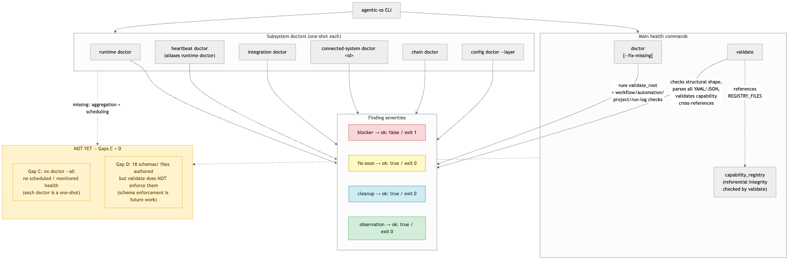

# 16 · Health, Doctor & Validation

> **Purpose:** confirm that your installed OS root is structurally sound, your
> runtime registries are coherent, and your harness capabilities are wired
> correctly — with honest, one-shot CLI commands that report findings by severity.
>
> **You'll use:** `agentic-os doctor`, `agentic-os validate`,
> `agentic-os runtime doctor`, `agentic-os heartbeat doctor`,
> `agentic-os integration doctor`, `agentic-os chain doctor`,
> `agentic-os config doctor --layer`.
> **Prereqs:** an installed OS root ([01 · Install & Quickstart](01-install-and-quickstart.md)).

---

## The idea

Health checking in the Agentic OS is split into two distinct concerns:

1. **Shape** — does the filesystem match what the package expects? `validate`
   answers this: it walks the installed root, requires the standard file/folder
   set, parses every YAML and JSON file for syntax, and checks referential
   integrity across the capability registries.
2. **Readiness** — are the objects inside that shape (workflows, automations,
   projects, runtime registries, integrations) in a healthy state? `doctor` and
   the family of subsystem doctors answer this, each scoped to one part of the OS.

Neither command mutates your root by default. `doctor --fix-missing` is the
one additive exception: it creates missing managed files without overwriting
anything.

**Honest current limits (Gaps C and D):** every doctor is a *one-shot CLI call*
— there is no `doctor --all` aggregation, no scheduled run, and no alerting. Gap
D: the 18 schema files in `schemas/` exist but `validate` does not enforce them
(`validate.py` imports neither `jsonschema` nor `schemas/`); malformed runtime
YAML can pass `validate` and fail later at use. Both gaps are tracked in the
backlog; the recommendations are below.



---

## `agentic-os doctor [--root] [--fix-missing]`

`doctor` is the main, broadest health check. It runs `validate_root` internally
and then layers five additional scans on top:

| Scan | What it checks |
| --- | --- |
| **validate_root** | Structural shape + YAML/JSON parse + capability cross-references (see `validate` section below) |
| **active_work_findings** | Active-work rows missing a concrete next action |
| **project_findings** | Every project directory — presence of `project.yml`, `status.md`, `source-map.md` |
| **workflow_findings** | Every `workflow.md` across all domains — required-section readiness |
| **automation_findings** | Every `automation.md` across all domains — maturity-gate readiness |
| **run_log_findings** | Open run logs — whether they have been closed with validation evidence |

**Severity model.** All findings carry one of four severities; only `blocker`
flips the result to `ok: false` and exits 1:

| Severity | Meaning | `ok` | Exit |
| --- | --- | --- | --- |
| `blocker` | Structural error; root or a required object is broken | `false` | 1 |
| `fix-soon` | Configuration gap (e.g. missing credential env var) | `true` | 0 |
| `cleanup` | Warning from structural validation (e.g. legacy folder present) | `true` | 0 |
| `observation` | Informational (e.g. "required files and folders are present") | `true` | 0 |

Exit code 2 signals a usage error or deliberate refusal — not a health finding.

**`--fix-missing`** runs an additive repair before the health scan. For a
standard (non-customer) root it runs `init os` and `install docs`; for a
customer root it runs `customer update`. It never overwrites existing files.

**Flags:**

| Arg / Flag | Required | Default | Description |
| --- | --- | --- | --- |
| `--root` | No | `~/agentic_os` | Installed OS root path |
| `--fix-missing` | No | — | Create missing managed files; does not overwrite |

---

## `agentic-os validate [--root]`

`validate` checks structural shape only — it is read-only and writes nothing.
Concretely it:

- Requires the standard root files (`AGENTS.md`, `CLAUDE.md`, `ROUTER.md`,
  `CONTEXT.md`, `RULES.md`, `TOOLS.md`, `agentic-os.lock.json`, …).
- Requires the standard domain directories and their internal lane structure
  (scoped to the profile's `approved_domains` if a `profile.yml` or
  `customer.yml` is present, otherwise the defaults).
- Requires the capability registry files (`registries/capabilities.yml`,
  `registries/commands.yml`, `registries/skills.yml`, `registries/mcp-servers.yml`,
  `registries/libraries.yml`, `registries/hooks.yml`, `registries/plugins.yml`,
  `registries/rules.yml`) and checks **referential integrity**: every capability
  entry that references a skill, MCP server, command, or other type must resolve
  to a real entry in the corresponding registry.
- Parses every `.json` file for valid JSON and every `.yml`/`.yaml` file for
  valid YAML, adding an error for any that fail to parse.
- Warns about legacy root folders (`domains/`, `workflows/`, etc.) left over from
  older installs.

Exits 1 if any errors are found; exits 0 with warnings printed to stderr.

> **Gap D — schemas exist but are not enforced.** `schemas/` contains 18
> JSON/YAML schema files (workflow, automation, domain, run, registries,
> update-grant, …). `validate.py` does not load or apply them — only parse
> correctness is checked, not structural conformance. Malformed heartbeat,
> schedule, or chain-rule YAML can pass `validate` and fail later at use.
> Recommendation: add `jsonschema` enforcement (or a `validate --strict` mode)
> that maps every structured file to its schema. Tracked as Gap D.

**Flags:**

| Arg / Flag | Required | Default | Description |
| --- | --- | --- | --- |
| `--root` | No | `~/agentic_os` | Installed OS root path |

---

## The subsystem doctors

Each subsystem doctor scopes to one part of the runtime. All share the same
`root: … / ok: … / findings: […]` output contract; all exit 0 when `ok: true`
and exit 1 when `ok: false`.

| Command | What it checks | Real output captured |
| --- | --- | --- |
| `runtime doctor` | Heartbeat registry, integration registry, credential env vars for integrations | Yes |
| `heartbeat doctor` | Same as `runtime doctor` (alias) | Yes |
| `integration doctor` | Integration registry + credential env vars | Yes |
| `chain doctor` | Chain rules file — syntax and referential integrity | Yes |
| `connected-system doctor <id>` | A specific connected system's status and selected provider | Structural only (not in output matrix) |
| `config doctor --layer <layer>` | Codex `config.toml` presence and OTEL/MCP contract for the given layer | Yes |

### `runtime doctor` / `heartbeat doctor`

`heartbeat doctor` is an alias for `runtime doctor` — their output is identical.
Both scan the runtime registry (`runtime-registry.yml`) and integration registry
(`integration-registry.yml`) for missing credential environment variables.

### `chain doctor`

Checks chain rule files for structural validity. A clean root with no broken
chain rules reports `ok: true` with an empty findings list.

### `connected-system doctor <id>`

Takes the ID of a specific connected system (e.g. `notion_genome`, `slack_genome`)
and reports its status, selected provider, and any connectivity or credential
issues. Use `connected-system list` first to see available IDs.

### `config doctor --layer <layer>`

Validates the Codex `config.toml` for the specified layer. Reports a `blocker`
finding (and exits 1) when `config.toml` is absent — the expected state before
`config install` has been run. Valid `--layer` values match those accepted by
`config install` (e.g. `agentic_os_root`, `global_user_harness`, `project`).

---

## The capability registry

`capability_registry.py` maintains the OS's visible capability inventory: all
commands, skills, MCP servers, libraries, hooks, plugins, and rules the OS
exposes. It serves two roles on this page:

1. **Rendered at init/update time** into `registries/*.yml` and `INVENTORY.md`.
   These are the files agents read via `TOOLS.md` to know what they can invoke.
2. **Validated by `validate`** via `validate_capability_registries`: any capability
   entry referencing a non-existent skill ID, MCP server ID, or command ID is
   reported as an error. This is the referential-integrity gate.

The nine capability directories (`bin/`, `commands/`, `skills/`, `mcp/`,
`plugins/`, `libraries/`, `hooks/`, `rules/`, `registries/`) are also required
to exist — `validate` reports a `blocker` for any that are missing.

---

## Real examples

### `agentic-os validate` — healthy root

```text
valid: .../root
```

Exits 0. On a healthy root, output is a single line.

---

### `agentic-os doctor` — healthy root

```text
root: .../root
ok: true
repairs: []
findings:
- severity: observation
  path: .../root
  message: required files and folders are present
```

Exits 0. No blockers; `ok: true`.

---

### `agentic-os doctor --fix-missing` — additive repair

```text
root: .../root
ok: true
repairs:
- init os
- install docs
findings:
- severity: observation
  path: .../root
  message: required files and folders are present
- severity: observation
  path: .../root
  message: 'additive repair executed: init os, install docs'
```

Exits 0. Repairs are listed; existing files were not overwritten.

---

### `agentic-os runtime doctor` (and `heartbeat doctor`)

```text
root: .../root
ok: true
findings:
- severity: fix-soon
  path: .../root/shared_factory/00-control-plane/runtime-registry.yml
  message: 'credential environment variable is not set: AGENTMAIL_API_KEY'
- severity: fix-soon
  path: .../root/shared_factory/00-control-plane/integration-registry.yml
  message: 'credential environment variable is not set: AGENTMAIL_API_KEY'
```

Exits 0. `fix-soon` findings do not flip `ok` — they are advisory.

---

### `agentic-os integration doctor`

```text
root: .../root
ok: true
findings:
- severity: fix-soon
  path: .../root/shared_factory/00-control-plane/integration-registry.yml
  message: 'credential environment variable is not set: AGENTMAIL_API_KEY'
```

Exits 0.

---

### `agentic-os chain doctor`

```text
ok: true
findings: []
```

Exits 0. Clean chain rules, no findings.

---

### `agentic-os config doctor --layer agentic_os_root` — before `config install`

```text
ok: false
root: .../root
layer: agentic_os_root
findings:
- severity: blocker
  path: .../root/config.toml
  message: config.toml is missing
  remediation: Run agentic-os config install --root .../root
    --layer agentic_os_root --dry-run, review the diff, then rerun with --apply.
```

Exits 1. `config.toml` absent is a `blocker` — this is the normal state before
`config install` has been run, not a crash.

---

### `agentic-os losmon validate`

```text
project: .../root/los/02-projects/losmon_replacement
created_or_verified:
- .../root/los/02-projects/losmon_replacement
- .../root/los/03-workflows/engineering/pr_review
- .../root/los/03-workflows/engineering/failing_ci_triage
- .../root/los/03-workflows/operations/deploy_planning
- .../root/los/04-automations/support/thread_intake
run_logs:
- .../root/los/06-runs-and-logs/runs/20260529T005119Z-los-pr_review/run-log.md
- .../root/los/06-runs-and-logs/runs/20260529T005119Z-los-failing_ci_triage/run-log.md
- .../root/los/06-runs-and-logs/runs/20260529T005119Z-los-deploy_planning/run-log.md
comparison: .../root/los/02-projects/losmon_replacement/artifacts/losmon-comparison.md
```

`losmon validate` scaffolds the LOSMon replacement project and emits run logs for
each workflow — it is not a structural health check but a migration readiness
scaffold.

---

## The monitoring gap (Gap C) — what is missing and what to do about it

> **Current state:** all doctors are one-shot CLI commands. There is no
> `doctor --all` aggregation, no supervisor-driven health loop, and no alerting.
> Drift and failures are invisible until someone manually runs a doctor.

**Recommended path (from the backlog):**

1. Add `agentic-os doctor --all` that fans out across every subsystem doctor and
   returns one consolidated health report — `ok`/`findings` per subsystem, a
   top-level `ok` that is true only when all subsystems are ok.
2. Have the supervisor (Gap A — the always-on runtime process) run `doctor --all`
   each tick, write a health scorecard to a known path, and emit a `HEALTH_REGRESSION`
   event when any subsystem flips from ok to not-ok.
3. Until the supervisor exists, run the doctors manually after every significant
   change and after `agentic-os update apply`.

---

### Running this from Claude vs Codex

- **Claude:** run `/os-doctor`, or invoke the **`os-doctor`** skill. The skill
  runs `doctor` and the relevant subsystem doctors, then reports findings by
  severity.
- **Codex:** run `agentic-os doctor --root ~/agentic_os` directly, or chain
  `agentic-os validate && agentic-os runtime doctor && agentic-os integration doctor`.
  The `agentic_os_root` profile governs tool access.

Full mechanics: [13 · Agent Surfaces](13-agent-surfaces.md).

---

## Guardrails & gotchas

- **`ok: true` does not mean no findings.** `fix-soon`, `cleanup`, and
  `observation` findings do not change `ok`. Read the full findings list, not
  just the exit code.
- **`config doctor` exits 1 by design before `config install`.** A missing
  `config.toml` is a `blocker`, so exit 1 is normal until you have run
  `config install`. Do not treat it as a crash.
- **`validate` does not enforce schemas (Gap D).** Passing `validate` means the
  filesystem shape is correct and all YAML/JSON parses; it does not mean your
  heartbeat or chain-rule files conform to the 18 schemas in `schemas/`.
- **Names are snake_case.** All domain, workflow, and automation names must use
  lowercase letters, digits, and underscores only.
- **Always pass `--root` in scripts.** The default `~/agentic_os` is your live
  install; pass an explicit `--root` in CI or tests to avoid touching it.
- **All doctors are read-only except `doctor --fix-missing`.** It is safe to run
  any doctor at any time; `--fix-missing` is the one command that writes files,
  but it only adds — it never overwrites.

## Related

- [01 · Install & Quickstart](01-install-and-quickstart.md) — `init` produces the
  root that `validate` and `doctor` check.
- [09 · Runtime & Always-On](09-runtime-and-always-on.md) — the runtime registries
  that `runtime doctor` and `heartbeat doctor` scan.
- [11 · Connected Sources](11-connected-sources.md) — `connected-system doctor`
  checks the systems registered there.
- [14 · Config, Update & Backup](14-config-update-backup.md) — `config doctor`
  validates the Codex config layer installed by `config install`.
- [18 · Troubleshooting & FAQ](18-troubleshooting-and-faq.md) — what to do when
  a doctor reports blockers.
- Atlas: [`gap-register.md` (Gaps C + D)](../.agentic-atlas/gap-register.md) · [`command-reference.md`](../.agentic-atlas/architecture/command-reference.md)
