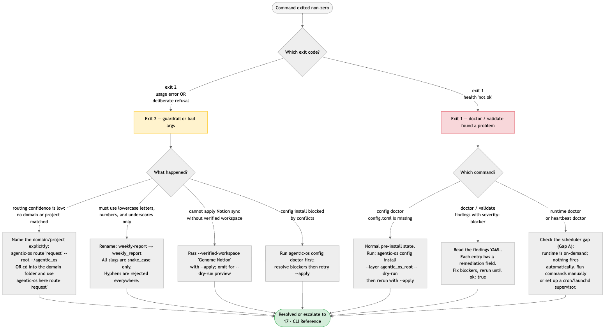

# 18 · Troubleshooting & FAQ

> **Purpose:** turn a stuck terminal session into a resolved one — by matching the
> error you actually see to the exact fix. This page is the first place to land
> when a command exits non-zero or a guardrail fires unexpectedly.
>
> **You'll use:** this page as a lookup — no commands to run before reading.
> **Prereqs:** a partially- or fully-installed OS root
> ([01 · Install & Quickstart](01-install-and-quickstart.md)). The
> [17 · CLI Reference](17-cli-reference.md) has the full flag tables.

---

## How non-zero exits work

The CLI has exactly three outcomes:

| Exit code | Meaning | When you see it |
| --- | --- | --- |
| **0** | Success | Command completed as expected. |
| **1** | Health "not ok" | A `doctor` or `validate` command found at least one `blocker`-severity finding. The YAML output tells you exactly what failed. |
| **2** | Usage error **or** deliberate refusal | Argparse rejected the invocation, **or** the CLI reached a safety guardrail and refused on purpose (e.g. low-confidence routing, `config install` blocked by a conflict, a Notion write without a verified workspace). |

Exit 2 is **not always a mistake** — several refusals are intentional safety gates.
Read the error message first; the remediation is usually printed on the same line.



---

## Part A — Troubleshooting FAQ

### Q: `command not found: agentic-os`

**Why it happens.** `agentic-os` is installed into the virtual environment created
during `pip install -e .` or `pipx install`. It is only on `PATH` if that
environment is active or was installed globally via pipx. This is Gap H — a known
onboarding friction point.

**Fix.** Choose one:

```bash
# Option 1 — activate the venv (development install)
source /Users/genome/projects/genomes_agentic_os/.venv/bin/activate
agentic-os doctor

# Option 2 — call the binary directly (no activation required)
/Users/genome/projects/genomes_agentic_os/.venv/bin/agentic-os doctor

# Option 3 — install globally via pipx (recommended for daily use)
pipx install /Users/genome/projects/genomes_agentic_os
agentic-os doctor
```

After the fix, `agentic-os doctor --root ~/agentic_os` should exit 0.

---

### Q: "must use lowercase letters, numbers, and underscores only"

**Exact error string (from `scaffold.validate_name`):**

```text
must use lowercase letters, numbers, and underscores only
```

**Why it happens.** Every domain, project, workflow, automation, run-log ID, and
schedule ID must be `snake_case`: lowercase letters, digits, and underscores only.
Hyphens are rejected everywhere. This is enforced at the `scaffold.validate_name`
call site before any file is written.

**Common culprit:** passing `weekly-report` instead of `weekly_report`, or
`launch-blog` instead of `launch_blog`.

**Fix.** Replace hyphens with underscores in the name argument:

```bash
# Wrong
agentic-os domain create my-domain --root ~/agentic_os

# Right
agentic-os domain create my_domain --root ~/agentic_os
```

The rule applies to every positional slug: domains, lanes, projects, workflows,
automations, profiles, rooms, schedules, customers.

---

### Q: "routing confidence is low: no domain or project matched" (exit 2)

**Exact error string (real output from `here route`):**

```text
error: routing confidence is low: no domain or project matched
```

**Why it happens.** The deterministic router in `routing.py` scored all
known domains and projects against your request and found no confident match. This
is a deliberate exit-2 refusal — the CLI refuses to guess. The matching threshold
may also be stricter than ideal for short or ambiguous requests (Gap I).

**Fix.** Three options, in order of preference:

1. **Name the domain or project explicitly** in the request string:
   ```bash
   agentic-os route "update the acme launch project" --root ~/agentic_os
   ```

2. **`cd` into the domain folder** and use `here route` — the router infers
   context from the working directory's `.agentic_root` marker:
   ```bash
   cd ~/agentic_os/acme
   agentic-os here route "update the launch project"
   ```

3. **Use `context build` with explicit flags** when you already know the target:
   ```bash
   agentic-os context build --domain acme --project launch --root ~/agentic_os
   ```

See [05 · Routing & Context](05-routing-and-context.md) for the full routing model.

---

### Q: "cannot close a run as done without validation evidence" (exit 2)

**Exact error string (from `workflow_ops.py:220`):**

```text
cannot close a run as done without validation evidence
```

**Why it happens.** `run-log close --status done` is an audit gate — you cannot
mark a run complete without at least one `--validation` flag. This is enforced in
`workflow_ops` before the run log is written. It is a guardrail, not a crash.

**Fix.** Pass `--validation` with a description of your evidence:

```bash
agentic-os run-log close acme 20260529T005116Z-acme-launch_blog \
  --status done \
  --validation "manual QA passed" \
  --root ~/agentic_os
```

If the work isn't actually done yet, use `--status waiting` or `--status
needs_approval` instead — neither requires validation evidence.

---

### Q: `backup run` exits with "update grant is missing; run update register first"

**Exact error string (from `update_ops.py:305`):**

```text
update grant is missing; run update register first: <path/to/registries/update-grant.json>
```

**Why it happens.** `backup run --apply` requires a pre-generated update grant
(SSH key pair + grant file in `registries/`). The grant is produced by
`update register`. Without it, the backup job refuses to run.

**Fix.** Run `update register` first, then retry `backup run`:

```bash
# Step 1 — generate the update grant (requires license activate first)
agentic-os update register --root ~/agentic_os

# Step 2 — dry-run the backup to verify
agentic-os backup run --root ~/agentic_os --dry-run

# Step 3 — apply if the plan looks right
agentic-os backup run --root ~/agentic_os --apply
```

`update register` also needs `license activate` to have been run if the OS was
freshly installed. Run `agentic-os update status --root ~/agentic_os` to check the
current license state.

---

### Q: `config doctor` exits 1 with "config.toml is missing"

**Example missing-config output:**

```text
ok: false
root: /private/tmp/aos-validate/root
layer: agentic_os_root
findings:
- severity: blocker
  path: /private/tmp/aos-validate/root/config.toml
  message: config.toml is missing
  remediation: Run agentic-os config install --root /private/tmp/aos-validate/root
    --layer agentic_os_root --dry-run, review the diff, then rerun with --apply.
```

**Why it happens.** This is the **normal missing-config state** for a legacy,
imported, or partially repaired directory. New scaffold commands create
`config.toml`; `config doctor` exits 1 when the target layer is still missing it.

**Fix.** Run `config install` as the `remediation` field instructs:

```bash
# Preview what will be written
agentic-os config install --root ~/agentic_os --layer agentic_os_root --dry-run

# Apply after reviewing
agentic-os config install --root ~/agentic_os --layer agentic_os_root --apply
```

After install, `config doctor` should exit 0 with `ok: true`.

For an existing OS tree with several missing configs, use the tree repair path:

```bash
agentic-os config install-tree --root ~/agentic_os --dry-run
agentic-os config install-tree --root ~/agentic_os --apply
```

---

### Q: `notion ... --apply` refuses without a verified workspace

**Exact error strings (from `notion_sync.py`):**

```text
# When --verified-workspace is omitted entirely:
cannot apply Notion sync without verified workspace: expected 'Genome Notion'

# When the workspace name doesn't match:
verified workspace 'wrong name' does not match expected workspace 'Genome Notion'

# When the name looks like Michael Clark's personal Notion:
refusing Notion write: verified workspace appears to be Michael Clark's personal Notion
```

**Why it happens.** Every `notion` subcommand that writes (`notion sync --apply`,
`notion bootstrap --apply`, `notion track-runtime --apply`) requires an explicit
`--verified-workspace` flag. The guard prevents accidental writes to the wrong
Notion workspace, and explicitly blocks writes to Michael Clark's personal account.

**Fix.** Pass the workspace name that matches what is configured in the OS root:

```bash
agentic-os notion sync --root ~/agentic_os \
  --apply \
  --verified-workspace "Genome Notion"
```

Omit `--verified-workspace` to run in `--dry-run` mode (no writes, no guard
required). See [12 · Control Plane — Notion](12-control-plane-notion.md) for
workspace configuration.

---

### Q: "profile customer.slug does not match" on `customer init`

**Exact error string (from `customer.py:107`):**

```text
profile customer.slug '<profile-slug>' does not match '<cli-slug>'
```

**Why it happens.** The `customer init <slug>` positional argument must equal the
`slug` field inside the profile YAML's `customer:` block. If the profile was
written for a different customer name, the two will conflict.

**Fix.** Either:
- Update the `customer.slug` field in the profile YAML to match the CLI argument,
  or
- Change the CLI argument to match the profile's `customer.slug`.

```bash
# Profile has customer.slug: acme_ops
# CLI call must use the same slug:
agentic-os customer init acme_ops \
  --profile /path/to/acme-ops.yml \
  --target /path/to/output
```

---

### Exit-code reference

| Code | Name | Meaning | Example commands |
| --- | --- | --- | --- |
| **0** | Success | Command completed as designed. | All commands on the happy path. |
| **1** | Health not ok | A `doctor` or `validate` scan found at least one `blocker` finding. YAML output has the details + `remediation`. | `config doctor`, `validate`, `doctor`, `workflow check`, `heartbeat doctor`, `chain doctor`, `runtime doctor`, `connected-system doctor`, `watch-source doctor`, `customer validate` |
| **2** | Usage error or deliberate refusal | Bad arguments **or** a safety guardrail fired. The error line is printed; read it before retrying. | `here route` (low confidence), `config install` (conflict), `notion sync --apply` (no verified workspace), argparse rejections |

---

## Part B — Known Limitations

These are the honest gaps between what the OS describes and what it does today.
Each is tracked in the atlas gap register
([`../.agentic-atlas/gap-register.md`](../.agentic-atlas/gap-register.md)).

### Gap A — No always-on scheduler or daemon (S1)

`runtime`, `heartbeat`, `schedule`, `watch-source`, `event process-due`, and
`runtime run-next` all exist and work. **None fires automatically.** There is no
daemon, no launchd plist, no systemd unit, no cron job installed. Every runtime
command defaults to `--dry-run` and requires an explicit `--apply` to do anything.

**Practical impact:** heartbeats don't beat, schedules don't fire, sources aren't
polled, and chain reactions don't process unless a human runs the command. The
"always-on" in the design is currently "on-demand."

**Workaround until the gap closes:** add a cron entry or launchd plist that
periodically runs the tick sequence:
```bash
agentic-os heartbeat run --apply --root ~/agentic_os
agentic-os schedule run-due --apply --root ~/agentic_os
agentic-os event process-due --apply --root ~/agentic_os
agentic-os runtime run-next --apply --root ~/agentic_os
```

See [09 · Runtime & Always-On](09-runtime-and-always-on.md) and the backlog
([`../.agentic-atlas/backlog.md`](../.agentic-atlas/backlog.md)) for the planned
supervisor installer.

---

### Gap B — Notion is plan-only (S2)

`notion plan-sync` works (exit 0, real output validated). `notion sync --apply`,
`notion bootstrap --apply`, and `notion track-runtime --apply` exist in the CLI and
have the write guards in place, but **no live Notion connection has been exercised
in the validation suite** — they are structurally sound but untested against a real
workspace. The control plane is plan-only today.

See [12 · Control Plane — Notion](12-control-plane-notion.md).

---

### Gap C — No aggregated / monitored health, no `doctor --all` (S2)

Each subsystem has its own `doctor` subcommand (`heartbeat doctor`, `chain doctor`,
`runtime doctor`, `config doctor`, etc.). There is no `doctor --all` or aggregated
health dashboard that runs them in sequence and summarizes across the whole OS. The
top-level `agentic-os doctor` checks only the core OS root structure.

**Workaround:** run each doctor manually and collect results:
```bash
agentic-os doctor --root ~/agentic_os
agentic-os runtime doctor --root ~/agentic_os
agentic-os heartbeat doctor --root ~/agentic_os
agentic-os chain doctor --root ~/agentic_os
agentic-os integration doctor --root ~/agentic_os
```

See [16 · Health, Doctor & Validation](16-health-doctor-validation.md).

---

### Gap D — `validate` does not enforce `schemas/` (S2)

The OS root includes a `schemas/` directory with YAML schemas for heartbeats,
schedules, chain rules, and events. `agentic-os validate` does **not** load these
schemas or check structured files against them. Malformed YAML can pass `validate`
and fail later at use time.

**Workaround:** manually inspect YAML files against `schemas/` when authoring
heartbeats, schedules, or chain rules.

---

### Gap E — No `metrics` command (S2)

The roadmap (phase 10) lists `agentic-os metrics refresh`, and every domain
scaffolds `07-metrics/baselines.md` and `scorecards.md`. No `metrics` subcommand
exists in the CLI today — the metrics layer is templates only.

---

### Gap F — Integrations and connected sources are registries and contracts, not live connections (S2)

`integration list`, `connected-system list`, and `watch-source list` show the
registries populated during `init`. `integration doctor` and `connected-system
doctor` verify that required fields are present. **No adapter actually polls a live
external system.** `watch-source poll --apply` and `integration setup --apply` are
defined but have not been tested against a real endpoint in the validation suite.

See [11 · Connected Sources](11-connected-sources.md).

---

### Gap I — Routing confidence threshold may be aggressive (S3)

`here route` from inside a domain that contains a matching project can still exit 2
("routing confidence is low: no domain or project matched") if the request phrasing
doesn't overlap sufficiently with registered names. The guardrail is correct in
principle; the matching threshold (`routing.detect_from_request`) may be stricter
than optimal.

**Workaround:** name the domain or project explicitly in the request, or use
`context build` with `--domain`/`--project` flags.

---

## Running this from Claude vs Codex

- **Claude:** `/os-doctor` runs the OS doctor skill. For any specific error above,
  paste the error string and ask Claude to walk through the fix using
  the **`os-navigator`** or **`os-doctor`** skill.
- **Codex:** run the exact CLI commands shown in each FAQ entry above, passing
  `--root ~/agentic_os`. The `agentic_os_root` profile in `config.toml` governs
  validation hooks and model routing for automated repair flows.

> The error strings and exit codes are identical in both harnesses — only the
> trigger differs. Full mechanics: [13 · Agent Surfaces](13-agent-surfaces.md).

---

## Related

- [01 · Install & Quickstart](01-install-and-quickstart.md) — the install steps
  that must succeed before most commands work.
- [05 · Routing & Context](05-routing-and-context.md) — routing logic and
  low-confidence refusal detail.
- [16 · Health, Doctor & Validation](16-health-doctor-validation.md) — the full
  doctor surface and how to read exit-1 findings.
- [17 · CLI Reference](17-cli-reference.md) — complete flag tables for every
  command.
- Atlas: [`gap-register.md`](../.agentic-atlas/gap-register.md) ·
  [`command-reference.md`](../.agentic-atlas/architecture/command-reference.md) ·
  [`validation/command-output-examples.md`](../.agentic-atlas/validation/command-output-examples.md)
