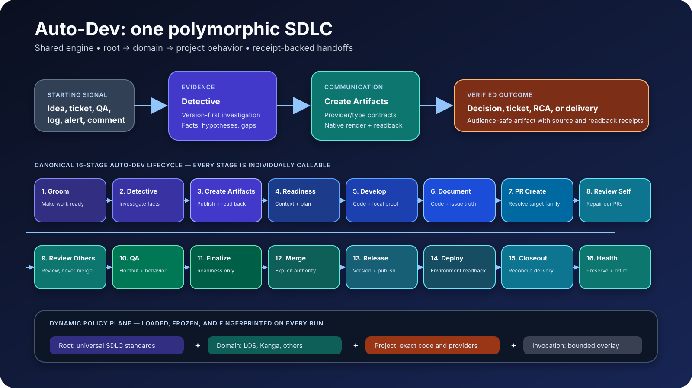
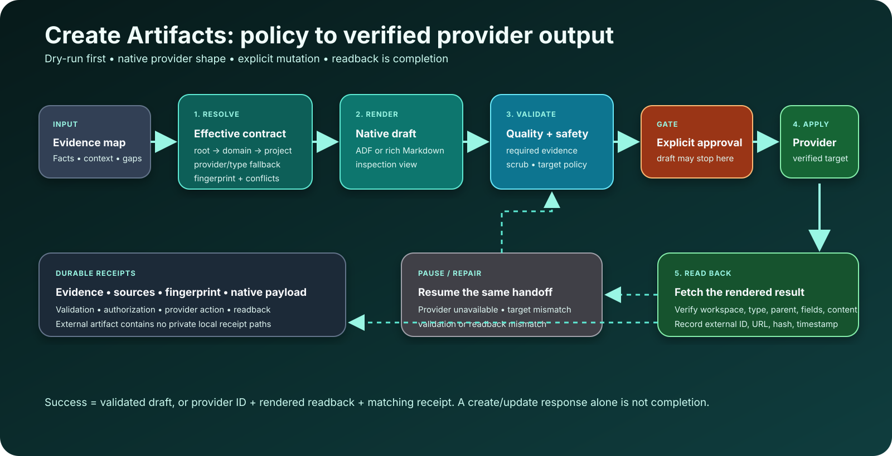
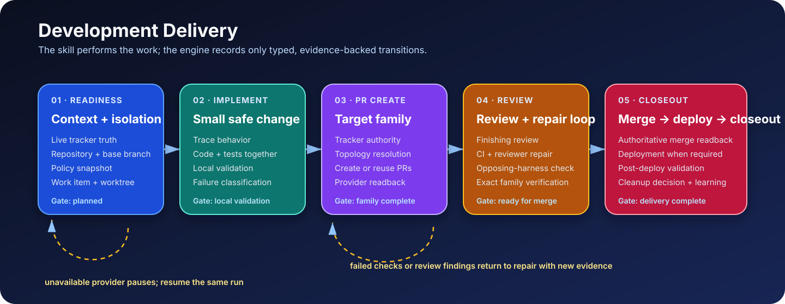
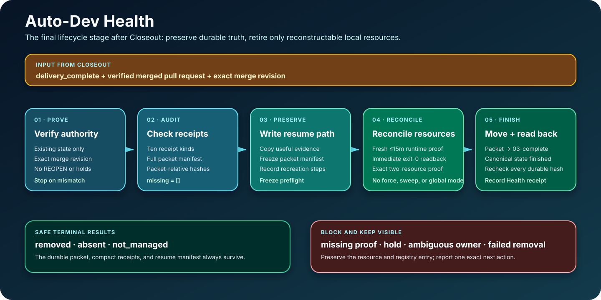

# 42 · Auto-Dev Program

> **One SDLC front door:** investigate, author the right artifacts, implement,
> review/repair, release/deploy, and close out—with behavior specialized by
> root, domain, and project Markdown rather than copied workflows. After
> delivery, Health preserves the durable packet while retiring reconstructable
> local resources.



## Architecture at a glance

| Layer | Owns | Does not own |
| --- | --- | --- |
| Auto-Dev program | intent routing, workflow family, shared policy planes, operator docs and handoffs | a second execution state machine |
| Development Delivery | work items, isolated worktrees, task/portfolio state, retries, receipts, review/release/deploy stages | provider artifact style or domain evidence catalogs |
| Create Artifacts | provider/type policy, provider-adapter rendering, evidence/semantic validation, typed apply/readback governance | tracker or documentation lifecycle state |
| Detective | version-first evidence gathering, source adapters, hypotheses and RCA | data/config mutation |
| Domain/project packs | exact tech stack, repositories, environments, evidence sources, provider terminology and output requirements | forks of shared workflow code |

## Dynamic policy folders

Adding a Markdown file changes the next run; no Python or registry edit is
needed.

These are five planes under one `auto_dev/` parent at every scope: Auto-Dev
behavior in the parent itself, plus nested environment access, development
standards, QA gates, and Gitflow topology. Artifact and investigation folders
are adjacent contracts, not additional development planes.

| Behavior | Root | Domain | Project |
| --- | --- | --- | --- |
| Auto-Dev workflow behavior | `harness/shared_factory/05-knowledge/auto_dev/` | `config/auto_dev/` | `config/auto_dev/` |
| Hosts/VPN/cloud access | `harness/shared_factory/05-knowledge/auto_dev/environment_access/` | `config/auto_dev/environment_access/` | `config/auto_dev/environment_access/` |
| Code/review | `harness/shared_factory/05-knowledge/auto_dev/dev_standards/` | `config/auto_dev/dev_standards/` | `config/auto_dev/dev_standards/` |
| QA | `harness/shared_factory/05-knowledge/auto_dev/qa_gates/` | `config/auto_dev/qa_gates/` | `config/auto_dev/qa_gates/` |
| Gitflow | `harness/shared_factory/05-knowledge/auto_dev/gitflow_topology/` | `config/auto_dev/gitflow_topology/` | `config/auto_dev/gitflow_topology/` |
| Artifact output | `harness/artifact-config/<provider>/<type>.md` | `artifact-config/<provider>/<type>.md` | `artifact-config/<provider>/<type>.md` |
| Investigation | `harness/investigation-config/` | `investigation-config/` | `investigation-config/` |

Every resolution records ordered sources and a content fingerprint. Narrower
configuration may specialize behavior but cannot weaken parent safety,
approval, sanitization, target verification, or readback.

Domain policy is now shaped exactly like project policy. The resolver reads a
domain's `config/auto_dev/` first and uses
`05-knowledge/auto_dev/` only when the canonical domain folder has no active
Markdown policy. It never merges both trees. This makes a domain the natural
home for a typed 1-N repository-family configuration without forking Auto-Dev;
the legacy tree is a migration compatibility input, not a new write target.

## Object Library self-hosting

The reusable Object Library uses Auto-Dev itself. Its durable source is
`michaelwclark/genomes_agentic_lib`; installed `<os-root>/lib/` is a validated,
replaceable projection. The `object-library` skill and
`library_self_hosting` workflow keep command/skill/workflow parity without
creating another state machine.

| Existing stage | Library responsibility |
| --- | --- |
| Develop | Build the deterministic source archive and receipt. |
| QA | Validate the exact archive SHA-256 and all manifest/registry boundaries. |
| Release | Publish the verified version, tag, archive, receipt, and changelog. |
| Deploy | Install the immutable released revision and verify installed object count/content hash plus library doctor. |
| Document rerun | Record actual release and install truth after Release/Deploy. |

The normal PR/review/Finalize/Merge/Closeout/Health owners still apply. The
post-release documentation pass reruns Document and adds evidence; it does not
become a seventeenth stage. See
[29 · Versioned Object Library](29-versioned-object-library.md).

## Detective


```bash
agentic-os detective resolve --trigger bug --domain los \
  --project los_app_los_django --environment preprod --explain
agentic-os detective start --input signal.yml --trigger bug --domain los \
  --project los_app_los_django --environment preprod --tenant navyfederal
agentic-os detective record-version --run-dir <run> \
  --authority-receipt <investigation-version-authority.json>
```

Environment investigations stay at `version_pending` until the exact deployed
version authority readback is known. Only sources declared in the pinned policy
may be recorded; authority, prerequisites, freshness, and explicit source
dispositions are enforced. Facts, hypotheses, disconfirming evidence, and the
conclusion cite evidence IDs. VPN, environment, authentication, and provider
unavailability pause the same run and resume only from a typed availability
probe receipt. The workflow is read-only; remediation routes separately.

## Create Artifacts



```bash
agentic-os artifacts resolve --provider jira --type bug \
  --domain los --project los_app_los_django --explain
agentic-os artifacts render --provider jira --type bug \
  --domain los --project los_app_los_django \
  --input evidence.yml --output draft.json
agentic-os artifacts validate --artifact draft.json
```

Rendering is local. Validation enforces required evidence receipts and
producer-supplied semantic assertions in addition to sections and safety.
`apply --execute` writes a routed filesystem target atomically; external
handoffs also require typed approval and target-verification receipts. The
registered provider adapter must return normalized live content in a typed
readback receipt, and the engine compares its hash with the rendered payload.
A create response or caller-supplied hash alone is not completion.

## Development stages



Everything is the orchestrator, not another stage. It uses this one exact order:

| Order | Stage | Manual skill | Recorder |
| --- | --- | --- | --- |
| 1 | Groom | `/auto-dev-grooming` | `auto-dev record --stage groom` |
| 2 | Detective | `/auto-dev-detective` | `auto-dev record --stage detective` |
| 3 | Create Artifacts | `/auto-dev-create-artifacts` | `auto-dev record --stage create_artifacts` |
| 4 | Readiness and Context | `/auto-dev-readiness` | `develop stage --stage readiness` |
| 5 | Develop | `/auto-dev-develop` or `/auto-dev-implementation` | `develop stage --stage implementation` |
| 6 | Document | `/auto-dev-document` | `auto-dev record --stage document` |
| 7 | PR Create | `/auto-dev-pr-create`; GitFlow and Release Propagation are aliases | compatibility recorder `develop stage --stage release_propagation` |
| 8 | Review Self | `/auto-dev-review-self` or `/auto-dev-review-repair` | `develop stage --stage review` |
| 9 | Review Others | `/auto-dev-review-others` | `auto-dev record --stage review_others` |
| 10 | QA | `/auto-dev-qa` | `auto-dev record --stage qa` |
| 11 | Finalize | `/auto-dev-finalize` | `auto-dev record --stage finalize` after PR-family convergence |
| 12 | Production Release Validation | `/auto-dev-validate-production-release` | `auto-dev record --stage validate_production_release` with read-only evidence |
| 13 | Merge | `/auto-dev-merge` | `develop stage --stage merge` after typed provider readback |
| 14 | Release | `/auto-dev-release` | `auto-dev record --stage release` |
| 15 | Deploy | `/auto-dev-deploy` | `develop stage --stage deploy` |
| 16 | Closeout | `/auto-dev-closeout` | `develop stage --stage closeout` |
| 17 | Health | `/auto-dev-health` | strict Health receipt after cleanup and finished-state readback |

When PR Create must refresh an existing PR after its commit ID changes, it
does not rewrite the old record. It requires provider readback for the new
head, an explicit link to the old head, and the same complete PR identity in
both receipts. That identity must match the selected repository, base branch,
and registered source branch, with a real PR identifier after the repository
prefix. It appends a new compatibility wrapper and makes that wrapper the
current PR Create evidence. A refresh is allowed only while
the task is still in local validation; once PR review begins, a changed head
requires a fresh delivery run so review, QA, and Finalize cannot stay attached
to the old commit.

### Documentation delivery

For this source package, a completed Auto-Dev Document outcome includes the
reader-facing Docusaurus source change under `docs/` or `operating-manual/` and
a successful `npm --prefix website run build`. Notion may project that result,
but it is not a substitute for the published documentation site.

If a documentation change cannot safely land in either site source tree,
Auto-Dev records a provider-ready, idempotent request for Create Artifacts to
create or reuse a Linear follow-up in **Rubicon: Documentation**. The follow-up
is read back before closeout; a local draft, queue item, or skipped projection
does not satisfy the Documentation stage.

The skills perform the code/provider work. The recorder validates all typed
`development-stage-evidence/v1` files before its first state mutation. Direct
string-receipt transitions fail closed. Each workflow remains independently
callable, but an Auto-Dev item cannot perform an external later stage until all
canonical predecessors are terminal and receipt-backed. Neither a domain nor a
project can reorder the list.

## Canonical program run packet

Every Auto-Dev Everything run also has a generic, immutable program-run packet
under `harness/shared_factory/06-runs-and-logs/program-runs/<packet-id>/`.
The packet supplements, but never replaces, Development Delivery, the
Execution Fabric, workflow run requests, or provider receipts.

- `00-program.json` records the program/run identity, subject, selected
  execution transport, and every configuration source read.
- `01-<workflow>.json`, `02-<workflow>.json`, and later ordered records seal
  the individual workflow observations: start and finish times, observed
  duration, prior/next workflow, transport/queue/worker/attempt references,
  receipt references, and outcome.
- `events.jsonl` is append-only start/completion evidence. The reader derives
  current state and metrics rather than rewriting a mutable summary.

Execution and quality are deliberately separate. A test assertion failure is
`execution.status: completed` plus `quality.status: failed`, and requires a
tracker-backed remediation reference; it is not an execution failure. An
unexpected exit, timeout, cancellation, lost worker, or corrupt evidence is an
execution failure with its own reason and receipt reference. This distinction
lets a family release controller loop quality regressions into Auto-Dev while
keeping real runtime failures visible to operators.

### Governed `not_required`

An inapplicable stage is still a terminal, auditable decision. The strict
`auto-dev-stage-policy-decision/v1` record names the work item, canonical work
id, domain, project, stage, reason, decision maker, policy fingerprint, and
verification time. Its `policy_source` hash must identify the linked delivery
run's exact frozen `effective-policies.json`; Auto-Dev copies that source and
the decision into packet-local immutable proof.

Standalone `not_required` is allowed only for Detective, Create Artifacts,
Review Others, Finalize, and Release. PR Create and Deploy may use the
same typed decision through Development Delivery. Groom, Readiness, Develop,
Document, PR Create, Review Self, QA, Merge, Closeout, and Health must complete.

### Pull-request and authorship authority

The canonical task freezes repository id, base branch, and provider-qualified
identities considered `ours`. Provider readback supplies `author_identity`; the
engine derives `author_kind` and rejects caller-selected classifications.
Finalize can authorize only `ours` and records
`readiness_decision: ready_for_merge` without merging. Review Others can
authorize only `others` and must record `review_mode: review_no_merge` plus
`review_result: clean`.

Merge consumes the hashed completed receipt from the applicable owner. The
readiness descriptor and the open, ready, and merged provider receipts must all
name the same provider, pull request, repository, base branch, reviewed
revision, author identity, and derived author kind. The merged receipt adds
`merge_sha`, keeps provider-read `source_head_sha` equal to the reviewed
`subject_revision`, and sets `readback_verified: true`.

### Health lifecycle



Health begins only after Closeout records `delivery_complete` and a completed
typed Merge receipt. That receipt must contain the provider-read `merge_sha`,
`source_head_sha` equal to the reviewed `subject_revision`, `provider`,
`pull_request`, configured `repository`, configured `base_branch`,
provider-qualified `author_identity`, derived `author_kind`, and
`readback_verified: true`. Health's terminal-authority
provider/reference must exactly match the Merge receipt's provider/pull-request
fields, and its terminal revision must equal `merge_sha`.

Health preserves the receipt audit, resume manifest, and full packet manifest,
then freezes a packet-local preflight. The manifest hashes all required and
declared packet files plus every other durable file outside Health's own output,
and proves the artifact/log directories exist. Physical cleanup re-hashes and
parses the canonical task, requires `delivery_complete`, and matches the exact
registered worktree id, path, branch, current HEAD, reviewed revision,
repository, and base branch. It compares packet Merge and Closeout snapshots
with canonical typed receipts as JSON and verifies the complete ordered
non-Health stage audit plus every stage snapshot and packet-manifest hash.

A managed runtime identity contains domain, project, and worktree. Its frozen
teardown and readback commands are identity-bound; Health never substitutes or
guesses commands. Runtime proof is newer than the preflight and no more than 15
minutes old. Immediately before worktree removal the gate executes the
registered readback again; exit 0 means that exact worktree runtime is absent,
and any other status blocks removal. Physical removal consumes exact domain,
project, worktree, preflight, and runtime-receipt inputs. It uses exact
`git worktree remove` behavior and never uses `--force`, runs a Git metadata
sweep or host-wide container/volume/image/network cleanup, selects all
resources, or touches a shared runtime.

LOS fast-worktree cleanup uses an identity-bound provider wrapper because its
item-owned state spans more than containers. The wrapper maps the declared
`los-los_app_los_django-<worktree>` identity to the exact worktree, compose
project containers plus exact project-labeled/prefixed networks and volumes,
`los_<slug>` Postgres database, and `los-<slug>:*` keys in both Redis and Valkey
across every configured logical cache database. It succeeds only after all are
absent. The shared external LOS network is never selected. If Docker resource
enumeration fails or shared Postgres, Redis, or Valkey is stopped or
unqueryable, readback fails closed; the normal LOS status display cannot prove
runtime absence in that condition.

After cleanup, only `work.yml` and `autodev.json` may change as a semantic
consequence of moving the packet and recording finished state. Every other
pre-cleanup packet hash must match; those two control files are parsed and
validated again. One atomic resource receipt binds both final dispositions. A
packet-local closed-worktree readback captures the exact live
`worktrees/closed.yml` row, or `not_managed`, before strict Health evidence is
recorded.

The Health receipt audit contains these ten exact kinds:
`terminal_authority`, `closeout`, `receipt_audit`, `resume_manifest`,
`packet_manifest`, `resource_cleanup`, `runtime_cleanup`, `work_state`,
`active_index`, and `validation`. Every present row is packet-local and
SHA-256-bound; `missing` is empty and `resume_ready` is true.

## Development policy readback

```bash
agentic-os develop policy <domain> <project> --plane dev_standards --json
agentic-os develop policy <domain> <project> --plane qa_gates --json
agentic-os develop policy <domain> <project> --plane gitflow_topology --json
agentic-os develop policy <domain> <project> --plane auto_dev --json
agentic-os develop policy <domain> <project> --plane environment_access --json
```

`agentic-os develop start ...` snapshots all five planes into the run's
`effective-policies.json` receipt before dispatch.

## One work-item state file

`<work-item>/autodev.json` is the plain-English resume file. It records
Everything versus single-stage mode, the current named workflow, per-workflow
status and receipt references, the next action, blockers, and a pointer to the
canonical Development Delivery task. It never replaces tracker/provider truth,
the SQLite work registry, or delivery transitions.

### Post-materialization executor handoff

`auto-dev everything --apply` can materialize a governed worktree before a
managed executor accepts the next stage. That is not stage execution. When no
configured executor accepts the handoff, Auto-Dev writes a task-scoped
`executor_unavailable` receipt with the worktree and frozen-policy context and
returns a non-success `pending` result. A repeated unaccepted handoff on the
exact packet preserves every prior receipt and records the next bounded
attempt rather than presenting a new `worktree_ready` success. After the
retry budget is exhausted, the result is `blocked` and nonrecoverable. Neither
result marks an Auto-Dev stage as executed or completed.

```bash
agentic-os auto-dev everything <domain> <project> <ticket> --apply
agentic-os auto-dev adopt <domain> <project> <ticket> \
  --state <existing-pre-vNext-packet> --run-id <stable-id> --apply
agentic-os auto-dev reconcile-historical --state <development-task-state.json> \
  --evidence <historical-delivery-evidence.json> --idempotency-key <key> --apply
agentic-os auto-dev reopen --state <finished-packet> \
  --run-id <new-id> --reason "<QA or support reason>" --stage qa --apply
agentic-os auto-dev document <domain> <project> <ticket> --apply
agentic-os auto-dev status <work-item>
agentic-os auto-dev record <work-item> --stage document \
  --evidence <auto-dev-stage-evidence.json> --idempotency-key <key>
```

`auto-dev adopt` is the explicit migration path for an active packet created
before `autodev.json` existed. It requires the exact packet, its one canonical
work-state row, and a matching source key. If that row already owns an active
registered worktree, adoption verifies the Git registration and branch before
attaching it; it never creates a replacement packet or checkout.

`auto-dev reconcile-historical` repairs only a legacy `worktree_ready`
delivery ledger. It requires complete typed receipts and exact provider-read
merge, release, and install identities. It snapshots validated evidence in the
existing packet, advances only the missing delivery states, and refuses a
revision, PR-authority, release, or install mismatch before any transition.
It cannot manufacture absent standalone stage receipts, so it preserves the
normal Closeout and Health truth gates.

`auto-dev reopen` is the only supported post-Health reactivation path. It
requires a Health-completed packet in `03-complete` and a terminal, closed
canonical work row. It preserves that packet unchanged, creates one new active
packet with a reopen receipt, and provisions a fresh delivery run, worktree, and
runtime registration. Manually changing canonical state cannot make a finished
packet writable; Development Delivery rejects that lane mismatch before writes.

No schedule is enabled. A future automation may invoke the same entrypoint and
state contract, but it must not own another queue or lifecycle.

Everything also accepts several positional tickets. That is one coordinated
run with one task, packet, worktree, and `autodev.json` per ticket—not one
shared mutable packet. Resume a paused ticket with its own `--state`; do not
restart or duplicate the other tickets.

## Chat routing

Users do not need to remember Auto-Dev names.

- “Why does this fail only for tenant X in preprod?” → Detective.
- “Make this a Jira bug / Linear initiative / RCA page” → Create Artifacts.
- “Fix/build/implement ticket X” → Auto-Dev over Development Delivery.
- “Take ticket X all the way” → Auto-Dev Everything.
- “Document this code/issue/architecture” → Auto-Dev Document.
- “Review this PR” → the canonical others'-PR adapter.
- “Clean up completed Auto-Dev work” → Auto-Dev Health.

Commands and skills remain available for precise manual invocation and every
workflow can also run as a sub-workflow or trigger-adapter target.

## Receipts and recovery

Keep the normalized request/evidence, effective policy resolution, decisions,
state/events, validation, external action, readback, and final result. Provider,
VPN, or environment unavailability pauses and resumes the same run. Code,
validation, target, and readback failures remain with their owning stage. Never
restart by deleting state or creating a duplicate external artifact.

Closeout proves delivery completion and reconciles provider state. Health runs
after that proof. It audits receipts before any cleanup, writes a resume
manifest, complete packet manifest, and immutable preflight; records the exact
target-local runtime teardown and absence readback against that preflight hash;
removes only the exact registered reconstructable worktree; snapshots and
cross-checks the closed registry row; and moves the preserved packet to the
finished lane. It has no force, metadata-sweep, host-wide cleanup, all-resource,
or guessed-resource path. A root `REOPEN.md` or residual hold blocks cleanup.
Health is manually runnable and no schedule is enabled. Merge, Deploy, and
Closeout also require an existing
`--state`, preventing a downstream command from creating a duplicate item.

Health's preflight always records `dirty_disposition: clean_only`. Physical
worktree removal requires a clean `git status --porcelain`; a dirty checkout is
preserved and blocks cleanup even when its useful changes were copied into the
durable packet. Preservation or reconciliation happens in a separate operator
workflow. After that workflow makes the checkout clean, rerun Health and review
a newly generated preflight.

`autodev.json` keeps the reviewed-head `subject_revision` separate from the
final `terminal_revision`. Health anchors the former to the Merge receipt's
provider-read `source_head_sha` and the latter to its `merge_sha`,
requires the packet in `03-complete`, verifies canonical state.db is finished
and closed, confirms the item is absent from active projections, and accepts
only packet-local SHA-256-audited receipts.

A completed packet is immutable history. If QA or support requires another
change, use `auto-dev reopen --state <finished-packet> --run-id <new-id>
--reason "<why>" --stage qa --apply`. The command writes the explicit reopen
receipt into a new active packet and starts a new Auto-Dev delivery run with a
new worktree/runtime. Do not edit the finished packet or reuse its retired
resources; its receipts and manifests are the prior-run resume and audit record.

## Compatibility and retirement

The maintained overlap ledger is
[`ARCHIVE_SOON.md`](https://github.com/michaelwclark/genomes_agentic_os/blob/main/harness/shared_factory/00-programs/auto_dev/ARCHIVE_SOON.md).
It distinguishes canonical owners, trigger/evidence engines worth keeping, and
duplicated state/formatting/orchestration that can be archived only after parity
and rollback evidence.

## Running from Claude vs Codex

Both harnesses use the same CLI, program/workflow files, policy folders,
receipts, commands, and skills. Only the harness invocation/installation layer
differs. Reinstall/sync shared skills after source changes and validate both
registries before release.
