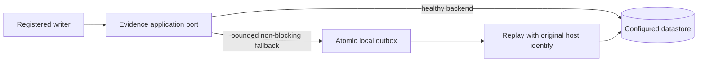

# Run Log Datalake operations guide

> **Status (2026-08-08):** Documentation baseline only. The Rubicon Run Log
> Datalake is not yet provider-readback verified as cut over. Treat the
> filesystem evidence path as the current operational source until AGE-154,
> AGE-155, AGE-156, and AGE-157 have independent terminal receipts.

## Audience and ownership

- **Audience:** Agentic OS operators and maintainers diagnosing run evidence.
- **Owner:** Agentic OS platform maintainers (Rubicon: Run Log Datalake).
- **Freshness:** Re-verify after every cutover, migration, retention-policy, or
  provider change; the `Status` line is the freshness marker.
- **Source of truth:** The installed Agentic OS source and its provider-read
  receipts. This page is an operator projection, not a replacement for those
  sources.

## What the datalake will do

The target design stores canonical run, conversation, watcher, alert,
heartbeat, report, and test evidence behind a provider-neutral application
port. MongoDB is an adapter, not lifecycle or queue authority. Evidence must
retain originating host identity and remain queryable without exposing
credentials or private local paths.

## Current behavior and safe operator posture

1. Use the existing filesystem run-log and receipt surfaces for current
   incident reconstruction.
2. Do not claim MongoDB cutover, historical coverage, retention enforcement,
   cleanup, or analytics completeness without an exact provider readback.
3. Do not delete filesystem evidence. Cleanup requires an import manifest,
   count/integrity comparison, rollback plan, and independent readback.
4. Keep examples and external links public-safe; never copy secrets, tokens,
   customer data, or machine-local paths into an operator page.

## Target write and outage flow

The caller must remain within the configured ingress bound during backend
outage. Replay is idempotent and must produce a receipt before any cleanup is
considered.

## Required evidence before this page is marked current

The operator-facing Notion child page and this source page may be marked
current only after the following are independently read back:

- query service parity across CLI, API, and MCP (AGE-154);
- writer cutover and outage/replay behavior (AGE-155);
- per-model retention, holds, compaction, and cleanup receipts (AGE-156);
- historical migration coverage and guarded filesystem cleanup (AGE-157);
- host attribution, source revision, installed-runtime revision, and owner;
- provider identity, parent, title, rendered headings, and content.

Until then, this document intentionally describes the boundary and the
verification gate rather than planned behavior as deployed behavior.
