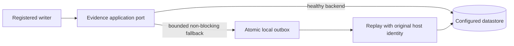

# Run Log Datalake operations guide

> **Status (2026-08-08):** Documentation baseline only. The Rubicon Run Log
> Datalake is not yet provider-readback verified as cut over. Treat the
> filesystem evidence path as the current operational source until AGE-154,
> AGE-155, AGE-156, and AGE-157 have independent terminal receipts.

## Audience and ownership

- **Audience:** Agentic OS operators and maintainers diagnosing run evidence.
- **Owner:** Agentic OS platform maintainers (Rubicon: Run Log Datalake).
- **Freshness:** Re-verify after every cutover, migration, retention-policy, or
  provider change; the `Status` line is the freshness marker.
- **Source of truth:** The installed Agentic OS source and its provider-read
  receipts. This page is an operator projection, not a replacement for those
  sources.

## What the datalake will do

The target design stores canonical run, conversation, watcher, alert,
heartbeat, report, and test evidence behind a provider-neutral application
port. MongoDB is an adapter, not lifecycle or queue authority. Evidence must
retain originating host identity and remain queryable without exposing
credentials or private local paths.

## Current behavior and safe operator posture

1. Use the existing filesystem run-log and receipt surfaces for current
   incident reconstruction.
2. Do not claim MongoDB cutover, historical coverage, retention enforcement,
   cleanup, or analytics completeness without an exact provider readback.
3. Do not delete filesystem evidence. Cleanup requires an import manifest,
   count/integrity comparison, rollback plan, and independent readback.
4. Keep examples and external links public-safe; never copy secrets, tokens,
   customer data, or machine-local paths into an operator page.

## Target write and outage flow

```mermaid
flowchart LR
  W[Registered writer] --> P[Evidence application port]
  P -->|healthy backend| D[(Configured datastore)]
  P -->|bounded non-blocking fallback| O[Atomic local outbox]
  O --> R[Replay with original host identity]
  R --> D
```

The caller must remain within the configured ingress bound during backend
outage. Replay is idempotent and must produce a receipt before any cleanup is
considered.

## Required evidence before this page is marked current

The operator-facing Notion child page and this source page may be marked
current only after the following are independently read back:

- query service parity across CLI, API, and MCP (AGE-154);
- writer cutover and outage/replay behavior (AGE-155);
- per-model retention, holds, compaction, and cleanup receipts (AGE-156);
- historical migration coverage and guarded filesystem cleanup (AGE-157);
- host attribution, source revision, installed-runtime revision, and owner;
- provider identity, parent, title, rendered headings, and content.

Until then, this document intentionally describes the boundary and the
verification gate rather than planned behavior as deployed behavior.

## Atomic outbox building block (AGE-153, implementation in progress)

The provider-neutral `run_evidence.outbox.FilesystemOutbox` is a local recovery
buffer. It is not connected to production writers. A configurable asynchronous
ingress building block is described below; full acceptance validation remains
part of AGE-153. Existing writer behavior is unchanged.

- `put(record)` returns a durable envelope key only after a private atomic file
  write, file fsync and directory fsync. An exception is not an acknowledgement.
- Explicit `OutboxPolicy` bounds count, bytes, individual envelopes, replay batch,
  lease duration and retry budget. One item slot and one maximum-sized record
  are reserved for atomic updates. Quarantine and interrupted temporary files
  consume the same quota; full or busy storage raises a visible typed error.
- Replay claims use unique fencing tokens and expiring leases. Provider I/O
  occurs after releasing the local lock. Expired workers cannot retire another
  worker's claim. Restarted workers can replay previously durable records.
- Replay persists through `RunLogStore`, reads back identity and content through
  that same port, and only then removes the local envelope. Failed writes or
  mismatched readback retain evidence, use capped backoff and eventually
  quarantine. The error code never includes raw provider diagnostics.
- Original timestamps, host, correlation, work/run identity and payload metadata
  stay in the frozen envelope. Replay atomically renames corrupt envelopes to
  unique quota-counted quarantine files and preserves their exact bytes. A
  poison record cannot block healthy replay. Filesystem permission and I/O
  failures remain visible errors, not malformed-data classifications.
- `status()` reports count, bytes, pending/claimed/quarantined items, interrupted
  temporary files and oldest age. Nothing prunes retained evidence automatically.

Use only an owned local directory with cooperative writers. Network filesystems,
malicious local file replacement, arbitrary blocked provider calls and end-to-end
production producer latency are not validated by this
building block. No live outbox or datastore is needed for its tests.

Run `tests/test_run_evidence_outbox.py` with a fresh item-owned pytest temporary
root. It covers restart, process exit, duplicate persistence, lease fencing,
concurrent-process quota enforcement, readback mismatch, backoff/quarantine,
fsync failures, serialization, capacity and private file permissions. Existing
port and MongoDB adapter conformance tests remain adjacent regression coverage;
a live disposable MongoDB profile is a separate opt-in gate.

## Bounded ingress building block (AGE-153, implementation in progress)

Inject the application-facing `EvidenceWriter` port into producers.
`build_evidence_writer(root, store, host_ids=...)` binds the canonical ingress
configuration to an injected `RunLogStore` and starts one worker. It does not
cut over existing writers, schedule replay or alter live installation state.

Input size and JSON validity are checked before identity normalization copies
or hashes the record. The configured model payload limit also applies before
acceptance. Cyclic input, non-integer schema versions and excessive payloads
raise `IngressError` without enqueueing or creating an envelope. Configuration
must select an outbox directory strictly inside the selected OS root; absolute,
parent-traversal and escaping symlink paths fail before directory creation.

### Configuration consumer inventory and tenant impact matrix

The inventory search covers `src/`, `harness/`, `schemas/`, `setup.py`, and the
run-evidence tests for `run-evidence.yml`, `load_run_evidence_config`,
`load_run_log_store_config`, and `build_evidence_writer`. The canonical registry
lists every planned producer under `writers`; AGE-155 owns those cutovers.

| Consumer and owner | Previous configuration | Canonical configuration | Meaningful runtime proof |
| --- | --- | --- | --- |
| `run_evidence_config.load_run_evidence_config`, configuration owner | Legacy five ingress keys remain schema-valid | Four additional safety keys are validated | Both shapes retain the complete model/writer registry |
| `run_evidence.store.load_run_log_store_config` and store construction, evidence-store owner | Backend, host, model and provider selections retain their shape | Selection remains identical | Legacy fixture writes and reads back a non-empty record through the actual store consumer |
| `run_evidence.ingress.build_evidence_writer`, ingress owner | Explicit construction failure for missing overflow/record/outbox bounds | Starts one worker with selected queue and filesystem limits | Canonical fixture submits, flushes and observes a durable matching record; missing and escaping paths fail visibly |
| `scaffold.py` package template installer, installer owner | Existing user configuration is preserved | Fresh scaffolds receive the additional defaults | Adjacent registry scaffold tests execute template installation and validate the installed registry |
| `validate.py` schema validation, validator owner | Old registry stays valid | New registry stays valid | Adjacent registry tests execute the schema consumer for valid and invalid registries |
| Registered producer families, respective `writers.*.owner` | Current filesystem behavior remains | No automatic ingress construction or writer cutover | Inventory conformance test compares actual evidence writers with registered owners and paths |

Backward compatibility preserves the legacy registry for its existing
consumers. A legacy ingress upgrade is coordinated before opting a producer
into the new writer: supply `overflow_policy`, `max_record_bytes`,
`max_outbox_items`, and `max_outbox_bytes` explicitly. The constructor never
silently chooses a durability/drop policy or rewrites user configuration.
This is new opt-in construction, so no existing producer loses a previously
supported call. Payload field nesting and stored correlation/host identity
remain unchanged.

Tenant impact is limited to the explicitly selected OS root. No remote tenant
configuration is changed by this library slice. The matrix classifies fresh
roots as compatible, legacy roots as compatible for existing readers/stores
and blocked for new ingress until configured, and existing producers as
unaffected pending AGE-155. Customer-specific overrides and live writer
cutover require separate execution receipts before activation; this source
matrix does not claim a live tenant inventory.

`tests/test_run_evidence_ingress.py` executes the legacy and canonical
configuration consumers, asserts persisted record content and visible empty/
invalid configuration failures, and uses separate-process abrupt-exit tests
for durable unavailable-ingress and background-outage acknowledgements.
The local MongoDB-unavailability test uses the real PyMongo deadline against
an owned unavailable loopback endpoint. Healthy/partial-network MongoDB
acceptance still requires the opt-in disposable-provider integration gate.

Submission validates the model, schema, classification and locally supplied
host set, freezes mutable input and enqueues without datastore I/O. One bounded
batch runs in the background. The MongoDB adapter owns a total PyMongo deadline
covering the batch and its readbacks. A partial or uncertain result sends the
whole batch through idempotent durable fallback.

| Returned status | Meaning | Caller action |
| --- | --- | --- |
| `queued` | Accepted in memory; not durable and vulnerable to process exit | Retain source evidence until completion when durability is required |
| `persisted` | Provider write and matching readback completed | Receipt reports durable; `persisted_id` resolves the verified provider record |
| `outboxed` | Atomic local envelope and directory fsync completed | Receipt reports durable; `outbox_key` identifies the retained envelope for explicit recovery |
| `dropped` | Local fallback failed, including capacity or permission failure | Receipt reports non-durable and a sanitized error code; caller must handle loss |
| `IngressError` | Validation failed or configured rejection applies | Nothing was accepted |

`record_id` always identifies the frozen submission. Idempotent duplicates can
converge to an earlier provider record with a different ID. After `wait(...)`
completes with `persisted`, use `persisted_id` with the store's `get` method.
It is populated only after every record in the batch passes provider readback
and remains `None` for queued, outboxed and dropped submissions. An outboxed
receipt acknowledges local durability and exposes `outbox_key` after fsync.
Same-content outbox duplicates share that key even when submitted IDs differ.
Recovery uses the key on `OutboxClaim` and its retained record identity; a later
explicit replay does not update the original receipt or claim a provider
identity across process restarts. Queued, persisted and dropped receipts have
no `outbox_key`.

Queue saturation, absent ingress and closed ingress use the configured
`overflow_policy`: `outbox` performs local durable fallback; `reject` raises
without accepting. Local fsync is synchronous and operating-system I/O can
stall. No hard wall-clock bound for a stalled filesystem is claimed.

The canonical `ingress` configuration controls queue capacity, batch size,
flush interval, write timeout, overflow policy, maximum record bytes, outbox
items and outbox bytes. Older configuration remains readable by existing
consumers, but constructing the new writer requires explicit overflow and
outbox bounds; missing bounds fail with an actionable configuration error.

`close(timeout_seconds=...)` wakes a partial batch and waits to the caller's
finite deadline. Its `drained` and `pending` fields distinguish completion
from a timed-out shutdown. It cannot forcibly cancel a nonconforming injected
provider. Do not interpret a timed-out close as a durable acknowledgement.

`status()` exposes bounded counters, queue/in-flight sizes, batch latency,
last successful write and outbox count/bytes/age/quarantine. Explicit
`replay(limit=...)` applies the provider deadline and records replay/retry
counts. Corrupt envelopes remain retained for operator recovery; there is no
implicit deletion of dead letters.

Use `tests/test_run_evidence_ingress.py` alongside the outbox and store tests.
These exercise healthy batching, frozen payloads, blocked-provider producer
latency, saturation, partial write recovery, shutdown, invalid input, local
storage failure, readback mismatch and bounded single-worker stress. Source
fixtures and the isolated in-memory package smoke do not establish real MongoDB
deadline behavior, production acceptance or writer cutover.
