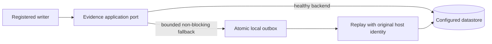

# Run Log Datalake operations guide

> **Status (2026-08-08):** Documentation baseline only. The Rubicon Run Log
> Datalake is not yet provider-readback verified as cut over. Treat the
> filesystem evidence path as the current operational source until AGE-154,
> AGE-155, AGE-156, and AGE-157 have independent terminal receipts.

## Audience and ownership

- **Audience:** Agentic OS operators and maintainers diagnosing run evidence.
- **Owner:** Agentic OS platform maintainers (Rubicon: Run Log Datalake).
- **Freshness:** Re-verify after every cutover, migration, retention-policy, or
  provider change; the `Status` line is the freshness marker.
- **Source of truth:** The installed Agentic OS source and its provider-read
  receipts. This page is an operator projection, not a replacement for those
  sources.

## What the datalake will do

The target design stores canonical run, conversation, watcher, alert,
heartbeat, report, and test evidence behind a provider-neutral application
port. MongoDB is an adapter, not lifecycle or queue authority. Evidence must
retain originating host identity and remain queryable without exposing
credentials or private local paths.

## Current behavior and safe operator posture

1. Use the existing filesystem run-log and receipt surfaces for current
   incident reconstruction.
2. Do not claim MongoDB cutover, historical coverage, retention enforcement,
   cleanup, or analytics completeness without an exact provider readback.
3. Do not delete filesystem evidence. Cleanup requires an import manifest,
   count/integrity comparison, rollback plan, and independent readback.
4. Keep examples and external links public-safe; never copy secrets, tokens,
   customer data, or machine-local paths into an operator page.

## Target write and outage flow

```mermaid
flowchart LR
  W[Registered writer] --> P[Evidence application port]
  P -->|healthy backend| D[(Configured datastore)]
  P -->|bounded non-blocking fallback| O[Atomic local outbox]
  O --> R[Replay with original host identity]
  R --> D
```

The caller must remain within the configured ingress bound during backend
outage. Replay is idempotent and must produce a receipt before any cleanup is
considered.

## Per-model payload byte boundary

`RunLogStore.append`, `append_many`, and `import_idempotently` validate payloads
at the provider-neutral store boundary. The in-memory contract store and MongoDB
adapter use the same `validate_payload` implementation. A model must declare a
positive integer `max_payload_bytes`; manually constructed legacy configurations
without that value fail closed on writes. Canonical registry configurations
already require this field.

The byte convention is JSON encoding with `allow_nan=False`, `ensure_ascii=True`,
comma-space and colon-space separators, encoded as UTF-8. Count the payload
object alone, excluding the record envelope and `payload_metadata`. ASCII
escaping means `\u00e9` counts as six bytes and a non-BMP character counts as its
two six-byte surrogate escapes. Quotes, backslashes, and control-character
escapes count as serialized. A payload exactly at the configured limit is
accepted; one byte over is rejected. Ingress may additionally impose a smaller
total-record bound that includes envelope metadata.

Validation freezes a JSON snapshot before hashing or persistence. Every batch
and import member is validated before the first record write, and persistence
reuses these snapshots instead of re-reading caller-owned payloads. This is
prevalidation atomicity, not a transaction guarantee against a later provider
outage. Existing content-hash idempotency remains unchanged for valid JSON;
duplicate identifiers or hashes never exempt a new payload from validation.
JSON object-key coercion collisions are rejected instead of dropping fields.
Payloads must contain valid Unicode scalar values after JSON decoding; lone
surrogates and invalid outer payload types are permanent invalidity even when a
caller supplies an existing content hash.

`PayloadValidationError` reports sanitized `payload_too_large` or
`invalid_payload_json` codes with `retryable=False`. Invalid values, non-finite
numbers, cycles, and oversized payloads are permanent failures. They are not
provider outages and must not be retried, truncated, or stripped of fields.

Ingress parity is an explicit dependency on unmerged
[PR #292](https://github.com/michaelwclark/genomes_agentic_os/pull/292), revision
`bbd06ee9a79909279104fa0f1ba396e1ea2f12b7`. Its actual `BufferedEvidenceWriter`
consumer uses this same serialization convention. A disposable conformance
fixture can load that immutable dependency against the changed store; this
does not merge, install, or cut over ingress. Each conformance receipt must name
the store revision, dependency revision, consumer, configured limit, convention,
and provider type. Fake-driver parity does not satisfy the separate disposable
live MongoDB healthy/partial-network conformance gate owned by AGE-153.

Historical oversized records remain intact and readable. Before AGE-155 producer
cutover or historical import, scan without mutating evidence, record per-model
counts and byte sizes using this convention, and obtain the owner's disposition
for oversized or invalid records. Preserve their originals and record explicit
pending/rejected import items; never silently truncate, discard, replay, or
delete them. A blocked member prevents that whole batch from starting. Any
approved change to a model's limit belongs in the canonical registry and needs
its own compatibility evidence. This source change alone does not authorize a
producer cutover or claim historical migration acceptance.

## Required evidence before this page is marked current

The operator-facing Notion child page and this source page may be marked
current only after the following are independently read back:

- query service parity across CLI, API, and MCP (AGE-154);
- writer cutover and outage/replay behavior (AGE-155);
- per-model retention, holds, compaction, and cleanup receipts (AGE-156);
- historical migration coverage and guarded filesystem cleanup (AGE-157);
- host attribution, source revision, installed-runtime revision, and owner;
- provider identity, parent, title, rendered headings, and content.

Until then, this document intentionally describes the boundary and the
verification gate rather than planned behavior as deployed behavior.
