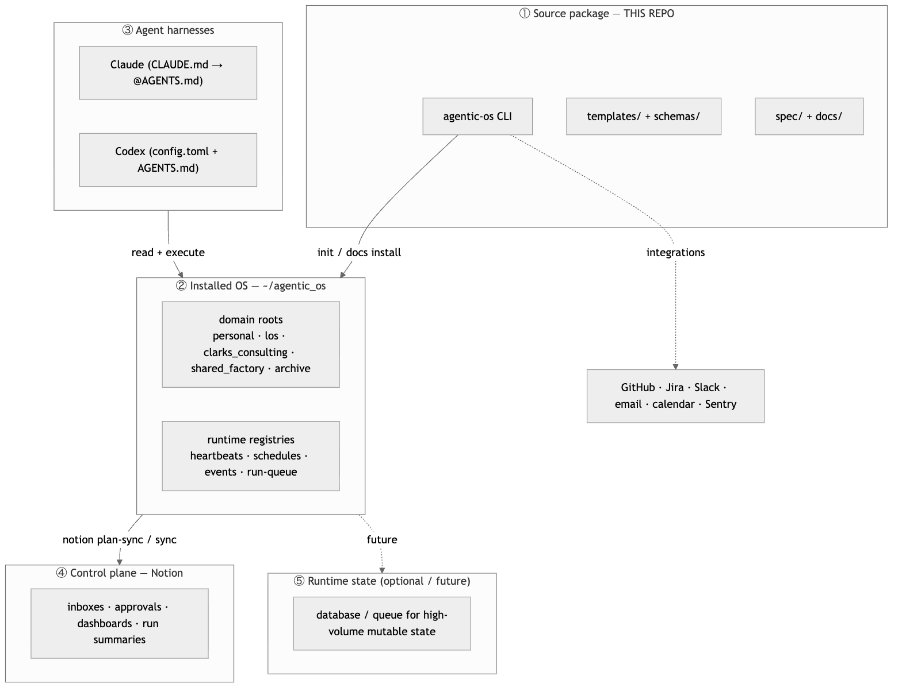
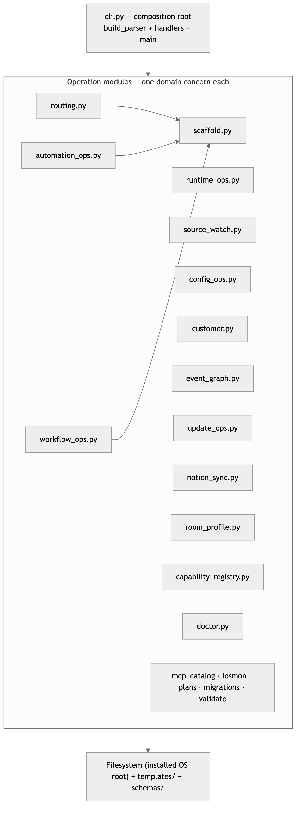

# System Architecture — Genome's Agentic OS

> **Audience:** any agent or engineer about to change this repo. Read this before
> writing code. It explains what the system *is*, how its parts relate, and the
> rules that keep it coherent. When in doubt, match what is described here rather
> than inventing a new pattern.

---

## 1. North star: the Model Workspace Protocol (MWP)

This project is a concrete, installable implementation of the **Model Workspace
Protocol** described in *"Interpretable Context Methodology: Folder Structure as
Agentic Architecture"* (Van Clief & McDermott, arXiv:2603.16021, Mar 2026).

The paper's thesis: for **sequential, human-reviewed workflows**, you do not need
a code-level multi-agent framework. You can replace framework orchestration with
**filesystem structure**:

| MWP idea | How this repo realizes it |
| --- | --- |
| Numbered folders are stages | `00-control-plane` → `01-inbox` → `02-projects` → `03-workflows` → `04-automations` → `05-knowledge` → `06-runs-and-logs` → `07-metrics` → `08-archive` |
| Markdown files carry the prompt/context for each step | `ROUTER.md`, `AGENTS.md`, `CONTEXT.md`, `RULES.md`, `TOOLS.md` at every routeable layer |
| Local scripts do the mechanical, non-AI work | The `agentic-os` Python CLI (scaffolding, validation, routing, registries) |
| One agent reading the right files at the right moment | The routing loop: read `ROUTER.md` → route to the narrowest layer → re-read context after `cd` |

**Design consequence that governs everything:** the *filesystem is the
architecture*. The CLI's job is to create, validate, and navigate that structure
deterministically — not to be a runtime that "owns" state in memory.

---

## 2. The five-layer runtime model

Genome's Agentic OS deliberately separates concerns across five planes. Confusing
these layers is the most common way to make a mess.



<!-- Diagram source: docs/architecture/diagrams/atlas-five-layer.mmd (gitignored). Regenerate: bash docs/architecture/tools/render-diagrams.sh -->

| Layer | Source of truth | Owns |
| --- | --- | --- |
| ① Source package (this repo) | git | Reusable specs, templates, schemas, CLI scaffold logic, docs |
| ② Installed OS (`~/agentic_os`) | filesystem | Live domains, routers, workflow/automation specs, context packs, run logs, runtime registries |
| ③ Harnesses (Claude, Codex) | their own config | Reading OS specs and executing workflows |
| ④ Control plane (Notion) | Notion (mirror) | Human cockpit: intake, approvals, dashboards, status. **Files remain authoritative.** |
| ⑤ Runtime state (future) | DB/queue | High-volume mutable state, locks, dedupe, replay, matching |

**Rule:** the filesystem (②) is always the operational source of truth. Notion (④)
is a *projection*. The database (⑤) is a *future* plane for when file-based state
stops scaling — it is not required for V1.

---

## 3. The object hierarchy

```text
Domain                      (personal, work, archive, … plus harness/shared_factory)
  └─ Lane / workstream      (engineering, marketing, sales, support, operations,
                             finance, personal_admin, learning)
      └─ Workflow           (a reusable, human-reviewed procedure spec)
          └─ Automation     (a qualified workflow promoted to recurring/triggered)
              └─ Run         (one execution, with a run log)
                  └─ Artifact (the durable output of a run)
```

Every domain gets the identical numbered skeleton (`00-control-plane` …
`08-archive`). This uniformity is the point: an agent that learns one domain can
operate any domain.

---

## 4. Python package architecture

The CLI is a single Python package (`src/genomes_agentic_os/`, ~10k LOC). It is
**not** the TS/hexagonal reference architecture used in Ledgerline/Losmon — it is a
**layered functional CLI**. The philosophy is the same (explicit naming, strict
separation, dependencies passed in, no hidden globals); the mechanism is Pythonic
(modules of pure functions, argparse composition root).

The apparent repeated name is the standard Python `src` layout: `src/` is an
import-isolation root, while `genomes_agentic_os/` is the importable package.
This prevents a checkout from accidentally shadowing the installed package
during tests. See [`../../src/README.md`](../../src/README.md) for the short
navigation guide.

### 4.1 Layering



<!-- Diagram source: docs/architecture/diagrams/atlas-package-layers.mmd (gitignored). Regenerate: bash docs/architecture/tools/render-diagrams.sh -->

**Dependency rule:** `cli.py` depends on the ops modules; ops modules depend on
`scaffold.py` for shared primitives (`expand_path`, `normalize_domain`,
`validate_name`, the `*_FILES` constants) and on the filesystem. Ops modules
should not import `cli.py`. There is no circular dependency. New shared primitives
belong in `scaffold.py`, not a new `utils.py`.

### 4.2 Module responsibility map

| Module | LOC | Responsibility |
| --- | --- | --- |
| `scaffold.py` | 2105 | **Filesystem scaffolding.** Domain/lane/file constants (`DEFAULT_DOMAINS`, `STANDARD_LANES`, `WORKFLOW_FILES`, `AUTOMATION_FILES`), `.agentic_root` marker, template rendering, `init`/domain/project creation. The backbone. |
| `runtime_ops.py` | 1186 | **Runtime registries.** Heartbeats, schedules, integrations, the run-queue, and `run-next` dispatch. File-backed; dry-run by default. |
| `cli.py` | 1176 | **Composition root.** `build_parser()` declares every command; `handle_*` functions adapt args → ops calls; `main()` dispatches. The one place wiring lives. |
| `source_watch.py` | 665 | **Connected sources.** `connected-system` + `watch-source` registries, cursors, polling. |
| `activity_ingestion.py` | — | **Operator analytics ingestion.** Opt-in provider adapters, metadata-only event envelopes, durable cursors, dedupe, metric bindings, and source health. |
| `config_ops.py` | 720 | **Codex `config.toml`.** Per-layer install/doctor plus routed tree install with conflict-aware merge. |
| `customer.py` | 734 | **Customer-OS factory.** Renders a client OS (router/context/rules/tools/assets) from a profile. |
| `event_graph.py` | 582 | **Event ledger + chains.** Append-only event log, declarative chain rules, idempotency keys, chain-depth loop guard, run-queue emission. |
| `validate.py` | 510 | **Structural validation.** Confirms an installed root has the expected shape; parses YAML/JSON. |
| `update_ops.py` | 454 | **Update & backup.** Grants/keys, plan/apply/rollback, `phone-home` heartbeat payload. |
| `capability_registry.py` | 331 | **Visible capability registry.** Commands, skills, MCP servers, libraries, hooks, plugins, rules → registry YAML + inventory markdown. |
| `routing.py` | — | **Deterministic routing.** `ContextPacket` assembly, `route_request`, `context_from_here`, `RISK_KEYWORDS` approval detection. No LLM. |
| `context_contracts.py` | — | **Context inheritance.** Versioned manifest parsing, parent/source provenance, duplicate suppression, and central provider-route resolution. |
| `context_compaction.py` | — | **Context migration analysis.** Bounded duplicate scans plus deterministic dry-run and rollback plans; never deletes. |
| `report_engine.py` | — | **First-class reports.** Versioned definition/run/artifact registries, rich sections, explicit source/projection evidence, governed lifecycle/run actions, and consolidation plans. |
| `automation_ops.py` | 282 | **Automation maturity.** Readiness checks + the `observe→prepare→propose→execute_approved→execute_guarded` ladder + project attachment. |
| `workflow_ops.py` | 278 | **Workflow readiness + run closeout.** Required-section checks, `run-log close` audit writes. |
| `workflow_engine.py` | — | **Governed workflow authoring.** Typed definition/version/instance/run projections, field-addressable validation, drift-safe create/update/publish, exact readback, rollback, and queue-only run requests. |
| `notion_sync.py` | 261 | **Notion projection.** Build/apply a reviewable filesystem→Notion sync plan. |
| `room_profile.py` | 238 | **Room-first profiles.** Profile templates + validation for profile-driven installs. |
| `mcp_catalog.py` | 208 | **MCP catalog.** Known MCP servers for the capability registry/tools layer. |
| `doctor.py` | 127 | **Health checks.** Workflow/automation/active-work/project/run-log findings; `--fix-missing` repair. |
| `losmon.py` | 116 | **LOSMon replacement validation** scaffolding. |
| `plans.py` | 111 | **Future-idea capture** into the right OS location. |
| `migrations.py` | 105 | **Migrations.** Reviewable plan/apply for installed-root upgrades. |

---

## 5. Dependency injection model (how state flows)

There is **no DI framework and no module-level mutable global**. The pattern is
*explicit parameter passing* — the functional analogue of the AppContext pattern:

- The **`--root`** path is the primary injected dependency. Every ops function
  takes `root` explicitly; nothing reads a global "current OS."
- The **`.agentic_root`** marker file (TOML) carries install-scoped config
  (`update_channel`, `update_policy`, and project link scope). It is read from the
  root, never cached in a singleton.
- The **`config.toml`** (Codex) and **profile YAML** are *data dependencies*
  resolved once at the edge (a CLI handler) and passed down — never re-read deep
  in the call tree.
- Handlers in `cli.py` are the composition root: they parse args, resolve the
  root, and call ops functions with explicit arguments. Ops functions are pure
  with respect to their inputs + the filesystem.

**Rule for new code:** take what you need as an argument. If a function needs the
root, pass `root`. Do not introduce a global config object, a singleton client, or
an import-time side effect.

---

## 6. Event emission & reaction model

This is the closest thing to an "event bus," but it is **file-backed and
deterministic**, consistent with MWP (state lives in files, not memory).


<!-- Diagram source: docs/architecture/diagrams/atlas-event-flow.mmd (gitignored). Regenerate: bash docs/architecture/tools/render-diagrams.sh -->

Key files (all under `shared_factory/00-control-plane/` and
`shared_factory/06-runs-and-logs/events/`): `event-graph.yml`, `chain-rules.yml`,
`event-cursors.yml`, `run-queue.yml`, `event-ledger-index.md`, plus `dead-letter/`
and `processing-results/`.

Guarantees built into `event_graph.py`:
- **Idempotency** — `rule_idempotency_key(rule, event)` prevents duplicate queueing. Already-seen matches are recorded with status `skipped` (not dead-lettered).
- **Loop protection** — `event_chain_depth(event)` caps chain reactions; events past the depth limit are `skipped`. `dead-letter/` is reserved for malformed *enabled* rules (missing `id`/`enqueue`), not for depth/dedupe.
- **Safety** — reactions only *queue* runs; execution is gated by automation
  maturity + approval rules. Nothing fires an external side effect implicitly.

**Rule:** emit events for cross-concern reactions (a source change should trigger a
review). Do *not* invent an in-process pub/sub; append to the ledger and add a
chain rule. If a caller needs an immediate result, call the function directly.

---

## 7. Deterministic routing

`routing.py` answers "where does this request belong?" with **no model call**:

- `detect_from_cwd(root, cwd)` — if you're inside a domain/project, infer from the path.
- `detect_from_request(root, request)` — match request text against known domains/projects/lanes.
- `route_request(...)` returns a **`ContextPacket`**: `domain, lane, object_type,
  target_path, sources_to_load, approval_risks, known_gaps, handoff_prompt`.
- `RISK_KEYWORDS` flags approval risks in the request (e.g. `send`, `deploy`,
  `delete`, `billing`, `customer`, `secret`) so risky work surfaces an approval gate.
- Low-confidence matches **refuse** (exit 2: "routing confidence is low") rather
  than guess — a deliberate guardrail.

The `ContextPacket` is the contract handed to a harness: the minimal, ordered set
of files to load plus the risks and gaps. This is MWP's "right files at the right
moment," computed deterministically.

---

## 8. Conventions that are enforced (not optional)

| Convention | Enforced where | Consequence if violated |
| --- | --- | --- |
| **snake_case names** (lowercase, digits, `_`) for domains/lanes/workflows/automations/projects | `scaffold.validate_name` | Command errors: "must use lowercase letters, numbers, and underscores only" |
| **Exit codes**: `0` ok · `1` health "not ok" · `2` usage error *or* deliberate refusal | `cli.main` | A non-zero exit is often a guardrail, not a crash. |
| **`--root` defaults to `~/agentic_os`** | every handler | Always pass `--root` in scripts/tests to avoid touching the real install. |
| **Dry-run by default** for runtime/notion/backup effects | `runtime_ops`, `notion_sync`, `update_ops` | Must pass `--apply` to mutate; `--dry-run` previews. |
| **`run-log close --status done` requires `--validation`** | `workflow_ops` | Audit gate: cannot close "done" without evidence. |
| **`backup run` requires `update register` first** | `update_ops` | Needs an update grant in `registries/`. |
| **`CLAUDE.md` is a thin include** (`@AGENTS.md`) | templates + installer | Don't duplicate instructions into `CLAUDE.md`. |

---

## 9. How to extend without making a mess

Adding a **new command**:
1. Add the subparser + flags in `cli.py:build_parser()` (match sibling command style).
2. Add a `handle_<command>(args)` function (thin adapter: resolve root, call ops, print result).
3. Put the real logic in the matching `*_ops.py` module (or a new `<concern>_ops.py` if it's a genuinely new concern). Functions take `root` and data explicitly.
4. If it creates files, add the template under `templates/` and a schema under `schemas/` if structured.
5. If it adds a tool/skill/command an agent should *see*, register it in `capability_registry.py`.
6. Keep names snake_case; keep effects dry-run-by-default if they touch external systems.
7. Add a test under `tests/`.

Adding a **new domain/lane/workflow/automation**: use the CLI (`domain create`,
`project create`, the `templates/workflow/*` and `templates/automation/*` files),
never hand-roll a divergent folder shape — `doctor` and `validate` will flag drift.

**Anti-patterns to reject:** a new `utils.py` dumping ground; an in-process event
bus; a module-level singleton or import-time side effect; reading config deep in
the call tree; non-deterministic routing; a workflow/automation folder that
doesn't match `WORKFLOW_FILES`/`AUTOMATION_FILES`.

---

## 10. Where to look next

- **Command reference (every flag + real example):** [`command-reference.md`](command-reference.md)
- **What's validated vs designed-but-not-running:** gap statuses in
  [`../18-troubleshooting-and-faq.md`](../18-troubleshooting-and-faq.md) (Part B;
  the retired atlas gap register survives in git history at
  `.agentic-atlas/gap-register.md`)
- **Re-run the validation harness (regenerates real command output):**
  `bash docs/architecture/tools/validate-cli.sh` — receipts land in gitignored `.validation/`
- **Upstream specs (intent):** `spec/architecture.md`, `spec/product-spec.md`, `spec/harness-context-contract.md`
