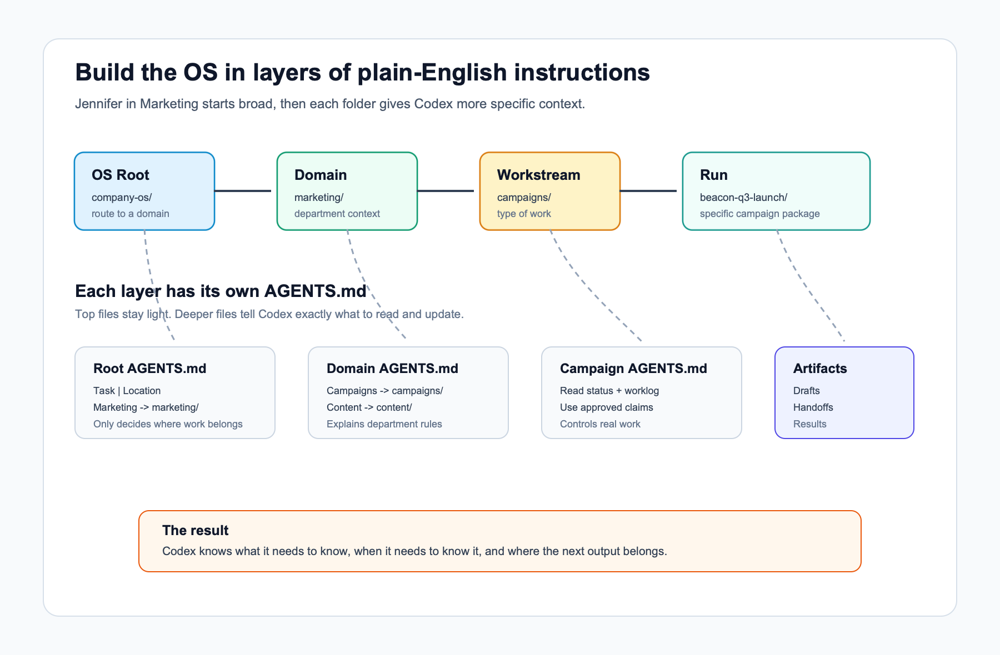

# Building an Agentic OS with plain-English AGENTS.md files



## Why This Article Exists

Most people do not struggle with AI because they lack ideas.

They struggle because every new AI session begins with the same hidden tax: explaining the business, the project, the customer, the files, the rules, the last decision, and the next step.

That is fine for a one-off question. It breaks down when the work spans days, departments, handoffs, reviews, approvals, and follow-up tasks. A marketing campaign moves from research to messaging to sales enablement. A customer support issue moves from intake to investigation to response templates. A sales opportunity moves from discovery notes to proposal language to follow-up assets.

The work has structure. The AI session usually does not.

This article shows how to fix that by organizing your files into a small "agentic operating system": folders plus plain-English `AGENTS.md` files that tell an AI assistant where it is, what matters there, what tools or references to use, and what it should leave behind for the next session.

This is not an engineering-only pattern. It is for people in Marketing, Sales, Customer Support, Operations, and leadership roles who want AI help that gets more reliable over time instead of resetting every time a new chat starts.

By the end, you should understand how to:

- break recurring work into clear domains, workstreams, workflows, and runs
- write simple `AGENTS.md` files that guide Codex, Claude Code, or a similar agentic harness
- keep context close to the work instead of trapped in chat history
- make handoffs easier between people, teams, and AI sessions
- leave a trail the next assistant can actually use

The overall idea is simple: do not ask the assistant to remember everything. Put the right instructions and context in the right folders so the assistant can find what it needs when it needs it.

Instead of one giant prompt, create a lightweight operating structure:

- folders for different areas of work
- plain-English `AGENTS.md` files that explain what happens in each folder
- reference files for stable facts and rules
- worklogs and handoffs for what changed
- outputs that the next person or assistant can reuse

The methods explained here are built on top of academic research about context engineering and many years of software development practice: small files, clear responsibilities, readable handoffs, review checkpoints, and durable outputs.

You do not need to be technical to use the pattern. You just need to make the work easy for the assistant to find, understand, continue, and improve.

## The Example We Will Use

This article uses a fictional example with Jennifer in Marketing and Theodore in Sales.

Jennifer wants AI help with campaigns, content, launches, and sales handoffs. Theodore needs to pick up the final campaign message without asking Jennifer to explain every draft, decision, and customer note again.

Jennifer and Theodore are made-up employees for the sake of illustration. They are placeholders for the real people and teams in your organization who need to hand work back and forth without losing context.

For Codex, the file that teaches the assistant how to operate in a folder is `AGENTS.md`.

The research idea behind this is simple: do not make the AI assistant hold the whole company in its head. Break work into logical areas. Put plain-English instructions in each area. Let the assistant read the instructions for the place it is standing in.

## The Agentic Loop

An agentic harness works best when the loop is explicit:

| Step | What The Assistant Does | What The Folder Provides |
| --- | --- | --- |
| 1. Orient | Figures out where it is and what kind of work this is | `AGENTS.md`, status files, routing tables |
| 2. Gather Context | Reads only the files needed for the current task | reference files, worklogs, decisions, open questions |
| 3. Act | Produces or updates the requested work | drafts, handoffs, reports, checklists |
| 4. Review | Shows what changed and what needs human approval | summary, changed files, open questions |
| 5. Record | Leaves the next session better informed | `WORKLOG.md`, `DECISIONS.md`, updated status |
| 6. Route Next | Points to the next folder, team, or workflow | handoff files and next-step notes |

Most failed AI work skips the first two steps and the fifth step. The assistant starts acting before it understands the situation, then finishes without leaving a useful trail.

The goal of an Agentic OS is to make the loop repeatable:

```text
Orient -> Gather Context -> Act -> Review -> Record -> Route Next
```

Every `AGENTS.md` file should help the assistant move through that loop.

## The Idea In One Table

| Level | Plain-English Meaning | Example |
| --- | --- | --- |
| OS Root | The front door. It routes work to the right department. | `company-os/AGENTS.md` |
| Domain | A department or major area of work. | `marketing/AGENTS.md` |
| Workstream | A type of work inside the department. | `campaigns/`, `content/`, `events/` |
| Workflow | A repeatable process. | `campaign-launch/` |
| Run | One specific execution of that workflow. | `beacon-q3-launch/` |
| Artifact | A durable output from the run. | `SALES-HANDOFF.md`, `EMAIL-SEQUENCE.md` |

You do not need all of this on day one. Start with the root, one domain, and one workflow.

## Example Folder Shape

```text
company-os/
  AGENTS.md

  marketing/
    AGENTS.md

    campaigns/
      AGENTS.md

      beacon-q3-launch/
        AGENTS.md
        STATUS.md
        WORKLOG.md
        DECISIONS.md
        OPEN-QUESTIONS.md

        reference/
          AUDIENCE.md
          BRAND-VOICE.md
          PRODUCT-FACTS.md
          APPROVED-CLAIMS.md
          CUSTOMER-LANGUAGE.md

        drafts/
          POSITIONING.md
          EMAIL-SEQUENCE.md
          LANDING-PAGE.md
          WEBINAR-OUTLINE.md

        handoff/
          SALES-HANDOFF.md
          LAUNCH-CHECKLIST.md

        results/
          LAUNCH-REPORT.md
          FOLLOW-UP-PLAN.md

  sales/
    AGENTS.md
```

The top level stays light. It should not contain every detail. It should tell Codex where to go.

The deeper folders carry more specific context.

## Layer 1: Root AGENTS.md

The root file is the map. It routes work to the right domain.

```markdown
# AGENTS.md

## Purpose

This is the company operating folder for AI-assisted work.

Use this folder to route requests to the right department area. Do not do
department-specific work from the root unless the request clearly belongs here.

## Routing

| Task | Location |
| --- | --- |
| Marketing campaigns, launches, content, messaging | `marketing/` |
| Sales talk tracks, outbound sequences, deal support | `sales/` |
| Customer support articles, help docs, issue summaries | `support/` |
| People operations, onboarding, internal process docs | `people/` |

## Naming Convention

- Department folders use lowercase names: `marketing/`, `sales/`, `support/`.
- Workstream folders use simple plural names: `campaigns/`, `content/`, `events/`.
- Specific work uses a short slug: `beacon-q3-launch/`.

## Context Details

At this level, only decide where work belongs.

Read the destination folder's `AGENTS.md` before doing the work.

## Output Expectations

When routing is complete, say:

- which domain owns the work
- which folder you are moving into
- what file you will read next
```

Jennifer types:

```text
Help me work on the Beacon launch.
```

Codex should route to `marketing/`.

## Layer 2: Marketing Domain AGENTS.md

The domain file explains how Marketing works. It still should not contain every campaign detail.

````markdown
# marketing/AGENTS.md

## Purpose

This domain owns marketing work: campaigns, product messaging, content,
events, launch planning, and handoffs to Sales.

## Routing

| Task | Location |
| --- | --- |
| Product campaign or launch | `campaigns/` |
| Blog posts, guides, newsletters | `content/` |
| Webinars, field events, conference prep | `events/` |
| Reusable voice, positioning, and templates | `reference/` |

## Naming Convention

Campaign folders use:

```text
<product-or-theme>-<timeframe>-<work-type>
```

Examples:

- `beacon-q3-launch`
- `renewal-risk-webinar`
- `customer-health-email-refresh`

## Context Details

Marketing work usually needs:

- audience
- offer
- approved claims
- customer language
- draft asset
- handoff owner

Do not invent product claims. If a claim is not approved, record it as an open
question.

## Handoff Rule

If the work will be used by Sales, create or update a `SALES-HANDOFF.md` file.

That file should be understandable to Theodore in Sales without requiring him to
read every marketing draft.
````

Now Codex knows Beacon is a marketing campaign and should move into `marketing/campaigns/`.

## Layer 3: Campaign Workstream AGENTS.md

The workstream file explains the repeatable pattern for campaigns.

````markdown
# marketing/campaigns/AGENTS.md

## Purpose

This folder contains marketing campaigns and launches.

Each campaign should have its own folder. A campaign folder is the durable
context pack for that launch.

## Routing

| Task | File Or Folder |
| --- | --- |
| Current status | `STATUS.md` |
| What changed over time | `WORKLOG.md` |
| Final decisions | `DECISIONS.md` |
| Unresolved questions | `OPEN-QUESTIONS.md` |
| Stable campaign facts | `reference/` |
| Draft campaign assets | `drafts/` |
| Sales or launch handoff | `handoff/` |
| Post-launch learning | `results/` |

## Naming Convention

Use this campaign folder format:

```text
<product>-<quarter-or-month>-<campaign-type>
```

Examples:

- `beacon-q3-launch`
- `atlas-june-webinar`
- `renewal-risk-q4-email`

## Context Details

Before creating or editing campaign assets, read:

1. `STATUS.md`
2. `WORKLOG.md`
3. `OPEN-QUESTIONS.md`
4. the campaign folder's own `AGENTS.md`

If those files are missing, create simple drafts before continuing.
````

Now Codex knows the campaign pattern.

## Layer 4: Specific Campaign AGENTS.md

This is where the real working context lives.

```markdown
# marketing/campaigns/beacon-q3-launch/AGENTS.md

## Purpose

This folder is the working space for the Beacon Q3 launch campaign.

Beacon helps customer success teams identify accounts at risk of churn before
renewal risk becomes visible too late.

## Current Goal

Create a campaign package that Marketing can launch and Theodore in Sales can
use without needing a separate explanation from Jennifer.

## Routing

| Task | Read First | Write Or Update |
| --- | --- | --- |
| Understand current state | `STATUS.md`, `WORKLOG.md`, `OPEN-QUESTIONS.md` | `STATUS.md` |
| Draft positioning | `reference/AUDIENCE.md`, `reference/PRODUCT-FACTS.md`, `reference/APPROVED-CLAIMS.md` | `drafts/POSITIONING.md` |
| Draft emails | `reference/BRAND-VOICE.md`, `drafts/POSITIONING.md` | `drafts/EMAIL-SEQUENCE.md` |
| Draft landing page | `reference/BRAND-VOICE.md`, `drafts/POSITIONING.md` | `drafts/LANDING-PAGE.md` |
| Prepare sales handoff | `drafts/POSITIONING.md`, `drafts/EMAIL-SEQUENCE.md`, `drafts/LANDING-PAGE.md` | `handoff/SALES-HANDOFF.md` |
| Capture launch learning | `STATUS.md`, `WORKLOG.md`, campaign results | `results/LAUNCH-REPORT.md` |

## Naming Convention

- Draft files use clear asset names: `EMAIL-SEQUENCE.md`, `LANDING-PAGE.md`.
- Handoff files name the receiving team: `SALES-HANDOFF.md`.
- Decisions go in `DECISIONS.md`, not scattered through drafts.
- Questions go in `OPEN-QUESTIONS.md`, not hidden in chat.

## Context Details

Stable reference files:

- `reference/AUDIENCE.md`
- `reference/BRAND-VOICE.md`
- `reference/PRODUCT-FACTS.md`
- `reference/APPROVED-CLAIMS.md`
- `reference/CUSTOMER-LANGUAGE.md`

Working files:

- `STATUS.md`
- `WORKLOG.md`
- `DECISIONS.md`
- `OPEN-QUESTIONS.md`
- `drafts/*`
- `handoff/*`
- `results/*`

Stable reference files are the rules. Working files are the current campaign.

## Operating Rules

- Do not invent product claims.
- If a claim is not in `reference/APPROVED-CLAIMS.md`, add it to `OPEN-QUESTIONS.md`.
- Keep the voice consistent with `reference/BRAND-VOICE.md`.
- Preserve decisions already recorded in `DECISIONS.md`.
- When a decision changes, update `DECISIONS.md` and explain why.
- When meaningful work happens, append a dated note to `WORKLOG.md`.
- When work is ready for Sales, update `handoff/SALES-HANDOFF.md`.

## Session Start

At the start of every session, read:

1. `STATUS.md`
2. `WORKLOG.md`
3. `OPEN-QUESTIONS.md`

Then respond with:

- current campaign stage
- latest decision
- open questions
- recommended next action
```

This is the file that makes Codex useful. Jennifer can start with:

```text
Help me work on the Beacon launch.
```

Codex has enough structure to find the campaign, understand the stage, and avoid starting over.

## How This Maps To The Research Paper

The research paper calls this idea Interpretable Context Methodology, or ICM.

The plain-English version:

| ICM Idea | Org-Friendly Translation |
| --- | --- |
| Folder structure as architecture | The folders teach the assistant where work belongs |
| Layered context | Top folders stay broad; deeper folders get specific |
| Stage contracts | Each `AGENTS.md` explains what to read, write, and avoid |
| Reference material | Stable facts, rules, claims, and voice guides |
| Working artifacts | Drafts, decisions, worklogs, handoffs, reports |
| Review gates | Humans review outputs before the next team uses them |

The assistant is not better because it sees everything. It is better because it sees the right things at the right time.

## Use This Pattern Anywhere

Jennifer in Marketing might use:

```text
marketing/
  campaigns/
  content/
  events/
```

Theodore in Sales might use:

```text
sales/
  outbound/
  deal-support/
  enablement/
```

Customer Support might use:

```text
support/
  help-center/
  issue-summaries/
  customer-followups/
```

Each area gets its own `AGENTS.md`.

Each file answers the same basic questions:

- What kind of work happens here?
- Where should different tasks go?
- What naming convention should be used?
- What context should the assistant read?
- What rules should it follow?
- What should it update when work is done?

## The Takeaway

An Agentic OS is not a technical platform first.

It is a habit of organizing work so people and AI assistants can pick it up without rebuilding the story from scratch.

Start light at the top. Add detail as the folders get closer to the real work. Use plain English. Use real folder names. Keep the instructions where the work happens.

That is enough to make AI assistance dramatically more repeatable.
