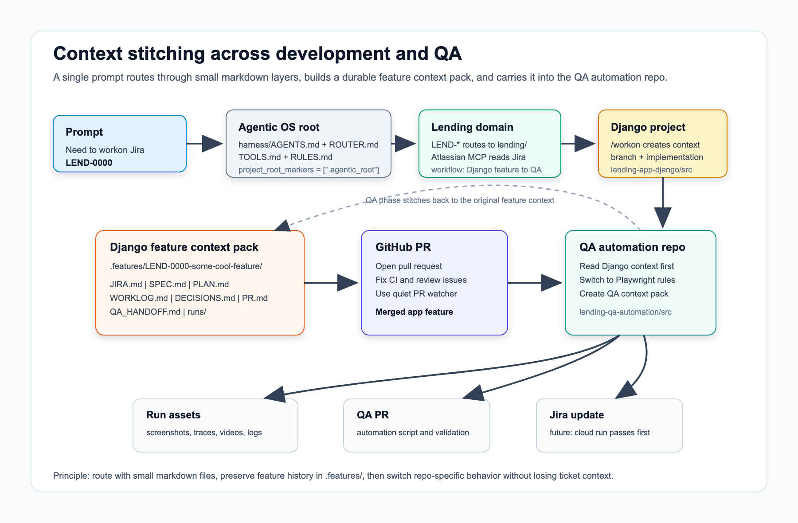

# Real-world use case: structuring an Agentic OS so agents know exactly how to operate



Most agentic workflow problems are not model problems. They are context problems.

Here is a real example. A developer finishes a Jira ticket in a Django repository, opens a pull request, fixes CI and review issues, merges it, and then needs to build the corresponding automated QA coverage in a separate Playwright repository.

Both steps are agentic. Both steps have their own repo, tools, branch rules, pull request expectations, and validation habits. The failure mode is that the second agent starts in the QA repo with almost none of the development context. It has to reconstruct the feature from the GitHub pull request, the Jira, a handful of comments, and whatever the human remembers to paste into the prompt.

That is fragile. It also defeats the point of having reusable agent workflows.

The better pattern is an Agentic OS: a small folder-based operating layer that lets agents route themselves, gather the right local context, use the right tools, and carry a feature from development into QA without losing the thread.

This tutorial uses a concrete example:

```text
Need to workon Jira LEND-0000
```

The setting is fictional but the shape is real: a lending-platform product
tracked in Jira under the `LEND` project key, built in a Django application
repo with a separate Playwright QA repo. The fake feature is:

```text
LEND-0000-some-cool-feature
```

The real workflow shape is:

1. Build the feature in `lending-app-django`.
2. Preserve the development context in `.features/LEND-0000-some-cool-feature/`.
3. Open and monitor the Django pull request.
4. After merge, start the matching QA automation work in `lending-qa-automation`.
5. Let the QA agent find and reuse the original feature context instead of reverse-engineering the work from scratch.

## The core idea

Do not make every agent session start with a giant prompt.

Instead, make the filesystem carry the operating context. A default
`agentic-os init` root ships three domains (`personal/`, `work/`, `archive/`)
plus a `harness/` directory that holds the root context files and managed OS
capabilities. This example adds one custom domain for the product work, created
with `agentic-os domain create lending`:

```text
~/agentic_os/
  .agentic_root
  harness/
    AGENTS.md
    CLAUDE.md
    ROUTER.md
    CONTEXT.md
    TOOLS.md
    RULES.md
    shared_factory/

  personal/
  work/
  archive/

  lending/
    AGENTS.md
    CLAUDE.md
    ROUTER.md
    CONTEXT.md
    TOOLS.md
    RULES.md

    02-projects/
      lending-app-django/
        AGENTS.md
        ROUTER.md
        TOOLS.md
        RULES.md
        src/        -> ~/projects/lending-app-django
        worktrees/

      lending-qa-automation/
        AGENTS.md
        ROUTER.md
        TOOLS.md
        RULES.md
        src/        -> ~/projects/lending-qa-automation
        worktrees/

    03-workflows/
      engineering/
        django-feature-to-qa-automation/
          WORKFLOW.md
          OUTPUTS.md
          RUNBOOK.md

    04-automations/
      engineering/
        qa-after-merge/
          AUTOMATION.md
          RUNBOOK.md
```

The point is not the exact names. The point is that every layer answers a different question:

- `AGENTS.md` tells the harness how to behave in this scope.
- `ROUTER.md` tells it where to go next.
- `CONTEXT.md` describes what this layer is and what lives around it.
- `TOOLS.md` tells it which tools, MCP servers, skills, scripts, and commands are available here.
- `RULES.md` captures local operating constraints.
- `03-workflows/` describes multi-step work that crosses repos or phases.
- `04-automations/` describes repeatable or event-driven work.
- `02-projects/*/src` points to the real source repo.
- `02-projects/*/worktrees` gives agents a place to create isolated branches without polluting the main checkout.

You are turning your working environment into a context map.

## The research lineage: ICM

This pattern lines up with a research framing called Interpretable Context Methodology, or ICM. The paper behind it is [Interpretable Context Methodology: Folder Structure as Agentic Architecture](https://arxiv.org/abs/2603.16021) by Jake Van Clief and David McDermott.

ICM's core claim is simple: for many sequential, human-reviewed AI workflows, the filesystem can replace a heavy orchestration framework. Instead of putting every step inside framework code, you put the workflow into folders, markdown files, stage contracts, reference files, and output artifacts. The agent does not need to remember the whole process. It reads the right files at the right moment.

The paper describes five useful context layers:

| ICM layer | What it means | Agentic OS example |
| --- | --- | --- |
| Layer 0 | Workspace identity: where am I? | root `harness/AGENTS.md` or its `CLAUDE.md` adapter |
| Layer 1 | Routing: where should this work go? | root/domain `ROUTER.md` |
| Layer 2 | Stage contract: what do I do here? | workflow runbooks, project `AGENTS.md`, QA skill instructions |
| Layer 3 | Reference material: stable rules | `TOOLS.md`, `RULES.md`, repo conventions, branch rules, Playwright standards |
| Layer 4 | Working artifacts: this run's state | `.features/<ticket>/JIRA.md`, `WORKLOG.md`, `PR.md`, `QA_HANDOFF.md`, run assets |

My example is not trying to restate ICM academically. It is applying the same idea to real software delivery. The Django feature context pack is Layer 4. The repo rules and QA automation conventions are Layer 3. The routers decide which layer to enter next. The handoff from Django to QA is the same pipeline idea the paper describes: one stage writes durable output, a human or agent reviews it, then the next stage reads it as input.

That is why the approach stays understandable. You can inspect the workflow by opening folders. You can debug it by reading the markdown. You can improve it by editing the source context instead of only correcting the final output.

## How Codex builds the instruction chain

Codex has a useful behavior here: it discovers project instructions from your Codex home and then from the project root down to the directory where the session starts. Official Codex docs describe this as an instruction chain: global guidance first, then project guidance from root to leaf, with deeper files appearing later and therefore able to override earlier guidance. Codex checks `AGENTS.override.md`, then `AGENTS.md`, then any configured fallback names, and includes at most one instruction file per directory.

That last sentence matters.

Codex will not automatically include every markdown file in the folder. If you create `ROUTER.md`, `TOOLS.md`, and `RULES.md`, your `AGENTS.md` should explicitly tell the agent to read them when the task requires routing or tooling decisions.

For a multi-repo Agentic OS, the other important setting is `project_root_markers`. By default, Codex treats `.git` as the project root. That is usually correct for a normal repo. It is wrong for an Agentic OS that intentionally contains multiple Git repositories under one operating root.

Use a marker file at the OS root:

```text
~/agentic_os/.agentic_root
```

Then configure Codex to treat that marker as the root:

```toml
# ~/.codex/config.toml

# Use the Agentic OS root instead of stopping at nested Git repos.
# If you prefer ".agentic_os", create that marker file and use that exact name.
project_root_markers = [".agentic_root"]

# Fallback means "use this only if AGENTS.override.md and AGENTS.md are absent".
# It does not mean "also include CLAUDE.md".
project_doc_fallback_filenames = ["CLAUDE.md"]

# Optional if your instruction stack grows, but prefer smaller scoped files first.
project_doc_max_bytes = 65536
```

Use project-local Codex config only for trusted project behavior:

```toml
# ~/agentic_os/lending/02-projects/lending-qa-automation/config.toml

log_dir = "./logs"

[mcp_servers.playwright]
command = "npx"
args = ["@playwright/mcp@latest"]
```

Keep behavioral rules in `AGENTS.md`, not in `config.toml`. Keep secrets out of shared repo config. Use environment variables and provider fields such as `env_key` or `env_http_headers` for credentials.

For Claude, each layer's `CLAUDE.md` is a thin adapter that imports the shared
entry point, so both harnesses read the same instructions:

```markdown
# CLAUDE.md

@AGENTS.md
```

For Codex, put the read order in `AGENTS.md`:

```markdown
# ~/agentic_os/harness/AGENTS.md

## Scope

This is the root harness of the Agentic OS. The OS root is not a product repo.

## Read first

- Read `ROUTER.md` before deciding where work belongs.
- Read `CONTEXT.md` to understand what this layer holds.
- Read `TOOLS.md` before using MCP servers, scripts, skills, or shell tools.
- Read `RULES.md` before writing files, opening PRs, or updating external systems.

## Operating rule

Route first, then work. Do not jump directly into a nested Git repo until the
router has selected the domain, project, workflow, and expected output.
```

## What happens after the prompt

The human types:

```text
Need to workon Jira LEND-0000
```

The agent should not ask, "Which repo is this?" That information belongs in the OS.

It starts at `~/agentic_os`.

### 1. Root context routes the request

`~/agentic_os/harness/AGENTS.md` tells the agent to read the router and tools
files before acting. The `.agentic_root` marker declares it as the harness
entrypoint, which is why the root context files live under `harness/` instead
of cluttering the bare OS root.

```markdown
# ~/agentic_os/harness/ROUTER.md

## Routing table

| Signal | Route |
| --- | --- |
| `LEND-*` Jira key | `lending/` |
| Lending application feature | `lending/02-projects/` |
| OS template or installer work | `harness/shared_factory/` |

## Rule

If the prompt contains a Jira key, route by Jira project key first. Use the
domain router to decide the project and workflow.
```

`~/agentic_os/harness/TOOLS.md` tells the agent what is available globally:

```markdown
# ~/agentic_os/harness/TOOLS.md

## Global tools

- Shell: local filesystem inspection, Git, test commands, and build commands.
- GitHub CLI: pull request creation, review inspection, and check status.
- Atlassian MCP: Jira and Confluence source-of-truth lookup.
- Notion: control-plane documentation, only in the approved workspace.
- Memory MCP: durable cross-session memory for project rules and findings.

## Tool rule

Prefer the highest-fidelity source. For Jira state, use Atlassian before copied
text. For pull request state, use GitHub before stale local notes.
```

Now the agent knows `LEND-0000` belongs to `lending/`.

### 2. Domain context chooses the workflow

Inside `~/agentic_os/lending/`, the router narrows the route:

```markdown
# ~/agentic_os/lending/ROUTER.md

## Jira routing

| Jira state or label | Route |
| --- | --- |
| Ready for development, backend/app behavior | `02-projects/lending-app-django/` |
| Merged app feature requiring browser regression coverage | `02-projects/lending-qa-automation/` |
| Release, deploy, or Helm work | `02-projects/lending-deploy-helm-charts/` |

## Workflow routing

- For a new `LEND-*` app feature, use `03-workflows/engineering/django-feature-to-qa-automation/`.
- The workflow is not complete when the Django PR merges if QA automation is applicable.
- The Django feature context pack is the handoff source for the QA automation phase.
```

`lending/TOOLS.md` captures domain-specific source systems:

````markdown
# ~/agentic_os/lending/TOOLS.md

## Source systems

- Jira: use Atlassian MCP for `LEND-*` issue details, status, acceptance criteria, and comments.
- GitHub: use the repo that matches the routed project.
- Pull request checks: use quiet PR watching for long-running checks.

## Required local context

For every ticket, create or reuse:

```text
.features/<ticket-slug>/
  JIRA.md
  SPEC.md
  PLAN.md
  WORKLOG.md
  DECISIONS.md
  PR.md
  QA_HANDOFF.md
  runs/
```
````

At this point the agent has not touched application code. It has only resolved the task.

### 3. Project context starts the Django feature

The project router points into the source checkout:

```markdown
# ~/agentic_os/lending/02-projects/lending-app-django/ROUTER.md

## Source

- Primary checkout: `src/`
- Agent worktrees: `worktrees/`
- Feature context: `src/.features/<ticket-slug>/`

## Workon flow

If the ticket does not already have a feature context directory, run the workon
flow before implementation. Do not begin code changes until `JIRA.md`, `SPEC.md`,
and `PLAN.md` exist.
```

`AGENTS.md` sets project behavior:

```markdown
# ~/agentic_os/lending/02-projects/lending-app-django/AGENTS.md

## Working expectations

- Use `/workon` for Jira-driven feature work.
- Create the branch from the repo's configured base branch.
- Use the ticket key in the branch name, for example:
  `codex/LEND-0000-some-cool-feature`.
- Keep `.features/<ticket-slug>/WORKLOG.md` current as implementation decisions change.
- Before opening a PR, update `.features/<ticket-slug>/PR.md` with summary,
  validation, risk, and follow-up QA notes.

## Done condition

The Django phase is done when the PR is merged and `QA_HANDOFF.md` clearly says
whether automated QA is required.
```

The `/workon` skill localizes the Jira. It uses Atlassian MCP to pull the ticket title, description, acceptance criteria, status, comments, and links, then writes a local context pack:

```text
lending-app-django/src/.features/LEND-0000-some-cool-feature/
  JIRA.md          # localized Jira source
  SPEC.md          # behavior the code must implement
  PLAN.md          # technical plan
  WORKLOG.md       # running implementation log
  DECISIONS.md     # important choices and tradeoffs
  PR.md            # PR summary, checks, review notes
  QA_HANDOFF.md    # what QA needs after merge
  runs/
```

This folder is the difference between context stitching and context archaeology.

The future QA agent should not have to infer the feature from a merged diff. It should read the same spec, worklog, decisions, and handoff notes that the development agent built while doing the work.

### 4. PR repair is part of the workflow

After the Django PR opens, the workflow is still active.

If tests fail or review automation complains, the agent uses the configured repair skill:

```markdown
# ~/agentic_os/lending/03-workflows/engineering/django-feature-to-qa-automation/RUNBOOK.md

## Pull request repair

- Use `/pr-repair` when GitHub Copilot review comments or CI failures need iterative repair.
- Record each failure and fix in the feature `WORKLOG.md`.
- Keep `PR.md` current with the PR URL, latest check state, and remaining risks.
- For long-running check monitoring, use quiet PR watching rather than repeated chat polling.
```

The feature context pack absorbs the messy middle of the work: failing checks, review comments, revised implementation decisions, and final validation.

### 5. Merge triggers the QA phase

Once the Django PR merges, the workflow asks a new question:

```text
Does this feature need automated browser or API QA coverage?
```

If yes, the agent routes to:

```text
~/agentic_os/lending/02-projects/lending-qa-automation/
```

That folder has its own context. It should not inherit Django implementation habits as if it were the same repo. It should inherit the ticket context, then switch operating modes.

````markdown
# ~/agentic_os/lending/02-projects/lending-qa-automation/ROUTER.md

## Source

- Primary checkout: `src/`
- Agent worktrees: `worktrees/`
- QA feature context: `src/.features/<ticket-slug>/`

## Cross-repo context lookup

For `LEND-*` QA work, first read the Django feature context:

```text
~/agentic_os/lending/02-projects/lending-app-django/src/.features/<ticket-slug>/
```

Then create the QA context folder:

```text
~/agentic_os/lending/02-projects/lending-qa-automation/src/.features/<ticket-slug>/
```

The QA context folder should link back to the Django context, Jira, and merged PR.
````

Now the QA agent knows where the old context lives before it starts writing tests.

```markdown
# ~/agentic_os/lending/02-projects/lending-qa-automation/AGENTS.md

## Working expectations

- Use the QA analysis workflow for merged app features that need automation.
- Read the Django feature context before reading the merged diff.
- Use Playwright conventions from this repo, not Django conventions.
- Store test assets under `.features/<ticket-slug>/runs/<timestamp>/assets/`.
- Open a QA automation pull request with the ticket key in the branch and title.
- When cloud runner support is wired, update Jira only after the automation run passes.

## Done condition

The QA phase is done when the automation PR is opened, the run assets are stored,
and the Jira/PR handoff explains what passed, what remains manual, and what will
be updated automatically in the future.
```

`TOOLS.md` makes the context shift explicit:

````markdown
# ~/agentic_os/lending/02-projects/lending-qa-automation/TOOLS.md

## Test tools

- Playwright for browser automation.
- GitHub Actions for cloud validation.
- Local screenshots, traces, and videos for debugging.

## Asset storage

Store run artifacts here:

```text
.features/<ticket-slug>/runs/<YYYYMMDD-HHMMSS>/assets/
  screenshots/
  traces/
  videos/
  logs/
```

## Jira update rule

Future state: when the GitHub-hosted QA run passes, automatically update the
Jira with the run URL, automation PR, and stored evidence location.
Until then, write the intended Jira update into `QA_RESULT.md`.
````

This is the important handoff: the agent changes working context, but it does not lose feature context.

## The context-stitching contract

For cross-repo work, make the handoff file explicit:

```markdown
# QA_HANDOFF.md

## Ticket

- Jira: LEND-0000
- Slug: LEND-0000-some-cool-feature
- Django context: `lending-app-django/src/.features/LEND-0000-some-cool-feature/`
- Django PR: `<github-pr-url>`

## Behavior to verify

- User-visible behavior:
- Critical states:
- Negative cases:
- Permissions or tenant constraints:

## Automation recommendation

- Required: yes
- Repo: `lending-qa-automation`
- Suggested test area:
- Data setup:
- Assertions:

## Evidence from development

- Acceptance criteria source: `JIRA.md`
- Implementation notes: `WORKLOG.md`
- Decisions: `DECISIONS.md`
- Known risks:
```

Then the QA repo creates its own local context:

```text
lending-qa-automation/src/.features/LEND-0000-some-cool-feature/
  SOURCE_CONTEXT.md   # links to Django context, Jira, and PR
  QA_PLAN.md          # automation plan
  TEST_SCRIPT.md      # test implementation notes
  RUNS.md             # local/cloud run history
  QA_RESULT.md        # result intended for Jira update
  runs/
```

The QA agent is no longer rebuilding the story from scratch. It is continuing the story from the agreed handoff.

## Why this works

The win is not that the agent has more context. The win is that it has the right context at the right layer.

In ICM terms, the goal is selective context loading. The agent should not drag the whole organization into every task. It should load enough structural context to route itself, enough reference context to follow the rules, and enough working context to continue the specific run.

Root context should be small. It should answer, "What world am I in?"

Domain context should answer, "Which source systems and workflows apply?"

Project context should answer, "How do I work safely in this repo?"

Feature context should answer, "What is this ticket, what changed, what did we learn, and what evidence exists?"

Run context should answer, "What happened this time?"

When those layers exist, a prompt like this is enough:

```text
Need to workon Jira LEND-0000
```

The agent can then:

1. Read `harness/AGENTS.md` and `harness/ROUTER.md` at the OS root.
2. Route `LEND-*` to `lending/`.
3. Read the lending domain rules and tools.
4. Use Atlassian MCP to fetch the Jira.
5. See that ready-for-development app work belongs in `lending-app-django`.
6. Run `/workon` and create `.features/LEND-0000-some-cool-feature/`.
7. Build the feature while keeping `WORKLOG.md`, `DECISIONS.md`, and `PR.md` current.
8. Open the Django PR.
9. Use `/pr-repair` or the configured repair loop for check/review failures.
10. Watch PR checks quietly.
11. On merge, read `QA_HANDOFF.md`.
12. Route to `lending-qa-automation`.
13. Load the QA repo's Playwright-specific expectations.
14. Find the original Django `.features/` context.
15. Build the QA automation PR with assets and run evidence.
16. Prepare the Jira update when the cloud run passes.

That is context stitching.

## The maintenance habit

Every time an agent helps you do a new kind of task, ask one question before you close the thread:

```text
What should exist in the Agentic OS so the next agent knows how to do this without me re-explaining it?
```

Sometimes the answer is a new skill. Sometimes it is a workflow runbook. Sometimes it is a better `TOOLS.md`. Sometimes it is a single routing rule.

Do not overbuild it. Add the smallest durable instruction that would have prevented the confusion you just had.

This works for much more than code. The same pattern works for research, sales workflows, client delivery, document review, support triage, release management, and operations. Any repeated knowledge-work path can become a folder, a router, a tool map, a rule file, and a context pack.

The goal is not to make the agent magical. The goal is to make the operating environment legible.

When the environment is legible, the agent does not need a 30-step prompt. It can read the room.

## Source notes

- [Interpretable Context Methodology: Folder Structure as Agentic Architecture](https://arxiv.org/abs/2603.16021): the research framing for folder structure, markdown stage contracts, reference material, working artifacts, and human-reviewed pipeline stages.
- [Codex custom instructions with AGENTS.md](https://developers.openai.com/codex/guides/agents-md): Codex reads global and project instruction files, walks from project root to current directory, checks `AGENTS.override.md`, `AGENTS.md`, then configured fallback names, and includes at most one file per directory.
- [Codex config basics](https://developers.openai.com/codex/config-basic): user defaults live in `~/.codex/config.toml`; trusted project overrides live in `.codex/config.toml`; CLI/config overrides have higher precedence than project and user config.
- [Codex advanced config](https://developers.openai.com/codex/config-advanced): default root detection uses `.git`; `project_root_markers` can customize that behavior for an Agentic OS root.
