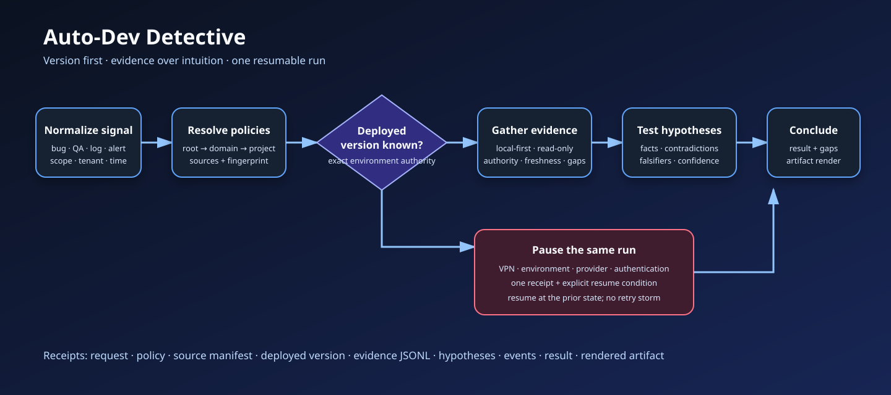

# Detective

## What this does

Turns a bug report, failed QA result, ticket comment, log entry, alert, incident,
or causal question into a version-aware evidence plan, bounded read-only source
receipts, competing hypotheses, and a confidence-rated conclusion. It is the
investigation and RCA workflow used before ticket authoring and implementation.

## Manual run

Use `/auto-dev-detective` from chat. The deterministic surface is
`agentic-os detective resolve|start|status|record-version|record-evidence|source-status|pause|resume|analyze|conclude|render|doctor`.
Equivalent bug, failed-QA, incident, log, and causal questions route here
implicitly.

## Inputs

- Original signal, trigger type, domain/project, environment, tenant or
  population, time window, expected behavior, impact, desired output, and
  optional invocation policy overlays.

## Outputs

- Normalized request, effective policy sources/fingerprint, source manifest,
  deployed-version receipt, evidence ledger, hypothesis analysis, result in
  JSON/Markdown, and optionally a provider-native artifact draft.

## States

`requested -> version_pending -> evidence_planned -> gathering -> analyzing ->
conclusion_ready -> complete`. Dependency unavailability moves the same run to
`paused` and restores its prior state after verified resume. Unsupported scope
or missing authority uses `blocked`; neither state is retried by deleting run
data.

## Steps

1. Preserve the signal and translate it into one testable question.
2. Compose root → domain → project → invocation investigation Markdown.
3. Create one run packet and ordered source manifest.
4. Resolve the exact deployed version for environment-scoped work.
5. Gather the least-privileged evidence needed from local-first and then live
   declared sources, recording authority, prerequisites, freshness, facts, and
   limitations. Explicitly disposition sources that are unavailable or outside
   the bounded question.
6. Compare competing hypotheses, contradictions, causal chain, counterfactuals,
   and disconfirming evidence.
7. State cause or best explanation, confidence, blast radius, unknowns, and
   next owner.
8. Render through Auto-Dev Create Artifacts when a Jira, Linear, Notion,
   Confluence, comment, investigation report, or RCA output is needed.

## Validations

- Environment-scoped code analysis has a deployed-version authority receipt.
- Every fact, hypothesis, disconfirming check, and conclusion cites recorded
  evidence IDs; reporter claims and inference remain labeled.
- Leading hypotheses include contradiction or falsifier checks.
- Source freshness and limitations are explicit.
- Investigation stayed read-only and external outputs are sanitized.
- Conclusion language matches evidence strength and confidence.

## Success modes

- `complete`: decision-grade local result with evidence, version, confidence,
  gaps, and next route.
- `complete_with_unknowns`: available evidence bounded the explanation but
  unresolved facts remain explicit and do not justify stronger claims.
- `rendered`: the complete result also has a validated provider-native draft;
  external application remains separately approved and read back.

## Failure modes and recovery

- Environment version unknown: remain `version_pending` or block on the exact
  authority; never inspect the default branch as a substitute.
- VPN/environment/provider unavailable: write one pause receipt with the
  resume condition; do not repeatedly retry.
- Source stale or missing: record an explicit disposition and lower confidence;
  `deferred` blocks conclusion.
- Conflicting evidence: retain both receipts and continue with competing
  hypotheses rather than choosing silently.
- Insufficient causal evidence: conclude “unknown” or “most likely” with the
  next falsifying check.
- Mutation requested mid-run: hand off to the owning configuration, code,
  deployment, or artifact workflow with the Detective result receipt.

## Events and receipts

Emit `investigation.started`, `investigation.version_resolved`,
`investigation.evidence_recorded`, `investigation.paused`,
`investigation.resumed`, `investigation.analysis_updated`,
`investigation.concluded`, and `investigation.artifact_rendered`. Keep request,
policy resolution, source manifest, deployed version, evidence JSONL,
hypotheses, event JSONL, run state, result, and artifact receipts.

## Cleanup and handoff

Retain compact receipts and the final result under routed policy; expire or
redact raw evidence according to source sensitivity. Ticket intake, Create
Artifacts, or implementation consumes the result reference and exact gaps—never
a copied chat summary with lost provenance.
