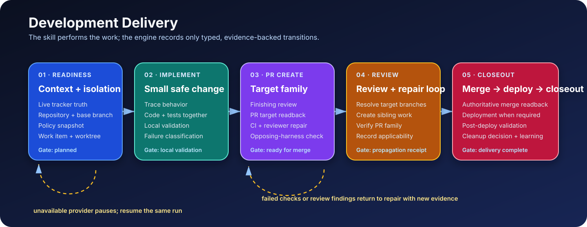

# Release Propagation

## Flow

## What this does

Preserves the stable `release_propagation` Development Delivery receipt for
existing tasks and adapters after the canonical PR Create workflow has already
resolved, created, and read back the complete pull-request family.

This is a lower-level compatibility recorder, not an Auto-Dev stage. It does
not resolve targets, create branches, cherry-pick code, open or retarget pull
requests, watch checks, or own GitFlow policy.

## Manual run

Use `/auto-dev-release-propagation`, which delegates to PR Create family mode.
After PR Create returns its provider-read family receipt, record that exact
receipt with `agentic-os develop stage <state.json> --stage
release_propagation ...`.

## Inputs

- canonical PR Create family receipt;
- exact task state, work-item identity, and `autodev.json` linkage;
- packet-local immutable evidence snapshot;
- stable idempotency key.

## Outputs

- packet-local `release_propagation` compatibility receipt;
- synchronized Auto-Dev `pr_create` projection referencing the same evidence;
- an append-only exact-head supersession wrapper when the same PR is rewritten;
- legacy Development Delivery event/readback for existing consumers.

## States

`compatibility_validation -> recorded|blocked`.

The recorder accepts only the delivery states supported by the canonical
implementation. It does not introduce target-matrix or provider lifecycle
states.

## Steps

1. Require the canonical work item and `autodev.json` linkage.
2. Require every predecessor of Auto-Dev PR Create to be terminal and
   receipt-backed.
3. Validate the PR Create family receipt and exact work-item/provider/revision
   identity.
4. Require the evidence snapshot to live inside the work-item packet.
5. Record the immutable compatibility receipt idempotently. If the same PR has
   a new provider-read head, require explicit supersession evidence, preserve
   the prior wrapper, append a new wrapper, and bind the task to that new
   wrapper.
6. Synchronize `autodev.json` so the same receipt is exposed as `pr_create`.
7. Read back the stored receipt and projection.

## Validations

- The canonical PR Create receipt already contains the complete provider-read
  target family.
- Work item, task, repository, provider, pull-request family, and revision
  identities match.
- The evidence is packet-local and its SHA-256 matches the stored receipt.
- Repeating the same idempotency key returns the same result; different input
  cannot overwrite it.
- A head refresh must name the prior head, keep the same repository, base,
  provider, PR, and source branch, and prove the new provider-read head.
- A head refresh cannot replace or alter the prior wrapper. The task binding
  moves only to the new append-only wrapper after both wrapper hashes verify.
- No target resolution, branch mutation, pull-request write, check watch, or
  policy decision occurs in this recorder.

## Success modes

- `recorded`: the lower-level receipt is stored and the Auto-Dev projection
  exposes the same evidence as completed PR Create.
- `idempotent`: an identical prior receipt is read back without another write.
- `superseded`: a new exact-head receipt is appended after an explicit,
  provider-read PR-head rewrite; the earlier wrapper remains intact.

## Failure modes and recovery

- Missing or incomplete PR Create family receipt: return to PR Create.
- Missing canonical `autodev.json` linkage: reconcile the existing work item;
  never create a second packet.
- Identity, revision, or evidence-hash mismatch: block on the exact mismatch.
- Idempotency collision: preserve the original receipt and stop.
- Head changed without explicit prior-head and provider readback evidence:
  keep the old wrapper current and return to PR Create to produce that proof.

## Events and receipts

Emit the legacy `development.stage.release_propagated` event only after the
compatibility receipt is stored. Preserve the canonical PR Create family
receipt, packet-local evidence SHA-256, compatibility receipt, and synchronized
`pr_create` projection.

## Cleanup and handoff

This recorder owns no worktree, branch, pull request, watcher, or cleanup
resource. Review Self consumes the canonical PR Create family receipt. Later
Finalize, Merge, Release, Deploy, Closeout, and Health retain their own
authorities.
